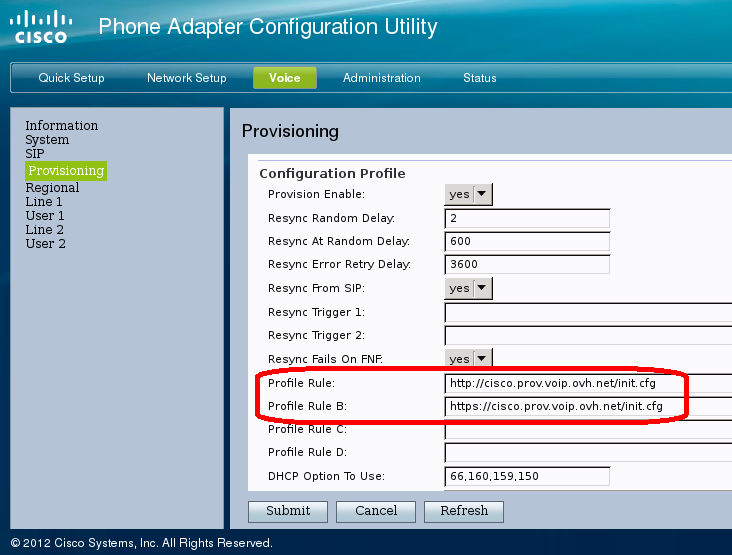

------------------------------------------------------------------------

Niveau : Débutant

------------------------------------------------------------------------

## Reconfiguration de l'équipement {#reconfiguration-de-léquipement}

-   Connectez-vous à votre Espace Client OVH : <https://www.ovhtelecom.fr/espaceclient/>
-   Cliquez sur le lien "**Administrez vos services de téléphonie via l'ancienne interface.**"
-   Cliquez sur la ligne à reconfigurer.
-   Cliquez sur "**Assistance**"
-   Cliquez "**Dépannage Plug & phone**"

{.thumbnail}

-   L'interface vous propose la reconfiguration automatique. Elle consiste à débrancher puis rebrancher électriquement votre équipement (durée de l'opération : 3minutes maximum)

{.thumbnail}

-   Cliquez sur **Reconfiguration manuelle**
-   Commencez par réinitialiser l'équipement. Pour ce faire :
    -   Débranchez le boîtier du réseau (câble Ethernet)
    -   Décrochez le combiné
    -   Composez **\*\*\*\***
    -   Attendez la voix en anglais dans le combiné
    -   Poursuivez à composer **73738\#** finissez par **1**
    -   Raccrochez
    -   Laissez le SPA112 dans l'état pendant une à deux minutes.
-   Ensuite, il vous faut récupérer l'adresse IP locale de votre adaptateur Cisco :
    -   Décrochez le combiné
    -   Composez **\*\*\*\***
    -   Attendez la voix en anglais dans le combiné
    -   Composez **110\#**
    -   La voix en anglais reprend en énumérant les chiffres qui composent l'adresse IP locale (notez que les points se disent "dot")
    -   Entrez l'adresse IP récupérée dans le champs en bas de l'interface.

Votre adresse IP locale sera composée de 4 nombres compris entre 0 et 254 et sauf configuration réseau particulière, débutera par 192**.**168**.**

{.thumbnail}

-   Il vous reste à cliquer sur le lien généré de l'adresse IP locale.
-   Vous serez alors dirigé dans la page de l'interface web du SPA112. Cette même page permet de reconfigurer en quelques clics votre Plug & Phone.
-   Si l'interface vous demande un identifiant et mot de passe : entrez **admin** et **admin**
-   Rendez vous dans la catégorie **Voice**{.thumbnail}

-   Puis cliquez **Provisionning** dans le volet à gauche{.thumbnail}

-   Dans "**Profile Rule**", renseignez l'adresse décrite par le Manager : **http://cisco.prov.voip.ovh.net/init.cfg**
-   Renseignez **https://cisco.prov.voip.ovh.net/init.cfg**dans "**Profile Rule B**"**.** Cela permet d’accélérer la reconfiguration du matériel.****
-   Finissez la procédure en cliquant sur **Submit**

## Mon adaptateur ne s'allume plus {#mon-adaptateur-ne-sallume-plus}

Si même le voyant Power n'est pas allumé : le boîtier n'est pas alimenté.

L'origine de cette situation se situe :

Soit dans le raccordement de la prise électrique (vérifiez que l'appareil, raccordé sur une autre prise murale, a le même comportement)

Soit dans le chargeur qui permet d'alimenter le SPA112. Si vous avez plusieurs équipement identique, inversez le changeur. Si non, n'hésitez pas à employer une alimentation identique : 5V - 2A

S'il s'avère que votre adaptateur est défaillant, nous vous prions de vous rapprocher du support technique par téléphone ou par mail pour procéder à un échange SAV.

------------------------------------------------------------------------

## Le voyant Line 1 de mon boîtier est complétement éteint {#le-voyant-line-1-de-mon-boîtier-est-complétement-éteint}

Le fait que le voyant Phone 1 soit éteint signifie que votre ligne OVH n'est pas enregistrée (authentifiée) dans le SPA112. Autrement dit, le boîtier ne communique pas avec le serveur de téléphonie. Aucune chance que vous puissiez émettre ou recevoir un appel via votre ligne.

Nous vous invitons à vérifier que l'origine du comportement ne se situe pas sur votre réseau local. Pour ce faire, branchez l'équipement sur un autre réseau local (sur la box d'un ami/ d'un voisin).

Si le phénomène persiste, reconfigurez le à l'aide du guide "[Reconfiguration de l'équipement](#DépannageSPA112-reconfiguration)"

------------------------------------------------------------------------

## Le voyant Line 1 de mon boîtier clignote en vert {#le-voyant-line-1-de-mon-boîtier-clignote-en-vert}

Lorsque le voyant Téléphone 1 clignote en vert, de manière régulière, c'est que le combiné raccordé sur Phone 1 est en prise de ligne, décroché. Si toutefois il s'agit d'un fax, alors le télécopieur tente de prendre la ligne.

Pour vérifier cette hypothèse, débranchez toutes les prises raccordées au SPA112 puis rebranchez uniquement l'alimentation.Le boîtier met environ une minute à démarrer.

Si Téléphone 1 continue de clignoter après cela, nous vous prions de vous rapprocher du support technique par téléphone ou par mail pour procéder à un échange SAV.

------------------------------------------------------------------------

## Je ne parviens ni à émettre ni à recevoir malgré que le voyant Line 1 soit allumé {#je-ne-parviens-ni-à-émettre-ni-à-recevoir-malgré-que-le-voyant-line-1-soit-allumé}

Le fait que le voyant Phone 1 soit allumé en vert fixe signifie que votre ligne OVH est bien enregistrée (authentifiée) dans le SPA112.

En raccordant un combiné sur Phone 1, vous devriez émettre et recevoir des appels.

Si toutefois ce n'est pas le cas, vérifiez que le port Phone 2 n'a pas de tonalité non plus.

Le combiné employé peut également être source du problème rencontré. Pour écarter l'hypothèse, branchez votre téléphone sur un autre équipement (type box chez un ami, un voisin) ou employez un autre combiné.

------------------------------------------------------------------------

## Mon adaptateur clignote dans toutes les couleurs {#mon-adaptateur-clignote-dans-toutes-les-couleurs}

C'est synonyme d'une mise à jour du firmware de l'équipement. Autrement dit, le SPA112 a trouvé une nouvelle version de micro-logiciel interne.

Pour palier à cela, laissez raccordé le boîtier directement à votre routeur/box pendant 24 heures (avec seulement un câble réseau, il ne doit pas y avoir d'intermédiaire type Switch ou prise CPL).

Si le phénomène persiste, nous vous prions de vous rapprocher du support technique par téléphone ou par mail pour procéder à un échange SAV.

------------------------------------------------------------------------

## Le voyant Power clignote rouge {#le-voyant-power-clignote-rouge}

L'équipement a détecté une anomalie logicielle ou matérielle. N'hésitez pas à appliquer la même procédure que pour "[Mon adaptateur clignote dans toutes les couleurs](#DépannageSPA112-clignote)".
