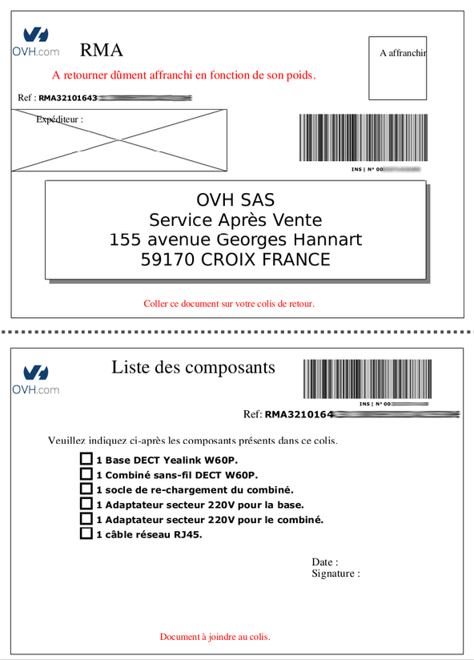

**Dernière mise à jour le 31/01/2020**

## Objectif

Lorsque vous changez de téléphone, vous restituez votre ancien matériel. Que notre support échange votre équipement ou que vous ayez résilié votre ligne, un RMA est généré. Il s'agit d'une autorisation de retour d'un équipement. Ce RMA permet de tracer également l'arrivée de l'équipement dans nos locaux et de restituer la caution ou valider la réception.

**Découvrez les étapes d'un RMA.**

## Réception du premier e-mail et envoi du colis

Lorsque votre RMA est créé, vous recevez un premier e-mail :

*Lors d'un échange de téléphone :*

    Titre: [OVH-TELECOM] Bon de retour pour votre matériel : #MODEL# #IDENT# Bonjour, Vous avez demandé, en date du
        #DATE#, un matériel de remplacement à celui correspondant au modèle #MODEL# (Réference : #REFERENCE#). Voici le bon
        de retour, au format PDF, pour le renvoi de ce matériel : Lien vers le PDF du RMA Veuillez imprimer ce bon svp, puis
        joindre la partie basse à votre colis, tandis que la partie haute devra être collée dessus, à l'extérieur. Merci de
        bien vérifier que votre matériel contienne tous les éléments d'origine. Vous disposez de 15 jours pour nous renvoyer
        ce matériel. Après ce délai, vous pourrez être facturé de la caution et/ou des frais de pénalités. Votre numéro de
        retour (RMA) est : #RMA# Il vous sera demandé en cas d'échange avec notre support concernant ce dossier. Adresse de
        retour : OVH SAS 130 quai du Sartel 59100 Roubaix

*Lors d'une résiliation :*

    Titre :[OVH-TELECOM] Bon de retour pour votre matériel : #MODEL# #IDENT# Bonjour, En date du #DATE#, un bon de
        renvoi du matériel, fourni par OVH, a été créé. Modèle : #MODEL# Réference/Mac : #REFERENCE# Cette demande de retour
        a pu être générée, non sur votre demande, dans les cas suivants : - Résiliation d'un abonnement - Suspension
        prolongée d'un abonnement - Impayé d'un abonnement* Voici le bon de retour, au format PDF, pour le renvoi de ce
        matériel : Lien vers le PDF du RMA Veuillez imprimer ce bon svp, puis joindre la partie basse à votre colis, tandis
        que la partie haute devra être collée dessus, à l'extérieur. Merci de bien vérifier que votre matériel contienne
        tous les éléments d'origine. Vous disposez de 15 jours pour nous renvoyer ce matériel. Après ce délai, vous pourrez
        être facturé de la caution et/ou des frais de pénalités. Votre numéro de retour (RMA) est : #RMA# Il vous sera
        demandé en cas d'échange avec notre support concernant ce dossier. Adresse de retour : OVH SAS 130 quai du Sartel
        59100 Roubaix . *Cette demande de retour sera automatiquement annulée en cas de régularisation de votre situation
        dans les délais. A défaut, votre abonnement sera définitivement supprimé et les frais éventuels restants
        appliqués.

Lorsque vous recevrez le mail, le lien du PDF est disponible dans le corps de l' e-mail. Il se présente sous cette forme :

{.thumbnail}

Une partie du bon est impérativement à joindre dans le colis et l'autre volet est à scotcher sur le colis pour l'affranchissement.

Le volet à joindre dans le colis contient une checklist des éléments à renvoyer. N'oubliez rien pour récupérer la totalité de la caution.

Conservez le récépissé de dépôt du colis tant que vous n'avez pas eu confirmation de la bonne réception dans nos locaux.

## Les rappels

Au bout de 10 et de 15 jours, si nous n'avons pas reçu votre colis avec le bon RMA, nous vous envoyons un rappel par e-mail sous cette forme :

    Troisième mail à J+15Titre: [OVH-TELECOM] Non réception de votre matériel : #MODEL# #IDENT# Bonjour, Sauf erreur de
        notre part, nous n'avons toujours pas reçu le matériel lié au retour ouvert en date du #DATE# :Modèle :
        #MODEL#Réference : #REFERENCE# Voici le bon de retour, au format PDF, pour le renvoi de ce matériel : Lien vers le
        PDF du RMA Veuillez imprimer ce bon svp, puis joindre la partie basse à votre colis, tandis que la partie haute
        devra être collée dessus, à l'extérieur. Merci de bien vérifier que votre matériel contienne tous les éléments
        d'origine. Sans restitution de votre matériel dans les 3 jours, nous devrons procéder à la fermeture de ce dossier.
        Adresse de retour : OVH SAS 130 quai du Sartel 59100 Roubaix

## La clôture

### Le matériel est reçu

Lorsque nous avons reçu votre équipement, vous recevez cet e-mail :

    Subject: [OVH-TELECOM] Réception du retour de votre matériel : #MODEL# #IDENT# Bonjour, Nous avons réceptionné le
        matériel lié au RMA #RMA# correspondant à la référence #MODEL#, et nous vous en remercions. Tout est en ordre et la
        totalité de votre caution vous sera restituée dans les jours qui suivent. Elle sera créditée sur votre compte OVH,
        accessible à partir de votre espace Client Télécom > Facturation > Mon Compte OVH. Vous pouvez à tout moment
        procéder à un transfert vers votre compte bancaire depuis votre espace client.

Si une caution est restituée, elle sera disponible sur votre compte OVHcloud pour payer vos prochaines factures. Si vous le souhaitez , vous pouvez en demander le versement sur votre compte bancaire via ces étapes :

-   connectez vous à votre Manager : <https://ovh.com/managerv3/?go#tel> ;
-   cliquez sur **Téléphonie**;****
-   cliquez sur le bouton "**Groupe**" ;
-   cliquez sur "**Facturation**" ;
-   cliquez sur "**Virement vers un compte bancaire**".

Entrez le compte bancaire à créditer et validez. Le virement sera effectué sous 48 heures ouvrées.

### Le matériel n'est pas reçu

Passé le délai de clôture du RMA, soit au bout de 45 jours, vous recevez l'e-mail suivant :

    Titre: [OVH-TELECOM] Fermeture du dossier retour : #RMA# #IDENT# Bonjour, Sauf erreur de notre part, nous n'avons
        pas reçu le matériel lié au retour ouvert en date du #DATE# : Modèle : #MODEL# Réference/Mac : #REFERENCE# Le bon de
        retour, pour le renvoi de ce matériel, était le suivant : Lien vers le PDF du RMA. Nous sommes donc dans
        l'obligation de fermer votre ticket.

## Aller plus loin

Échangez avec notre communauté d'utilisateurs sur <https://community.ovh.com>