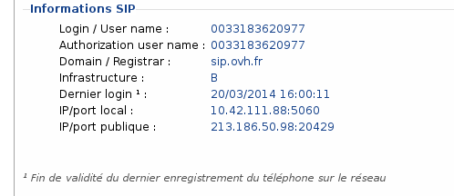
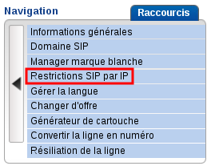
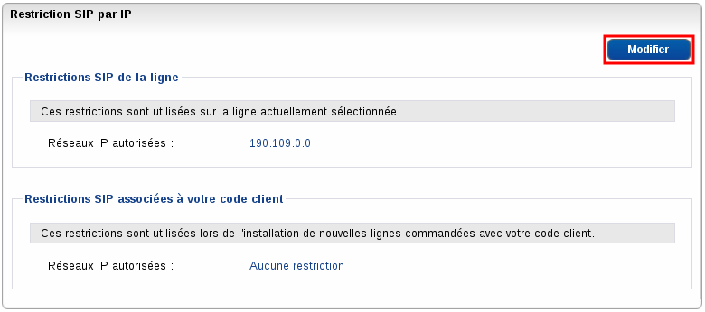

### Préambule {#préambule}

Les lignes SIP font l'objet d'une surveillance permanente de la part de nos outils de monitoring. Ceci permet de repérer divers dysfonctionnements dans l'utilisation ou dans la configuration des lignes.

Ce système envoie un e-mail à l'adresse de contact des nic-handle du service impacté.

**Sommaire :**

Niveau : Expert

------------------------------------------------------------------------

### **ShortExpire / SIP/2.0 423 Interval Too Brief** {#shortexpire-sip2.0-423-interval-too-brief}

Vous recevez cet e-mail lorsque la fréquence d'enregistrement de la ligne SIP est inférieure ou égale à 60 secondes.

Une mauvaise fréquence d'enregistrement va avoir pour effet de déclencher nos systèmes de protection et ne permettra pas une utilisation optimale de votre ligne. Cela peut également provoquer un bannissement temporaire si ça arrive de manière répétée.

Nous recommandons une valeur de 1800 secondes.

**Que faire vous lorsque-vous recevez cet e-mail ?**

-   Vous disposez d'une ligne SIP configurée sur un IPBX :

La correction du problème se fera en modifiant la configuration de l'IPBX, soit directement par le biais du fichier de configuration, soit, si votre IPBX le permet, par l'interface graphique. Vous devriez disposer d'un champ "Expire" ou "RegistrationExpire". Ce champ doit être renseigné avec la valeur "1800" au minimum.

-   Vous disposez d'une ligne SIP configurée sur un téléphone non fourni par OVH :

La correction du problème se fera en modifiant les paramètres de votre téléphone. Le paramètre "Expire" ou "RegistrationExpire" ou encore "ExpireTime" se trouvera généralement sur l'interface web de votre téléphone. Ce champ doit être renseigné avec la valeur "1800" au minimum.

-   Vous disposez d'une ligne SIP configurée sur un softphone :

La correction du problème se fera en modifiant les paramètres avancés de votre softphone. Le paramètre "Expire" ou "RegistrationExpire" doit être renseigné avec la valeur "1800" au minimum.

-   Vous disposez d'un Plug&Phone OVH :

Contactez par e-mail en suivant ce lien : [Support OVH](http://www.ovhtelecom.fr/support/support/support.xml){.external-link}

------------------------------------------------------------------------

### DifferentUserAgent {#differentuseragent}

Vous recevez cet e-mail lorsqu'une ligne SIP semble être configurée sur plusieurs équipements VoIP simultanément (IPBX, téléphone SIP, Softphone).

Cette méthode de fonctionnement peut entraîner des comportements indésirables et hasardeux :

-   réception des appels uniquement sur le dernier poste enregistré ;
-   émission d'un appel en échec car la ligne est non enregistrée sur le client SIP.

Un compte SIP doit donc être enregistré sur un seul équipement à la fois.

**Que faire lorsque-vous recevez cet e-mail ?**

-   Vous disposez d'une ligne SIP configurée sur un IPBX :

Il est possible que vos extensions s'enregistrent en doublon. Si c'est le cas, il est conseillé de les désactiver.

Pour ce faire, vous devez modifier la configuration de votre IPBX, soit directement par le biais du fichier de configuration, soit, si votre IPBX le permet, par l'interface graphique.

-   Vous disposez d'une ligne SIP configurée sur un téléphone non fourni par OVH :

Vous devez vous assurer qu'une même ligne n'est pas configurée sur deux ou plusieurs clients SIP (Téléphones, IPBX ou softphone). Vous pouvez vérifier la configuration de vos téléphones par le biais de leur interface web.

-   Vous disposez d'un Plug&Phone OVH :

Contactez-nous par e-mail en suivant ce lien : [Support OVH](http://www.ovhtelecom.fr/support/support/support.xml){.external-link}

------------------------------------------------------------------------

### DifferentRegisterInvitePort {#differentregisterinviteport}

Vous recevez cet e-mail lorsque les requêtes envoyées depuis votre téléphone arrivent depuis deux ports de connexion différents.

Cette anomalie va avoir pour conséquence l'impossibilité d'émettre ou de recevoir des appels correctement. En effet, un appel entrant ou sortant ne pourra aboutir si notre serveur de téléphonie ne sait pas quelle route emprunter pour délivrer l'appel. Vous risquez aussi de rencontrer des difficultés pendant vos appels, notamment au niveau de la voix. Vous risquez de ne plus entendre votre correspondant.

**Que faire vous lorsque-vous recevez cet e-mail ?**

Dans 99% des cas, le souci se présente lorsque les lignes sont connectées derrière un routeur dont la configuration par défaut n'est pas adaptée. (La plupart des "box" ne présentent pas le défaut.)

En effet, le port source de la requête qui a servi à l'enregistrement de la ligne SIP (REGISTER) n'est pas le même que celui utilisé pour émettre un appel (INVITE).

Les routeurs disposent d'un paramètre appelé "UDP Time Session" ou encore "TimeOut UDP Session". Ce paramètre doit être supérieur ou égal à 180 secondes afin d'éviter d'éventuels problèmes lors de vos appels. Si vous ne disposez pas d'une box, il vous faut modifier ce paramètre depuis l'interface Web de votre routeur.

------------------------------------------------------------------------

### JitterIncomingWarn et JitterOutgoingWarn {#jitterincomingwarn-et-jitteroutgoingwarn}

**** Cette notification n'est pas importante, sauf si elle revient de manière systématique.

Vous recevez cet e-mail lorsque nos robots détectent de la gigue en provenance ou à destination de votre ligne SIP. Le seuil d'activation de notre robot est de 1 ms de gigue sur un échantillonnage de 100 paquets.

Le mot "gigue" est un terme technique employé pour désigner la **variation** du délai de transmission d'un paquet entre deux réseaux informatique au fil du temps. Plus la variation est forte, plus la gigue augmente.

Ce phénomène n'est pas lié à la vitesse de connexion internet mais à la stabilité de cette dernière. Il est possible de disposer d'une connexion de 100 mbps et d'avoir de la gigue, comme il est possible d'avoir une connexion de 512 kbps et ne pas en avoir.

La gigue va voir des conséquences directes sur les communications VoIP, telles que des hachures, des coupures, des communications blanches.

**Que faire vous lorsque-vous recevez cet e-mail ?**

La gigue est le résultat d'une connexion internet dégradée ou d'un réseau saturé. Il vous faut donc porter votre attention sur les points suivants afin de limiter le phénomène :

-   les pertes de paquet : votre connexion perd-elle des paquets ?

Pour le savoir, un simple ping envoyé depuis une machine de votre réseau vers une adresse IP externe permettra de déterminer si vous perdez des paquets ou non.

**Exemple de ping**

    Ordinateur:~$ ping ovh.net PING ovh.net (213.186.33.6) 56(84) bytes of data. 64 bytes from
        ouaib.ovh.net (213.186.33.6): icmp_req=1 ttl=61 time=0.961 ms 64 bytes from ouaib.ovh.net (213.186.33.6): icmp_req=2
        ttl=61 time=0.800 ms 64 bytes from ouaib.ovh.net (213.186.33.6): icmp_req=3 ttl=61 time=0.883 ms 64 bytes from
        ouaib.ovh.net (213.186.33.6): icmp_req=4 ttl=61 time=0.771 ms --- ovh.net ping statistics --- 4 packets transmitted,
        4 received, 0% packet loss, time 3004ms rtt min/avg/max/mdev = 0.771/0.853/0.961/0.082 ms

Dans le cas où vous perdez effectivement des paquets, nous vous conseillons de contacter le support technique de votre fournisseur d'accès internet afin qu'un diagnostic soit réalisé à ce sujet.

-   la saturation de la bande passante : la VoIP a besoin de bande passante pour fonctionner correctement.

De ce fait, si vous êtes en présence de gigue, il est important de vérifier si votre ligne SIP dispose d'assez de bande passante pour fonctionner correctement.

Un téléchargement ou le visionnage d'une vidéo va consommer de la bande passante et générer d'éventuels problèmes de gigue. C'est pourquoi il est important de mettre en place une bonne gestion de la QoS.

-   la QoS (Quality of Service) : une bonne configuration de la QoS permet de favoriser le protocole SIP sur le reste du trafic de votre connexion internet.

La configuration de la QoS dépend du modem ainsi que du fournisseur d'accès Internet. Si vous possédez une connexion internet OVH, n'hésitez pas à nous contacter par e-mail en suivant ce lien : [Support OVH](http://www.ovhtelecom.fr/support/support/support.xml){.external-link}.

-   l'architecture de votre réseau : un réseau surchargé associé à un routeur entrée de gamme peut générer de la gigue.

En effet, des paquets peuvent se perdre si vous disposez d'un grand nombre d'équipements connectés sur votre routeur et que ce dernier n'arrive pas à gérer l'intégralité des flux. Dans ce cas, il est conseillé de réaliser un **test neutre**. Ce test consiste à ne brancher qu'un seul et unique téléphone sur votre routeur et à passer quelques appels. Si la communication est claire et ne présente aucune perturbation, alors le réseau était la cause de la gigue. Sinon, il faut continuer le diagnostic.

-   les erreurs CRC / FEC / HEC : ce sont des erreurs de transmission de données quantifiées par le modem pouvant générer de la gigue.

Vous pouvez généralement retrouver ces données sur l'interface web de votre modem. Une attention particulière doit être portée aux erreurs **HEC** ainsi qu'aux erreurs **CRC**. Ces erreurs, de par leur nature, vont avoir pour conséquences d'impacter votre connexion et ainsi générer de la gigue.

-   l'utilisation du courant porteur (ou boitier CPL) : cette méthode de connexion utilise votre réseau électrique afin de relier vos équipements informatiques.

La qualité de la connexion dépendra directement de la qualité de votre réseau électrique. Un réseau électrique dégradé ou perturbé aura pour effet de dégrader considérablement la communication entre vos équipements informatiques.

------------------------------------------------------------------------

### SIP/2.0 403 Wrong domain / SIP/2.0 404 Domain not bound {#sip2.0-403-wrong-domain-sip2.0-404-domain-not-bound}

Vous recevez ces erreurs lorsque vous enregistrez votre ligne sur le mauvais domaine ou sur un domaine inexistant.

Cette erreur provoquera le non-enregistrement de votre ligne lors de l'envoi du **REGISTER**.

**Que faire vous lorsque-vous recevez cet e-mail ?**Dans un premier temps, vérifiez le domaine de votre ligne :

-   Connectez-vous à votre Espace Client OVH : <https://www.ovhtelecom.fr/espaceclient/>
-   Cliquez sur le lien "**Accéder à l'ancienne interface**".
-   Cliquez sur l'icône "**Téléphonie**".
-   Cliquez sur la ligne concernée.
-   Cliquez sur l'onglet "**Gestion**" dans le menu **"Navigation**".
-   Cliquez sur l'onglet "**Informations générales**".
-   L'information est donnée sur la ligne "**Domain / Registrar**".

{.thumbnail}

------------------------------------------------------------------------

### SIP/2.0 403 Wrong login or password {#sip2.0-403-wrong-login-or-password}

Cette erreur peut être liée à plusieurs causes : une erreur de mot de passe lors du REGISTER, une mauvaise configuration de la ligne ou un port différent lors du REGISTER et de l'INVITE.

Pour identifier la cause de cette erreur :

**Si vous disposez d'un Plug And Phone :**

-   Si vous avez effectué un changement de téléphone et que le nouveau téléphone est déjà activé, votre ancien poste ne sera plus fonctionnel.
-   Si votre nouveau poste ne fonctionne pas suite à un RMA ou un échange, il faut l'activer :
    -   Connectez-vous à votre Espace Client OVH : <https://www.ovhtelecom.fr/espaceclient/>.
    -   Cliquez sur le lien "**Administrez vos services de téléphonie via l'ancienne interface.**"
    -   Cliquez sur l'icône "**Téléphonie**".
    -   Cliquez sur la **ligne** concernée.
    -   Cliquez sur "**Assistance**" dans le menu "**Navigation**".
    -   Cliquez sur "**Activer le nouveau téléphone**".
    -   Cliquez sur le bouton "**Gérer**".
    -   Pour activer le nouveau téléphone, cliquez sur "**Valider**".
    -   Si vous avez contacté notre support, il se peut que le mot de passe de test temporaire soit encore actif. 

**Si vous utilisez votre propre équipement SIP :**

-   Si vous avez contacté notre support, il se peut que le mot de passe de test temporaire soit encore actif.
-   Vérifiez que vous n'avez pas deux clients SIP enregistrés avec la même ligne.
-   Vérifiez que le mot de passe SIP est correct dans votre configuration.
-   Il se peut également que sur certains équipements, le REGISTER soit envoyé mais que votre équipement ne réponde pas au challenge. Vérifiez votre configuration pour ce point.

------------------------------------------------------------------------

### SIP/2.0 403 Not Registered {#sip2.0-403-not-registered}

Cette erreur survient lorsque votre client SIP envoie un INVITE sans REGISTER au préalable ou en ayant envoyé un REGISTER et un INVITE sur un port source différent.

**Que faire vous lorsque-vous recevez cet e-mail ?**

Certains IPBX permettent de réaliser des INVITE sans REGISTER. En revanche, notre infrastructure téléphonie ne permet pas ce genre d'opération. De ce fait, il vous faut modifier la configuration de votre IPBX. Chaque ligne doit être REGISTERED au préalable afin de pouvoir établir des appels.

Il est important de vérifier le deuxième point abordé plus haut, à savoir la question du changement de port entre la requête REGISTER et la requête INVITE.

Pour cela, vous pouvez retrouver le paragraphe traitant de ce sujet en cliquant [ici](#DiagnosticVoIP-UDP).

------------------------------------------------------------------------

### SIP/2.0 403 authentication failed {#sip2.0-403-authentication-failed}

Cette erreur résulte d'une tentative d'enregistrement de la ligne SIP sur une IP non autorisée.

**Que faire vous lorsque-vous recevez cet e-mail :**

-   Si vous êtes à l'origine de la tentative d'enregistrement :

Vous avez activé le service de restriction par IP et vous tentez de vous enregistrer depuis une adresse IP non incluse dans votre paramétrage. Il vous faut alors modifier la configuration du service en question.

Pour ce faire, dans le Manager Téléphonie, sélectionnez la ligne concernée.

Cliquez sur "**Gestion**" :

Cliquez sur "**Restrictions SIP par IP**" :

{.thumbnail}

S'affiche alors la page suivante où, dans le cas présent, la ligne sélectionnée précédemment peut s'enregistrer sur l'IP 190.109.0.0 uniquement.

{.thumbnail}

Pour changer ce paramétrage, cliquez sur "**Modifier**".

Deux possibilités s'offrent à vous :

**Supprimer** tous les réseaux IP autorisés en cliquant sur {.thumbnail}, auquel cas votre ligne ne sera plus protégée que par le mot de passe de connexion.

**Ajouter** l'adresse IP du réseau sur lequel vous tentez d'enregistrer la ligne SIP en question en cliquant sur {.thumbnail} puis en renseignant l'adresse IP du réseau dans le champ.

Validez vos changements en cliquant sur "**Valider**".

-   Si vous n'êtes pas à l'origine de cette tentative d'enregistrement :

Cela signifie qu'une tentative de connexion avec le bon couple d'identifiant / mot de passe a eu lieu avec votre ligne. Il est donc conseillé de modifier le mot de passe de votre ligne si vous ne disposez pas d'une offre Plug&Phone afin d'éviter une utilisation non souhaitée de votre ligne.

------------------------------------------------------------------------
