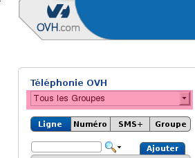

### Préambule {#préambule}

L'offre de VoIP permet de scinder les parties Administration, Technique et Facturation sur plusieurs identifiants (Nic) afin de donner des droits à plusieurs services/personnes.

La modification du contact Facturation permet de donner accès uniquement aux relevés de consommations et aux factures.

**Sommaire :**

Niveau : Débutant

------------------------------------------------------------------------

### Prérequis {#prérequis}

Sur une **ligne** ou un **numéroalias**, seul le contact **Technique** peut être modifié.Sur un **groupe**, vous pouvez changer les contacts **Administration**, **Technique** et **Facturation**. Dans ce cas, le changement se **propagera** sur**tous les services** présents dans le groupe.

Pour le changement d'un contact **administration** et **technique** il faut simplement avoir un **identifiantclient**. Pour changer le contact **facturation**, il faut que l'identifiant **destinataire** ait procédé à la validation du compte via **[la procédure de validation VoIP]({legacy}7536703)** et que le compte soit créditeur ou neutre.

### Les droits des différents contacts {#les-droits-des-différents-contacts}

***Le contact Administration :*******Cet identifiant peut gérer l’intégralité des options sur les lignes et numéros, aussi bien techniquement que commercialement. Le contact administration peut modifier les offres sur les lignes et ajouter des options. Le changement de contact ne peut se faire que par celui-ci.

***Le contact Technique :*******Cet identifiant peut gérer les modifications techniques sur les lignes et numéros. Il permet de gérer les configurations des services et options.

***Le contact Facturation :*** Cet identifiant peut gérer la facturation et télécharger les relevés de consommations.

### Changement des contacts Administration, Technique et Facturation sur un groupe {#changement-des-contacts-administration-technique-et-facturation-sur-un-groupe}

Le contact **Administration** est à changer en **dernier** lorsque vous modifiez le contact **Technique**. En effet, si vous modifiez en **premier le contact Administration**, vous n'aurez plus**les droits nécessaires** à la modification du contact **Technique** ou **Facturation**.

Pour effectuer la modification :

-   Connectez-vous à votre Espace Client OVH : <https://www.ovhtelecom.fr/espaceclient/>.
-   Cliquez sur le lien "**Accéder à l'ancienne interface**".
-   Cliquez sur l'icône "**Téléphonie**".
-   Sélectionnez le groupe à modifier à gauche de la fenêtre.

{.thumbnail}

-   Cliquez ensuite sur l'onglet "**Groupe**".
-   Cliquez sur l'onglet "**Gestion des contacts**".
-   Cliquez le bouton "**Gérer**".

Le changement de contact se présente sous la forme d'un tableau récapitulant les contacts déjà en place et les services appartenant au groupe.

{.thumbnail}

-   La modification est à effectuer sur la ligne du **Groupe**. Le mot de passe destinataire est demandé.

    Changement du contact technique sur une ligne ou un numéro {#changement-du-contact-technique-sur-une-ligne-ou-un-numéro}
    ----------------------------------------------------------

    Sur une ligne ou un numéro, seul le contact **Technique**peut être modifié unitairement. Il vous suffit de le modifier sur la ligne correspondant au service souhaité.

-   Appuyez sur le bouton "**Valider**" pour valider la modification.

