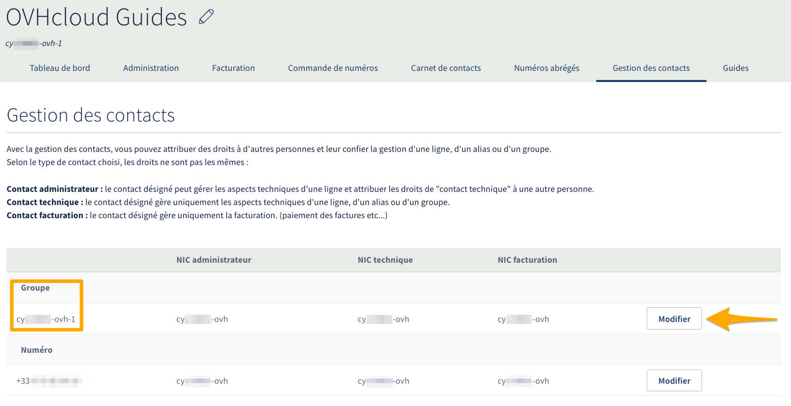
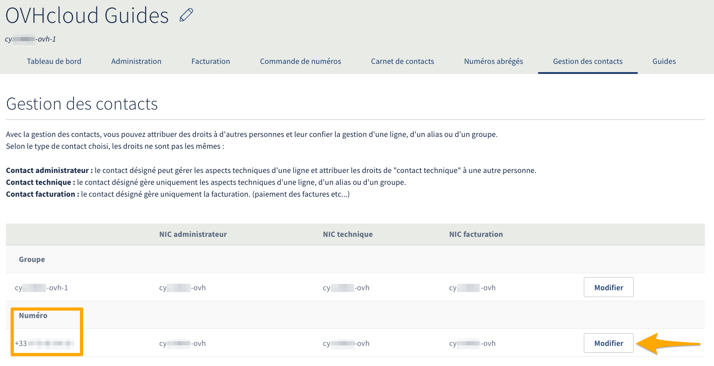

**Dernière mise à jour le 26/02/2020**

## Objectif

OVHcloud vous permet de différencier la gestion administrative, technique et de facturation d'un service pour la confier à plusieurs contacts, chacun d'eux associé à un identifiant client. Cette gestion de contacts pour les services VoIP est partiellement différente de la [gestion de contacts des autres services OVHcloud](https://docs.ovh.com/fr/customer/gestion-des-contacts/). En effet, la gestion de contacts VoIP peut être réalisée soit sur un groupe de téléphonie (le conteneur dans lequel sont stockés les lignes téléphoniques et numéros alias), soit directement sur un service VoIP (ligne téléphonique ou numéro alias).

**Découvrez comment modifier les contacts d'un service VoIP.**

## Généralités

### Les droits des différents contacts
**Le contact administrateur :** Cet identifiant peut gérer l’intégralité des options sur les lignes et numéros, aussi bien techniquement que commercialement. Le contact administrateur peut modifier les offres sur les lignes et ajouter des options. 

**Le contact technique :** Cet identifiant peut gérer les modifications techniques sur les lignes et numéros. Il permet de gérer les configurations des services et options.

**Le contact facturation :** Cet identifiant peut gérer la facturation et télécharger les relevés de consommations. La modification du contact facturation permet de donner accès uniquement aux relevés de consommations et aux factures.

> [!primary]
>
> Le changement de contacts sur un service VoIP ne peut être réalisé que par le contact administrateur.
>

### Application de ces droits pour les différents services VoIP

Les lignes téléphoniques VoIP et numéros alias peuvent appartenir à un ou plusieurs groupes de téléphonie.

- Sur une **ligne** ou un **numéro alias**, seul le contact technique peut être modifié.
- Sur un **groupe**, vous pouvez changer les contacts administrateur, technique et facturation. Dans ce cas, le changement se propagera sur tous les services présents dans le groupe.

## Prérequis 
- Être connecté à  votre [espace client OVHcloud](https://www.ovh.com/auth/?action=gotomanager){.external}
- Disposer d’un accès à l’adresse e-mail renseignée dans votre profil.
- Posséder l’identifiant client du nouveau contact (destinataire de la modification).
- Le nouveau contact doit quant à lui disposer d’un accès à l’adresse e-mail renseignée dans son profil.
- En cas de modification du contact facturation, l’ancien et le nouveau contacts facturation doivent avoir validé leurs comptes via [la procédure de validation VoIP](https://docs.ovh.com/fr/voip/la-procedure-de-validation-voip/) et être à jour de leurs règlements.

## En pratique

### Modifier les contacts administrateur, technique et facturation sur un groupe

> [!primary]
>
> En cas de changement de tous les contacts pour un service, le contact administrateur est à modifier **en dernier**. En effet, si vous le modifiez en premier, vous ne disposerez plus des droits nécessaires pour modifier les contacts technique ou facturation.
>

Connectez-vous à votre [espace client OVHcloud](https://www.ovh.com/auth/?action=gotomanager){.external}, cliquez sur `Télécom`{.action} puis sur `Téléphonie`{.action}. Sélectionnez votre groupe de téléphonie puis cliquez sur `Gestion des contacts`{.action}.

Vous pourrez alors cliquer sur `Modifier`{.action} à droite de votre groupe de téléphonie et renseigner le nouveau NIC (identifiant client) qui récupérera la gestion de ce groupe. Cliquez sur `Valider`{.action} pour valider la modification. Ce changement s'appliquera à tous les services du groupe.

{.thumbnail}

Un e-mail va être envoyé aux contacts impliqués dans ce processus de modification.

### Modifier le contact technique d'une ligne VoIP ou d'un numéro alias

Connectez-vous à votre [espace client OVHcloud](https://www.ovh.com/auth/?action=gotomanager){.external}, cliquez sur `Télécom`{.action} puis sur `Téléphonie`{.action}. Sélectionnez votre groupe de téléphonie puis cliquez sur `Gestion des contacts`{.action}.

Vous pourrez alors cliquer sur `Modifier`{.action} à droite de votre ligne VoIP ou de votre numéro alias pour modifier uniquement le contact technique de ce service. Renseignez le nouveau NIC (identifiant client) qui récupérera la gestion technique de ce service. Cliquez sur `Valider`{.action} pour valider la modification.

{.thumbnail}

Un e-mail va être envoyé aux deux contacts impliqués dans ce processus de modification.

### Valider, refuser ou suivre un changement de contact

> [!primary]
>
> Cette étape est identique à celle décrite dans le [guide de changement de contacts](https://docs.ovh.com/fr/customer/gestion-des-contacts/#valider-refuser-ou-suivre-un-changement-de-contact_1) pour tous les services OVHcloud.
>

Pour suivre et gérer les demandes en cours, cliquez sur le nom rattaché à votre identifiant client dans la barre de menu en haut à droite, puis sur `Mes contacts`{.action} et enfin sur `Mes demandes`{.action}. C’est ici que vous pourrez accepter ou refuser une demande.

{.thumbnail}

Pour cela, vous devez être en possession du code de validation (aussi appelé token) contenu dans l’e-mail pour valider ou refuser la demande.

> [!primary]
> Ce code est personnel, à usage unique et sa composition différera pour les deux contacts.

L'e-mail reçu contient  également un lien menant directement sur la page permettant de valider ou de refuser la demande. En passant par cet e-mail, le code de validation (token) sera automatiquement prérempli.

Si l'un des contacts n'a pas reçu l'e-mail, il se peut que l'adresse de contact renseignée dans le profil ne soit pas à jour. Vous pouvez la vérifier dans votre profil, la modifier si nécessaire puis redemander l'envoi de l'e-mail en cliquant sur `Renvoyer la demande`{.action}.

{.thumbnail}

Si un seul contact a validé le changement, un message apparaîtra, vous informant que la demande est toujours en attente de validation par l'autre contact. Si l'un des contacts vient tout juste de valider une demande,  l'affichage dans l'espace client se mettra à jour sous quelques minutes.

{.thumbnail}

Dès que les deux contacts ont validé la demande, le changement sera effectif sous quelques minutes. Les deux contacts recevront un e-mail les informant que la demande a bien été traitée.

## Aller plus loin

Échangez avec notre communauté d'utilisateurs sur [https://community.ovh.com](https://community.ovh.com).