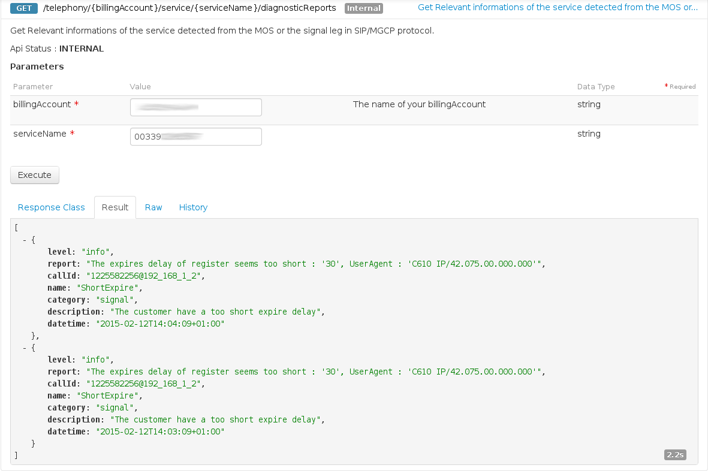
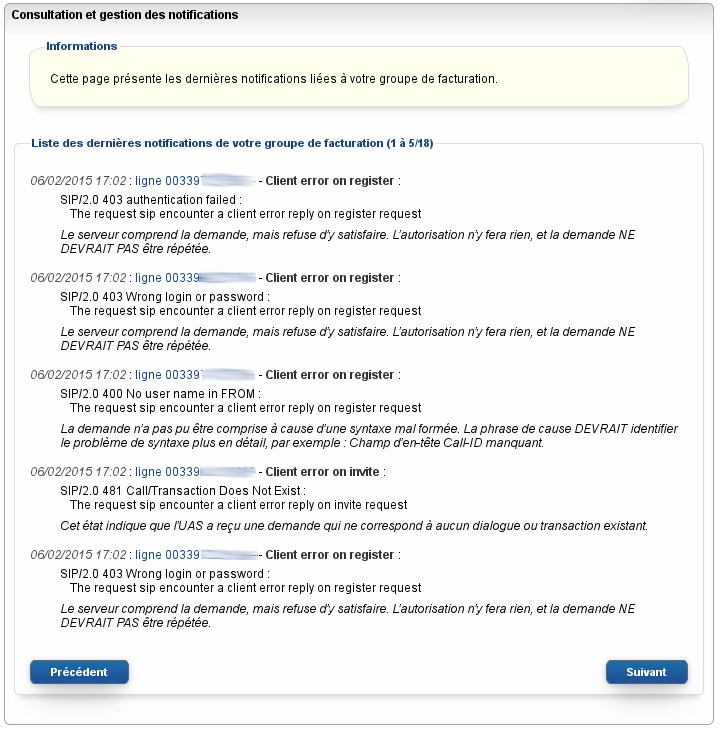

## 
Pour connaitre les bases de notre API :

[Bases de l'API](https://api.ovh.com/g934.first_step_with_api)


## 
L'ensemble des évenements relatives à un service sont conservés au moins 48H :

```
/telephony/{billingAccount}/service/{serviceName}/diagnosticReports
```


## Depuis l'API
Vous pouvez lister l'ensemble des évenements relatifs à un service via la méthode REST :

```
/telephony/{billingAccount}/service/{serviceName}/diagnosticReports
```


{.thumbnail}


## Depuis le manager
Rendez-vous dans votre manager rubrique Assistance->Consultation des gestion des notifications

{.thumbnail}


## Attribut de l'évenement
Chaque évenement contient : 


- level => Le niveau de criticité (DEBUG,INFO, WARN, CRITICAL)
- category => La catégorie d'évenement (signal, qualité d'appel, etc ..)
- name => Le type d'évenement
- Description => La description liée au type d'évenement
- Report => Le rapport de l'évenement


## Type d'évenement
Voici une liste d'exemple d'envoi des évenements :

- Erreur 4XX
- Erreur 5XX
- Flood de paquets
- Différent UserAgent connecté sur la même ligne SIP
- Register avec un bail <= 60 sec
- Port register différent du port invite (Communication blanche)
- Legs incomplètes (Perte de paquets)
- JitterMin > 1 avec plus de 100 paquets échantillonnés


## 
Il est possible de retrouver l'ensembles des dernières ips d'enregistrement d'une ligne Sip via la méthode REST : 

```
/telephony/{billingAccount}/line/{serviceName}/ips
```


