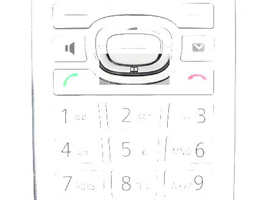
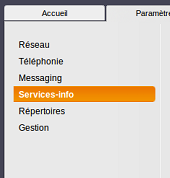

------------------------------------------------------------------------

**Sommaire :**

------------------------------------------------------------------------

### Effectuer un transfert d'appel {#effectuer-un-transfert-dappel}

Vous pouvez effectuer un transfert d'appel accompagné via le combiné :

-   Lorsque vous avez votre correspondant en ligne, appuyer sur la touche sous l'écran avec le label "**Dble Appel**".
-   Composez le numéro du **destinataire du transfert**et appuyez sur le bouton **vert**pour lancer l'appel.
-   Une fois l'appel décroché, appuyez sur le bouton "**Options**" puis "**Relier**".

L'appel est maintenant transféré.

### **Réaliser une conférence** {#réaliser-une-conférence}

****Le téléphone permet de réaliser des conférences avec**deux correspondants** (2 appels simultanés) maximum.

-   À l’écran, sélectionnez **Double Appel** et validez par la touche **OK**. Votre correspondant actuel est mis en attente.
-   Entrez le numéro de votre nouveau correspondant et validez par **Envoi**. Votre nouveau correspondant prend l’appel.
-   Pour mettre en place la conférence à trois, appuyez sur la touche **Confér**.

### **Sélectionner la ligne pour les appels sortants** {#sélectionner-la-ligne-pour-les-appels-sortants}

****Par défaut, le téléphone est configuré pour utiliser votre**ligne VoIP OVH** pour les appels sortants. Vous pouvez choisir une configuration alternative vous permettant de :

-   choisir la ligne à utiliser pour tous les appels sortants ;
-   sortir avec la ligne analogique ;
-   sortir avec la ligne OVH.

Pour modifier la configuration du combiné :

-   Sur le combiné appuyez sur le bouton **Menu**;****
-   Allez dans **Réglages**;****
-   Allez dans **Téléphonie**;****
-   Allez dans **Envoi Connexion**;****
-   Choisissez **INT1** (ou le nom de votre combiné) ;
-   Dans "Connexion pour appels sortants" ;
    -   -   -   -   **Sélectionnez à chaque appel**;****
                -   **Ligne fixe** pour sortir avec la ligne analogique ;
                -   **IP1**pour sortir avec la ligne OVH ;

-   Cliquez sur **Sauver**.

### Gérer sa messagerie vocale depuis le combiné {#gérer-sa-messagerie-vocale-depuis-le-combiné}

Vous pouvez consulter la messagerie vocale de la ligne en appelant le **123**, en appuyant sur le **bouton représentant une enveloppe** ou en restant appuyé **deux secondes** sur le bouton **1**.

Vous êtes notifié sur le combiné lorsque vous avez un message vocal non lu : **le bouton représentant une enveloppe** clignote sur le clavier du combiné.

### Gérer le carnet de contact du Manager {#gérer-le-carnet-de-contact-du-manager}

Vous avez la possibilité d'utiliser le répertoire réseau sur votre téléphone Gigaset. Les contacts sont à entrer dans votre Manager. Pour le configurer sur votre C470IP :

-   Connectez-vous à votre Espace Client OVH : <https://www.ovhtelecom.fr/espaceclient/>
-   Cliquez sur le lien "**Administrez vos services de téléphonie via l'ancienne interface**".
-   Cliquez sur la **Ligne de votre Gigaset**.
-   Cliquez sur **Assistance**.
-   Cliquez sur **Dépannage Plug&Phone**.
-   Entrez l'**adresse IP privée depuis laquelle le téléphone se connecte** et cliquez sur **Initialiser et Continuer**.
-   Un nouvel écran s'affiche avec les paramètres à entrer dans la configuration du téléphone.
-   Connectez vous à l'interface Web du Siemens via le lien donné dans le Manager : [http://IP\_du\_téléphone/settings\_services\_online\_directory.html.](http://IP_du_t%C3%A9l%C3%A9phone/settings_services_online_directory.html.){.external-link}
-   Cliquez sur **Ajouter**.
-   Renseignez les options suivantes :
    -   -   Entrez "**Entreprise**" dans la partie "**Nom fournisseur**" ;
        -   Renseignez l'**URL** indiquée sur le manager dans "**Adresseduserveur**" ;
        -   Cochez la case "**Activer**" pour "**Pages blanches**" ;
        -   Cochez la case "**Activer**" pour "**Pages jaunes**".

-   Cliquez sur **Définir** pour valider la configuration.
-   Cochez **Entreprise**.
-   Cliquez sur **Définir**.
-   Sélectionnez **Entreprise** dans le menu déroulant.
-   Cliquez à nouveau sur **Définir**.

Pour accéder au carnet, il vous suffit d'appuyer deux secondes sur la touche Répertoire du combiné :

{.thumbnail}

### **Personnaliser la sonnerie** {#personnaliser-la-sonnerie}

Votre téléphone a en mémoire plusieurs sonneries que vous pouvez choisir à votre convenance :

-   Appuyez sur la **droite** de la touche de **navigation**.

<!-- -->

-   Dans le menu déroulant, sélectionnez « **Réglages** » et validez par la touche « **OK** ».

<!-- -->

-   Dans le sous-menu déroulant, sélectionnez « **Son/Audio** » et validez par la touche « **OK** ».

<!-- -->

-   Dans le sous-menu déroulant, sélectionnez « **Régl. sonnerie** » et validez par la touche « **OK** ».

<!-- -->

-   Sélectionnez le type de sonnerie puis validez par la touche « **OK** » .

### **Désactiver les services Gigaset.net (Météo, Horoscope, etc.).** {#désactiver-les-services-gigaset.net-météo-horoscope-etc..}

Il est possible de désactiver le service info de Siemens via l'interface web :

-   Rendez-vous sur l'interface Web du téléphone : [http://gigaset-config.com](http://gigaset-config){.external-link} et sélectionnez votre téléphone. Vous pouvez également obtenir l'adresse IP du téléphone en appuyant **1 seconde** sur le bouton central de la base. Le combiné va alors sonner et vous donner**l'adresse IP locale** qu'il faudra rentrer dans votre **navigateur**.
-   Renseignez**le code PIN** du téléphone sur l'interface Web. Par défaut, il s'agit de **0000**.
-   Rendez-vous dans la partie "Paramètres".
-   Cliquez sur "**Services Info**" dans le menu à gauche.

{.thumbnail}

-   Passez le champ **Activer les services info** sur "**Non**" puis cliquez sur "**Définir**".
