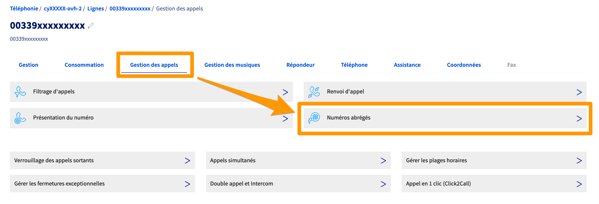
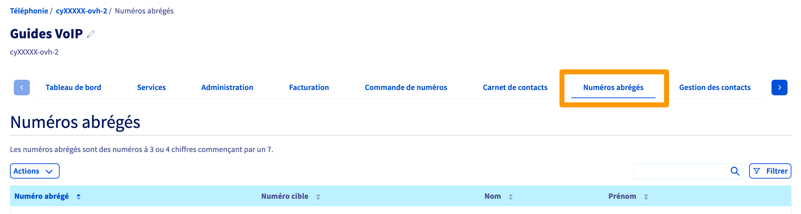
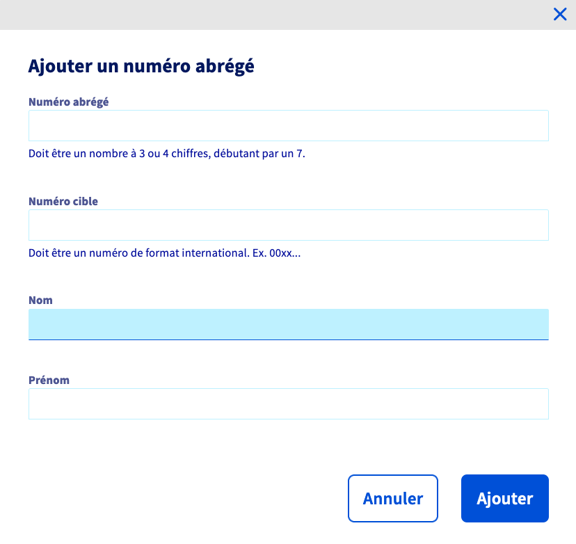

**Dernière mise à jour le 18/05/2022**

## Objectif

Votre ligne SIP OVHcloud vous permet de recevoir et d’émettre des appels. Afin de rendre les interactions avec vos correspondants plus faciles, vous pouvez créer des numéros abrégés : ils associent les numéros longs (composés de dix chiffres) à des numéros courts (composés de trois à quatre chiffres, bien plus simples à mémoriser).

**Apprenez à créer des numéros abrégés pour vos lignes SIP OVHcloud.**

## Prérequis

- Disposer d'au moins une [ligne SIP OVHcloud](https://www.ovhtelecom.fr/telephonie/voip/){.external}.
- Être connecté à l'[espace client OVHcloud](https://www.ovh.com/auth/?action=gotomanager&from=https://www.ovh.com/fr/&ovhSubsidiary=fr){.external}.

## En pratique

> [!success]
>
> Il est recommandé de mettre en place des numéros abrégés à 4 chiffres. Si le numéro est composé uniquement de 3 chiffres, l'appelant attendra quelques secondes avant d'être mis en relation.
>

### Étape 1 : accéder à la gestion des numéros abrégés

Vous pouvez créer des numéros abrégés pour une seule ligne ou partager ces numéros abrégés sur un groupe de lignes (toutes les lignes rattachées à ce groupe en bénéficient alors).

- **Pour accéder à la gestion des numéros abrégés d'une seule ligne** :

Connectez-vous à votre [espace client OVHcloud](https://www.ovh.com/auth/?action=gotomanager&from=https://www.ovh.com/fr/&ovhSubsidiary=fr){.external}. Cliquez sur `Téléphonie`{.action} puis sélectionnez la ligne concernée. Positionnez-vous sur l'onglet `Gestion des appels`{.action} et cliquez sur `Numéros abrégés`{.action}.
 
{.thumbnail}

- **Pour accéder à la gestion des numéros abrégés d'un groupe de lignes** :

Connectez-vous à votre [espace client OVHcloud](https://www.ovh.com/auth/?action=gotomanager&from=https://www.ovh.com/fr/&ovhSubsidiary=fr){.external}. Cliquez sur `Téléphonie`{.action} puis sélectionnez le groupe de lignes concerné. Cliquez enfin sur le bouton `Numéros abrégés`{.action}.
 
{.thumbnail}

### Étape 2 : gérer les numéros abrégés

La création des numéros abrégés s'effectue de la même manière, que vous ayez sélectionné une seule ligne ou un groupe de lignes.

Dans la page de gestion, un tableau liste les numéros abrégés déjà créés. Deux boutons vous permettent également de gérer les numéros abrégés de la ligne.

{.thumbnail}

#### Ajouter ou modifier un numéro abrégé

Pour ajouter un nouveau numéro abrégé, cliquez sur le bouton `Actions`{.action}, puis sur `Ajouter`{.action}. Pour modifier un numéro abrégé existant, cliquez sur le bouton `...`{.action} à droite du numéro puis sur `Éditer`{.action}.

Remplissez alors les informations demandées :

|Informations|Détail|
|---|---|
|Numéro abrégé|Renseignez le numéro abrégé souhaité. Celui-ci doit contenir trois ou quatre chiffres. Si vous avez sélectionné un groupe de lignes, le numéro doit débuter par le chiffre « 7 ». Si vous avez sélectionné une ligne, le numéro doit débuter par « 2 ».|
|Numéro cible|Composez au format international le numéro vers lequel le numéro abrégé enverra l'appel (par exemple, 0033123456789 pour un numéro français).|
|Nom|Indiquez le nom du correspondant rattaché au numéro abrégé.|
|Prénom|Renseignez le prénom du correspondant rattaché au numéro abrégé.|

Ensuite, cliquez sur le bouton `Ajouter`{.action}.

{.thumbnail}

#### Importer des numéros abrégés

Pour importer des numéros abrégés, cliquez sur le bouton `Actions`{.action} puis sur `Importer`{.action}. Dans la fenêtre qui s'affiche, cliquez sur le bouton `Sélectionnez votre fichier`{.action}. Pour être accepté par l'outil d'import, le fichier doit être au format CSV et respecter une forme précise dans son contenu. Vous trouverez un exemple ci-dessous :

|Numéro abrégé|Numéro cible|Prénom|Nom|
|---|---|---|---|
|7890|0033123456789|John|Smith|

Vous pouvez également utiliser un éditeur de texte, en séparant chaque information par une virgule (par exemple : `7890,0033123456789,John,Smith`).<vr>
Une fois le fichier sélectionné dans la fenêtre d'import, cliquez sur le bouton `Valider`{.action}.

> [!warning]
>
> Si aucun indicatif pays n'est renseigné dans les numéros cibles dans votre fichier, nous ajouterons automatiquement à ceux-ci l'indicatif correspondant au pays de votre identifiant client. 
>

{.thumbnail}

#### Télécharger la liste des numéros abrégés actuelle

Pour télécharger la liste actuelle des numéros abrégés, cliquez sur le bouton `Actions`{.action} puis sur `Télécharger`{.action}. Une fenêtre vous invite alors à enregistrer le fichier.

Le fichier obtenu sera au format CSV.

#### Supprimer un ou plusieurs numéros abrégés

Pour supprimer tous les numéros abrégés actuels, cliquez sur le bouton `Actions`{.action}, choisissez `Vider`{.action} et sélectionnez `Valider`{.action}. Pour supprimer un seul numéro abrégé, cliquez sur le bouton en forme de trois points à sa droite puis sur `Supprimer`{.action}.

### Étape 3 : utiliser les numéros abrégés sur votre ligne

Une fois la liste des numéros abrégés complétée selon votre convenance, vous pouvez utiliser ce service depuis la ou les lignes concernées. 

Composez alors un numéro abrégé que vous souhaitez contacter depuis l'une de vos lignes.

## Aller plus loin

Échangez avec notre communauté d'utilisateurs sur <https://community.ovh.com>.
