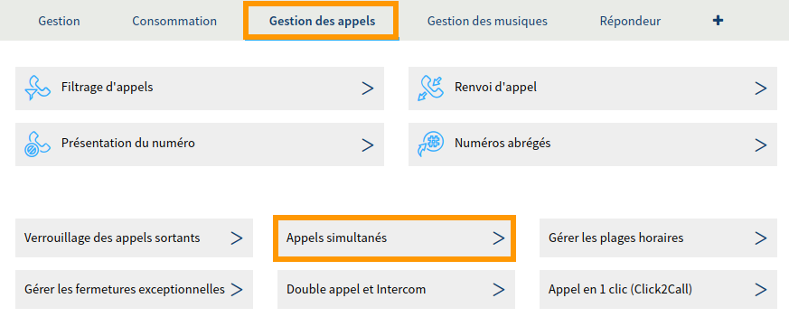
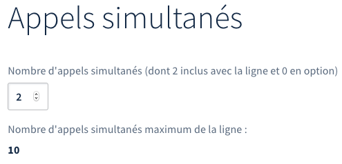

**Dernière mise à jour le 21/06/2022**

## Objectif

Votre ligne téléphonique chez OVHcloud vous permet de recevoir et d'émettre des appels. Dans le but de maximiser votre disponibilité lorsque vous êtes joint, vous pouvez être amené à devoir prendre plusieurs appels simultanés sur une même ligne téléphonique. Ceci peut vous permettre d'éviter de perdre des appels.

**Apprenez à gérer et utiliser les appels simultanés avec une ligne téléphonique OVHcloud.**

## Prérequis

- Disposer d'une ligne téléphonique possédant un [forfait compatible](https://www.ovhtelecom.fr/telephonie/services_inclus/){.external} avec la fonctionnalité « appels simultanés ».
- Posséder et avoir installé un téléphone Plug & Phone.
- Être connecté à l'[espace client OVHcloud](https://www.ovh.com/auth/?action=gotomanager&from=https://www.ovh.com/fr/&ovhSubsidiary=fr){.external}, partie `Télécom`{.action}.

{.thumbnail}

## En pratique

### Gérer les appels simultanés

Pour démarrer la manipulation, connectez-vous à votre [espace client OVHcloud](https://www.ovh.com/auth/?action=gotomanager&from=https://www.ovh.com/fr/&ovhSubsidiary=fr){.external}, partie `Télécom`{.action}. Cliquez sur `Téléphonie`{.action}, puis sélectionnez la ligne concernée.

Positionnez-vous sur l'onglet `Gestion des appels`{.action} puis cliquez sur `Appels simultanés`{.action}.

{.thumbnail}

La page qui s'affiche vous permet de visualiser le nombre d'appels simultanés inclus dans votre offre ou en option sur votre ligne. Selon vos besoins, vous avez la possibilité d'augmenter ou de diminuer ce nombre en utilisant les flèches à droite du nombre actuel d'appels simultanés. Avant d'entamer toute démarche, nous vous recommandons de vous assurer que :

- le téléphone sur lequel est configurée votre ligne est apte à gérer le nombre d'appels simultanés dont vous souhaitez bénéficier. Retrouvez plus d'informations sur les téléphones depuis le lien : <https://www.ovhtelecom.fr/telephonie/comparatif-des-telephones.xml> ;
- la bande passante de votre connexion internet est suffisamment dimensionnée pour gérer le nombre d'appels simultanés dont vous souhaitez bénéficier. Pour une utilisation optimale, une bande passante comprise entre 70 et 100 Kbit/s est requise par appel simultané.

Dès que vous êtes prêt, modifiez le nombre d'appels simultanés grâce aux flèches, puis suivez les étapes qui s'affichent. Pour chaque ajout, n'oubliez pas de payer le bon de commande qui s'affichera.

{.thumbnail}

### Utiliser les appels simultanés

Vous avez la possibilité d'utiliser les appels simultanés selon le nombre maximum d'appels défini dans votre offre ou votre option. **Chaque appel en cours consomme un appel simultané**. La ligne utilisée doit donc disposer d'un appel simultané disponible si vous souhaitez en utiliser un nouveau. 

Un signal sonore (un bip) vous avertira lorsque vous recevrez un nouvel appel, utilisant donc un appel simultané. Votre téléphone doit être compatible afin de pouvoir entendre ce signal. Reportez-vous aux documentations OVHcloud accessibles depuis le lien <https://www.ovhtelecom.fr/telephonie/telephones/cisco_CP8851/documents.xml> pour le vérifier.

Lorsque vous souhaitez utiliser les appels simultanés :

- **avec un poste standard OVHcloud** : assurez-vous d'avoir paramétré une touche de ligne pour chacun d'entre eux. Si vous ne savez pas comment faire, reportez-vous aux informations décrites dans la documentation intitulée « [Configurer les touches programmables de votre téléphone OVHcloud](https://docs.ovh.com/fr/voip/configurer-touches-programmables/) » ;

- **avec un numéro configuré en file d'appels** : assurez-vous que celui-ci est correctement configuré par rapport au nombre d'appels simultanés qu'il peut recevoir. Si nécessaire, reportez-vous aux informations décrites dans la documentation intitulée « [Configurer une file d’appels sur un numéro alias](https://docs.ovh.com/fr/voip/les-files-d-appels/) ».

> [!primary]
>
> L'un de vos appels simultanés doit être disponible sur votre ligne quand vous voulez transférer un appel. Lorsque vous réalisez celui-ci, vous composez le numéro vers lequel vous souhaitez transférer l'appel. Vous utilisez donc un appel simultané le temps du transfert.
> 

## Aller plus loin

Échangez avec notre communauté d'utilisateurs sur <https://community.ovh.com>.
