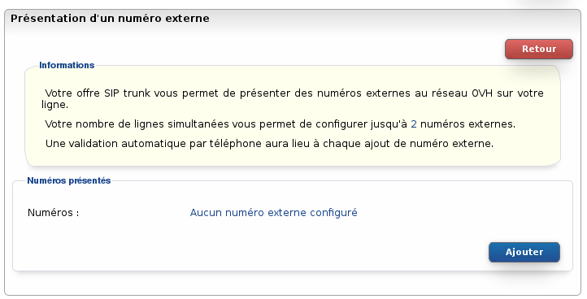
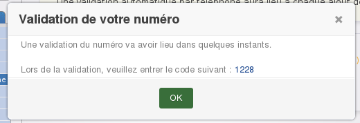
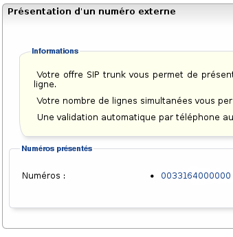

### Préambule {#préambule}

Les offres **[trunk](https://www.ovhtelecom.fr/telephonie/sip_trunk/){.external-link}** permettent de présenter un numéro externe ou un alias à la volée. Découvrez comment gérer ces options dans ce guide.

**Sommaire :**

Niveau : Intermédiaire

------------------------------------------------------------------------

### Prérequis {#prérequis}

Pour réaliser ce guide vous devez avoir :

-   un trunk ;
-   un numéro alias ou un numéro porté ;
-   un numéro dit externe si vous souhaitez utiliser cette fonction.

------------------------------------------------------------------------

### Configuration d'un alias ou d'un numéro porté {#configuration-dun-alias-ou-dun-numéro-porté}

Pour permettre d'utiliser la présentation des alias à la volée via votre IPBX, il faut configurer les alias en redirection de type **DDI** :

-   Connectez-vous à votre Espace Client OVH : <https://www.ovhtelecom.fr/espaceclient/>
-   Cliquez sur le lien "**Accéder à l'ancienne interface**".
-   Cliquez sur l'icône "**Téléphonie**".
-   Cliquez sur l'onglet "**Numéro**".
-   Cliquez sur le **numéro** à configurer.
-   Cliquez sur "**Configuration du numéro**" dans le menu "**Navigation**".
-   Cliquez sur "**Modifier le type de numéro**".
-   Cliquez sur le bouton "**Gérer**".
-   Sélectionnez dans la liste "**Redirection avec présentation de ce numéro sur ma ligne SIP ou mon Trunk (Ddi)**".
-   Cliquez sur le bouton "**Valider**" pour appliquer la configuration.

{.thumbnail}

Il faut à présent configurer la redirection du numéro vers le trunk :

-   Cliquez sur l'onglet "**Gérer la redirection**".
-   Cliquez sur le bouton "**Gérer**".
-   Sélectionnez le trunk destinataire de la redirection dans la liste "**Ligne :**".
-   Validez la configuration en appuyant sur le bouton "**Valider**".

------------------------------------------------------------------------

### Configuration d'un numéro externe {#configuration-dun-numéro-externe}

Avec les offres **[trunk](https://www.ovhtelecom.fr/telephonie/sip_trunk/){.external-link}** vous avez la possibilité de présenter un numéro fixe externe sans le porter : nous autorisons la présentation du numéro depuis votre trunk après validation du numéro.

Ce numéro sera alors à présenter directement depuis votre IPBX dans les paramètres du **CallerID**. Pour la configuration sur votre IPBX, reportez vous à nos **[guides]({legacy}7536732)** ou renseignez-vous auprès du support de votre équipement.

Il n'est pas possible de valider un numéro de mobile ou un numéro surtaxé. Le numéro externe à valider devra être du même indicatif que votre trunk. Par exemple, sur un trunk **français**, vous ne pouvez valider que des numéros externes **français**.

Le nombre du numéros externes que vous pouvez valider est égal au nombre d'appels simultanés de votre trunk.

Pour demander l'activation d'un numéro externe :

-   Connectez-vous à votre Espace Client OVH : <https://www.ovhtelecom.fr/espaceclient/>
-   [Cliquez sur le lien "**Accéder à l'ancienne interface**".](https://www.ovhtelecom.fr/espaceclient/){.external-link}
-   [Cliquez sur l'icône "**Téléphonie**".](https://www.ovhtelecom.fr/espaceclient/){.external-link}
-   Sélectionnez votre ligne trunk.
-   Dans le menu "**Navigation**" cliquez sur "**Gestion des appels**".
-   Cliquez sur "**Présentation d'un numéro externe**"
-   Cliquez sur le bouton "**Modifier**".
-   Vous accédez à ce formulaire :

{.thumbnail}

-   Cliquez sur "**Ajouter**" pour entrer le numéro externe à valider au format **international.**
-   Un appel est généré sous quelques minutes et il vous faut entrer le code affiché à l'écran du Manager pour valider le numéro.

{.thumbnail}

Une fois validé, le numéro apparaît dans le Manager :

{.thumbnail}

------------------------------------------------------------------------

