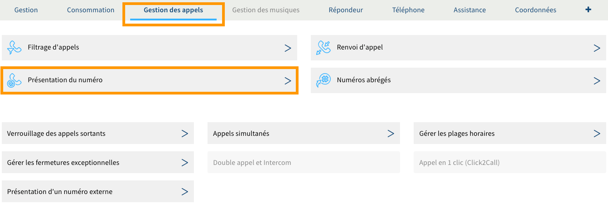
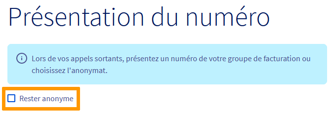
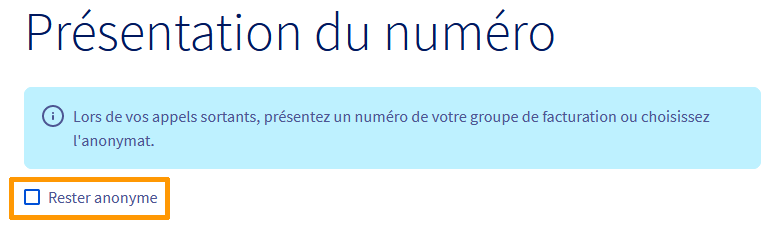

**Dernière mise à jour le 21/05/2021**

## Objectif

Votre ligne téléphonique OVHcloud vous permet de recevoir et d'émettre des appels. Selon vos besoins, vous avez la possibilité de modifier le numéro présenté à vos correspondants ou de rester anonyme lorsque vous lancez une communication.

**Découvrez comment configurer la présentation du numéro de votre ligne OVHcloud.**

## Prérequis

- Disposer de l'une des combinaisons de services ci-contre : au moins deux [lignes VoIP OVHcloud](https://www.ovhtelecom.fr/telephonie/voip/){.external} **ou** au moins une [ligne VoIP OVHcloud](https://www.ovhtelecom.fr/telephonie/voip/) et un [numéro alias OVHcloud](https://www.ovhtelecom.fr/telephonie/numeros/) **ou** une ligne Trunk.
- Posséder un [forfait compatible](https://www.ovhtelecom.fr/telephonie/services_inclus/){.external} avec le service « Fonctionnalités du téléphone ».
- Être connecté à l'[espace client OVHcloud](https://www.ovh.com/auth/?action=gotomanager&from=https://www.ovh.com/fr/&ovhSubsidiary=fr), partie `Télécom`.

## En pratique

Même si le principe de la présentation du numéro reste le même, la manipulation sera différente selon la ligne que vous souhaitez configurer. Poursuivez la lecture de cette documentation en fonction de celle que vous souhaitez gérer.

- [Configurer la présentation du numéro d'une ligne SIP](./#configurer-la-presentation-du-numero-dune-ligne-sip).
- [Configurer la présentation du numéro d'une ligne Trunk](./#configurer-la-presentation-du-numero-dune-ligne-trunk).

### Configurer la présentation du numéro d'une ligne SIP

Pour démarrer la manipulation, connectez-vous à votre [espace client OVHcloud](https://www.ovh.com/auth/?action=gotomanager&from=https://www.ovh.com/fr/&ovhSubsidiary=fr){.external}, partie `Télécom`. Cliquez sur `Téléphonie`{.action} dans la barre de services à gauche, puis sélectionnez la ligne concernée.

Positionnez-vous sur l'onglet `Gestion des appels`{.action} et cliquez sur `Présentation du numéro`{.action}.

{.thumbnail}

La page qui s'affiche vous indique l'état actuel de la présentation du numéro. Par défaut, votre numéro est présenté. Vous avez cependant la possibilité de choisir deux autres configurations :

|Configuration|Description|
|---|---|  
|Rester anonyme|Permet de masquer votre numéro lorsque vous émettez un appel. Pour valider ce choix, cochez la case `Rester anonyme`{.action}. Vous pouvez également activer cette configuration grâce à un code à taper sur votre combiné (voir la documentation [Activer ou désactiver des services depuis le téléphone](../activer-desactiver-services-depuis-telephone/)).|
|Présenter un autre numéro|Permet de présenter un numéro différent de celui de la ligne sélectionnée lorsque vous émettez un appel (par exemple, pour masquer le numéro direct d'un de vos collaborateurs en affichant celui de votre standard téléphonique). Pour cela, cliquez sur `Choisir un autre numéro`{.action}, puis sélectionnez celui souhaité dans la liste. Seuls les numéros rattachés à vos groupes de facturation apparaissent dans la liste.|

Une fois votre choix fait, cliquez sur le bouton `Appliquer les modifications`{.action}. Vous pouvez aussi cliquer sur `Appliquer à plusieurs lignes`{.action} pour dupliquer les paramètres sur d’autres lignes OVHcloud.

{.thumbnail}

### Configurer la présentation du numéro d'une ligne Trunk

Dans le cas d'une offre Trunk, voici les configurations possibles.

|Configuration|Description|Mise en place|
|---|---|---|
|Rester anonyme|Permet de masquer votre numéro lorsque vous émettez un appel.|Depuis l'espace client OVHcloud|
|Présenter de manière unique un numéro OVHcloud|Permet de présenter un numéro OVHcloud défini.|Depuis l'espace client OVHcloud|
|Présenter « à la volée » un numéro OVHcloud|Permet de présenter « à la volée » les alias en redirection avec présentation vers votre ligne Trunk.|Depuis votre propre équipement IPBX|
|Présenter « à la volée » un numéro externe|Permet de présenter « à la volée » les numéros externes validés.|Depuis votre propre équipement IPBX|

Dès que vous êtes prêt, poursuivez la lecture de cette documentation en fonction de la configuration que vous souhaitez mettre en place.

- [Masquer son numéro](./#masquer-son-numero) (depuis l'espace client).
- [Présenter de manière unique un numéro OVHcloud](./#presenter-de-maniere-unique-un-numero-ovhcloud) (depuis l'espace client).
- [Présenter « à la volée » un numéro OVHcloud](./#presenter-a-la-volee-un-numero-ovhcloud) (depuis votre propre équipement IPBX).
- [Présenter « à la volée » un numéro externe](./#presenter-a-la-volee-un-numero-externe) (depuis votre propre équipement IPBX).

#### Masquer son numéro

Connectez-vous à votre [espace client OVHcloud](https://www.ovh.com/auth/?action=gotomanager&from=https://www.ovh.com/fr/&ovhSubsidiary=fr), partie Télécom. Cliquez sur `Téléphonie`{.action} dans la barre de services à gauche, puis sélectionnez la ligne Trunk concernée.

Positionnez-vous sur l'onglet `Gestion des appels`{.action} et cliquez sur `Présentation du numéro`{.action}.

{.thumbnail}

La page qui s'affiche vous indique la configuration actuelle de la présentation du numéro. Par défaut, votre numéro est présenté. Pour le masquer, cochez la case `Rester anonyme`{.action}, puis cliquez sur le bouton `Appliquer les modifications`{.action}. Vous avez aussi la possibilité de cliquer sur `Appliquer à plusieurs lignes`{.action} pour dupliquer ce paramètre sur d’autres lignes OVHcloud.

{.thumbnail}

#### Présenter de manière unique un numéro OVHcloud

Connectez-vous à votre [espace client OVHcloud](https://www.ovh.com/auth/?action=gotomanager&from=https://www.ovh.com/fr/&ovhSubsidiary=fr), partie Télécom. Cliquez sur `Téléphonie`{.action} dans la barre de services à gauche, puis sélectionnez la ligne Trunk concernée.

Positionnez-vous sur l'onglet `Gestion des appels`{.action} et cliquez sur `Présentation du numéro`{.action}.

{.thumbnail}

La page qui s'affiche vous indique la configuration actuelle de la présentation du numéro. Par défaut, votre numéro est présenté. Pour en présenter un autre, cliquez sur `Choisir un autre numéro`{.action}, puis sélectionnez celui souhaité dans la liste. Seuls les numéros rattachés à vos groupes de facturation apparaissent ici.

Une fois votre choix fait, cliquez sur le bouton `Appliquer les modifications`{.action}. Vous avez aussi la possibilité de cliquer sur `Appliquer à plusieurs lignes`{.action} pour dupliquer les paramètres sur d’autres lignes OVHcloud.

{.thumbnail}

#### Présenter « à la volée » un numéro OVHcloud

> [!warning]
>
> Avant de poursuivre, assurez-vous que  :
>
> - le numéro que vous souhaitez présenter n'est pas associé à une ligne OVHcloud (SIP ou Trunk, par exemple). Seuls les numéros alias pourront être présentés ; 
> 
> - le numéro pour lequel vous souhaitez modifier la présentation dispose bien d'une redirection avec présentation. Si besoin, reportez-vous aux instructions décrites dans notre documentation [Créer une redirection avec présentation](../creer-redirection-avec-presentation/).
>

Le mode anonyme doit être désactivé sur la ligne Trunk depuis l'espace client, sinon il sera prioritaire sur la présentation de votre IPBX.

Depuis votre [espace client OVHcloud](https://www.ovh.com/auth/?action=gotomanager&from=https://www.ovh.com/fr/&ovhSubsidiary=fr), partie `Télécom`. Cliquez sur `Téléphonie`{.action} dans la barre de services à gauche, puis sélectionnez la ligne Trunk concernée.

Positionnez-vous sur l'onglet `Gestion des appels`{.action} et cliquez sur `Présentation du numéro`{.action}.

{.thumbnail}

Décochez la case `Rester anonyme`{.action}, puis cliquez sur le bouton `Appliquer les modifications`{.action}

{.thumbnail}

Vous pouvez à présent configurer la présentation du numéro sur votre équipement IPBX.

> [!primary]
> 
> - Des connaissances avancées sur l'équipement que vous utilisez sont nécessaires pour pouvoir le configurer. Nous vous recommandons de faire appel à un prestataire spécialisé ou de vous rapprocher du constructeur de l'équipement si vous éprouvez des difficultés. En effet, nous ne serons pas en mesure de vous fournir une assistance à ce propos.
> 
> - Il ne sera pas possible de présenter à la volée le même numéro depuis deux lignes Trunk différentes.
>

#### Présenter « à la volée » un numéro Externe

La présentation d'un numéro externe depuis votre IPBX nécessite la validation du numéro souhaité.

Connectez-vous à votre [espace client OVHcloud](https://www.ovh.com/auth/?action=gotomanager&from=https://www.ovh.com/fr/&ovhSubsidiary=fr), partie Télécom. Cliquez sur `Téléphonie`{.action} dans la barre de services à gauche, puis sélectionnez la ligne Trunk concernée.

Positionnez-vous sur l'onglet `Gestion des appels`{.action} et cliquez sur `Présentation d'un numéro externe`{.action}.

{.thumbnail}

La page qui s'affiche liste les numéros externes déjà ajoutés dans un tableau et vous donne la possibilité d'en ajouter d'autres (tant que le nombre maximal autorisé n'est pas atteint).

{.thumbnail}

Pour ajouter un nouveau numéro externe, renseignez ce dernier au format international (par exemple, 0033100000000 pour un numéro français) dans la zone de texte à côté de `Numéro externe`, puis cliquez sur `Ajouter`{.action}. Un code de validation apparaît alors.

Sous quelques minutes, le numéro renseigné recevra un appel. Décrochez et indiquez alors le code de validation par le biais du clavier de votre téléphone. Si tout est correct, le numéro affichera un statut « Validé » dans le tableau.

{.thumbnail}

Le mode anonyme doit être désactivé sur la ligne Trunk depuis l'espace client, sinon il sera prioritaire sur la présentation de votre IPBX.

Depuis votre [espace client OVHcloud](https://www.ovh.com/auth/?action=gotomanager&from=https://www.ovh.com/fr/&ovhSubsidiary=fr), partie `Télécom`. Cliquez sur `Téléphonie`{.action} dans la barre de services à gauche, puis sélectionnez la ligne Trunk concernée.

Positionnez-vous sur l'onglet `Gestion des appels`{.action} et cliquez sur `Présentation du numéro`{.action}.

{.thumbnail}

Décochez la case `Rester anonyme`{.action}, puis cliquez sur le bouton `Appliquer les modifications`{.action}

{.thumbnail}

Vous pouvez à présent configurer la présentation du numéro sur votre équipement IPBX.

> [!primary]
> 
> - Des connaissances avancées sur l'équipement que vous utilisez sont nécessaires pour pouvoir le configurer. Nous vous recommandons de faire appel à un prestataire spécialisé ou de vous rapprocher du constructeur de l'équipement si vous éprouvez des difficultés. En effet, nous ne serons pas en mesure de vous fournir une assistance à ce propos.
> 
> - Il ne sera pas possible de présenter à la volée le même numéro depuis deux lignes Trunk différentes.
>

## Aller plus loin

Échangez avec notre communauté d'utilisateurs sur <https://community.ovh.com>.
