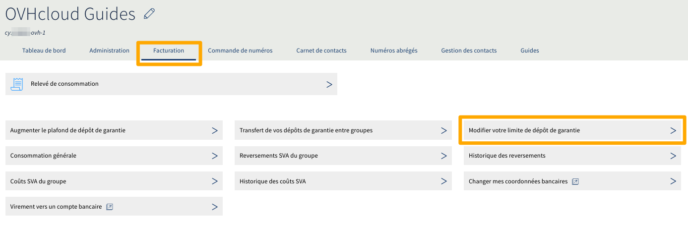
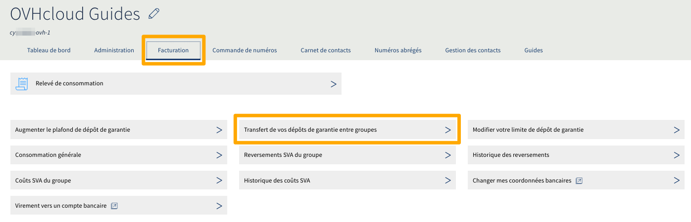

**Dernière mise à jour le 09/03/2020**

## Objectif
Vos lignes téléphoniques OVHcloud appartiennent à un ou plusieurs groupes de téléphonie. Chaque groupe possède un plafond de hors forfait autorisé que vous pouvez ajuster selon vos besoins.

**Découvrez comment gérer le plafond de hors-forfait de vos services VoIP.**

## Prérequis

- Être connecté à votre [espace client OVHcloud](https://www.ovh.com/auth/?action=gotomanager).
- Disposer d'au moins un groupe de téléphonie.

## Généralités

Chaque groupe de téléphonie possède une autorisation de hors-forfait globale. C'est un hors forfait maximum par mois qui ne pourra être dépassé par votre groupe, c'est-à-dire par l'ensemble des lignes et numéros qui le composent.
Cette autorisation de hors-forfait est en fait composée de 2 entités :

- **La limite de base**, une valeur non personnalisée.
- **Le dépôt de garantie**, un dépôt d'argent qui peut vous être restitué sur demande.

Par défaut, la limite de base est à 150€ HT et le dépôt de garantie à 0 € HT. Vous avez donc, par défaut, une autorisation de hors-forfait à 150€ HT par groupe.

> [!primary]
> Cette limitation est obligatoire. Celle-ci va vous éviter d'avoir une facture hors-normes en cas de piratage de votre ligne SIP.
> Pour éviter ce dernier cas de figure, nous vous recommandons de [sécuriser votre ligne SIP](https://docs.ovh.com/fr/voip/securiser-ligne-sip/).  
> 

### Exemple

Le groupe G contient une ligne A et une ligne B et a une autorisation de hors-forfait à 150€ HT par mois. 
Au cours du mois:

-   A fait un hors forfait de 50€ HT
-   B fait un hors forfait de 90€ HT

{.thumbnail}

Il ne reste donc plus que 10€ HT (150-(50+90)=10) de hors-forfait autorisé pour le reste du mois et pour l'ensemble des lignes.

#### Comment augmenter le hors forfait autorisé ? 

Selon vos besoins, deux méthodes existent pour augmenter l'autorisation de hors-forfait. Ces deux méthodes peuvent être cumulées.

Vous pouvez augmenter la limite de base du groupe à 300€ sans verser d'argent, en [suivant ces instructions.](https://docs.ovh.com/fr/voip/gestion-du-depot-de-garantie-et-de-la-limite-hors-forfait/#augmenter-la-limite-de-base)

Pour l'exemple cité plus haut :

{.thumbnail}

Vous pouvez également augmenter votre dépôt de garantie en [suivant cette méthode](https://docs.ovh.com/fr/voip/gestion-du-depot-de-garantie-et-de-la-limite-hors-forfait/#augmenter-le-depot-de-garantie). 

Pour l'exemple cité plus haut :

{.thumbnail}

> [!primary]
>
> En cas de dépassement du hors-forfait autorisé sur votre groupe de téléphonie, vous ne pourrez pas augmenter la limite de base du groupe. Vous devrez alors augmenter votre dépôt de garantie.
> Pour en savoir plus, reportez-vous à la partie [Qu'arrive t-il en cas de dépassement ?](https://docs.ovh.com/fr/voip/gestion-du-depot-de-garantie-et-de-la-limite-hors-forfait/#qu-arrive-t-il-en-cas-de-depassement) en bas de ce guide.
>

## En pratique

### Augmenter la limite de base

Connectez-vous à votre [espace client OVHcloud](https://www.ovh.com/auth/?action=gotomanager){.external}, sélectionnez l'onglet `Telecom`{.action} puis la rubrique `Téléphonie`{.action} et enfin votre groupe de téléphonie.
Dans l'onglet `Facturation`{.action}, cliquez sur `Modifier votre limite de dépôt de garantie`{.action}.

{.thumbnail}

Choisissez le montant de votre limite. Une lecture des contrats relatifs à cette limite est demandée. Cochez ensuite la case d'acceptation de ces contrats puis cliquez sur `Modifier`{.action}.

{.thumbnail}

Vous pouvez revenir à 150€ HT à tout moment via la même méthode.

### Augmenter le dépôt de garantie

Connectez-vous à votre [espace client OVHcloud](https://www.ovh.com/auth/?action=gotomanager){.external}, sélectionnez l'onglet `Telecom`{.action} puis la rubrique `Téléphonie`{.action} et enfin votre groupe de téléphonie.
Dans l'onglet `Facturation`{.action}, cliquez sur `Augmenter le plafond de dépôt de garantie`{.action}.

{.thumbnail}

Sélectionnez le montant du dépôt parmi les choix proposés. Une lecture des contrats relatifs à cette commande est demandée. Cochez ensuite la case d'acceptation de ces contrats puis cliquez sur `Commander`{.action}. 

{.thumbnail}

Un bon de commande sera alors généré. Cliquez sur le numéro de bon de commande pour l'afficher et le payer.

{.thumbnail}

> [!primary]
> - Vous pouvez rajouter une somme par dessus un dépôt déjà existant, elle sera cumulée au premier.
> - Le dépôt de garantie ne peut pas servir à payer votre hors-forfait. Ce dépôt restera inactif tant qu'il ne sera pas récupéré.
>

### Comment récupérer le dépôt de garantie ?

Si votre dépôt de garantie est trop élevé pour vos besoins actuels, vous pouvez demander à nos services un remboursement total ou partiel. Dans votre espace client, cliquez sur `Besoin d'aide`{.action} en haut à droite puis sur `Demande d'assistance`{.action}.

### Les transferts entre groupes

Si vous possédez plusieurs groupes de téléphonie, vous pouvez ajuster leur hors-forfait autorisé en transférant, partiellement ou totalement, un dépôt de garantie d'un groupe à l'autre.

Connectez-vous à votre [espace client OVHcloud](https://www.ovh.com/auth/?action=gotomanager){.external}, sélectionnez l'onglet `Telecom`{.action} puis la rubrique `Téléphonie`{.action} et enfin votre groupe de téléphonie.
Dans l'onglet `Facturation`{.action}, cliquez sur `Transfert de vos dépôts de garantie entre groupes`{.action}.

{.thumbnail}

Sélectionnez le groupe « Source » qui va transférer le dépôt de garantie, choisissez le montant à transférer puis choisissez le groupe « Destination ». Confirmez le transfert en cliquant sur `Valider`{.action}. 

{.thumbnail}

> [!warning]
> Le transfert entre groupes n'est pas possible si le groupe source ou destination est suspendu pour dépassement du hors forfait autorisé.
>

### Qu'arrive t-il en cas de dépassement ?

Au cours du mois, vous recevrez des e-mails de notification sur votre adresse e-mail de contact lorsque:

- Votre hors-forfait dépasse 50% de l'autorisation
- Votre hors-forfait dépasse 80% de l'autorisation
- Votre hors-forfait dépasse 90% de l'autorisation

> [!warning]
> Lorsque votre hors forfait atteint 100% de l'autorisation, le groupe de téléphonie, ainsi que les lignes et numéros qui y sont attachés, sont automatiquement suspendus et inutilisables.
>

Si votre groupe est suspendu pour dépassement du hors-forfait autorisé, la première chose à faire est de s'assurer qu'il n'y a pas eu un piratage de votre ligne. Pour cela, consultez les appels émis par les lignes et numéros du groupe.

Connectez-vous à votre [espace client OVHcloud](https://www.ovh.com/auth/?action=gotomanager){.external}, sélectionnez l'onglet `Telecom`{.action} puis la rubrique `Téléphonie`{.action} et enfin votre groupe de téléphonie.

Dans l'onglet `Facturation`{.action}, cliquez sur `Consommation générale`{.action}.

{.thumbnail}

Si vous constatez des anomalies, commencez par [sécuriser votre ligne SIP](https://docs.ovh.com/fr/voip/securiser-ligne-sip/). 

Une fois ces vérifications effectuées, vous pouvez débloquer le groupe en [augmentant le dépôt de garantie du groupe](https://docs.ovh.com/fr/voip/gestion-du-depot-de-garantie-et-de-la-limite-hors-forfait/#augmenter-le-depot-de-garantie).

## Aller plus loin

Échangez avec notre communauté d'utilisateurs sur <https://community.ovh.com>.