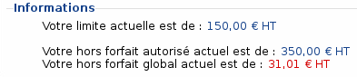
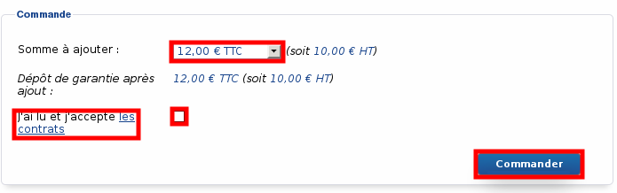
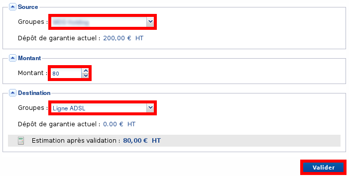

### Préambule {#préambule}

Avec la téléphonie OVH, votre groupe possède un plafond de hors forfait autorisé. Vous trouverez dans ce guide commande gérer ce plafond et le modifier.

Niveau : Débutant

------------------------------------------------------------------------

### Autorisation de hors-forfait, limite et dépôt de garantie, qu'est-ce que c'est ? {#autorisation-de-hors-forfait-limite-et-dépôt-de-garantie-quest-ce-que-cest}

Chaque groupe de téléphonie possède une autorisation de hors-forfait globale. C'est un hors forfait maximum par mois qui ne pourra être dépassé par votre groupe, c'est-à-dire par l'ensemble des lignes et numéros qui le composent.

Exemple {#exemple}
-------

Nous avons un groupe **G** qui contient une ligne **A** et une ligne **B** et qui a une autorisation de hors-forfait à **150€ HT** par mois.Au cours du mois:

-   **A** fait un hors forfait de **50€ HT**
-   **B** fait un hors forfait de **90€ HT**

Il ne reste donc plus que**10€ HT***(150-(50+90)=10)* de hors-forfait autorisé pour le reste du mois et pour l'ensemble des lignes **A** et **B.**

Cette limitation est obligatoire. Celle-ci va vous éviter d'avoir une facture hors-normes en cas de piratage de votre ligne SIP.

Il y a évidement d'autres sécurités possibles à configurer sur une ligne SIP pour éviter cela.

Cette autorisation de hors-forfait est en fait composée de **2 entités**:

-   **La limite de base**=&gt; valeur non personnalisée
-   **Le dépôt de garantie =&gt;**dépôt d'argent par virement qui sera restitué sur demande****

Par défaut, la limite de base est à **150€ HT** et le dépôt de garantie à **0€ HT**.Vous avez donc, par défaut, une autorisation de hors-forfait à **150€ HT** par groupe.

Vous pouvez gérer cette autorisation de hors-forfait :

-   Rendez vous sur le **manager Téléphonie**.
-   Cliquez sur l'onglet **"Groupe"** et choisissez le **groupe concerné**.

{.thumbnail}

-   Cliquez sur "**Facturation"**.
-   Cliquez sur "**Dépôt de garantie"**.

Vous pouvez consulter un résumé pour le groupe :

-   Cliquez sur **"Modifier votre limite**".

{.thumbnail}

Dans notre cas :

-   L'autorisation de hors-forfait est de **350€ HT** (limite de base **150€ HT** + dépôt de garantie **200€ HT**).
-   Le hors forfait total du groupe pour le mois en cours est de **31,01€ HT**.

------------------------------------------------------------------------

### Comment augmenter mon hors forfait autorisé ? {#comment-augmenter-mon-hors-forfait-autorisé}

Selon vos besoins, il est possible d'augmenter cette autorisation via le Manager. Pour cela, il y a**deux solutions (qui peuvent être cumulées)** :

#### Augmenter ma limite de base {#augmenter-ma-limite-de-base}

Vous pouvez augmenter votre limite de base à 300€ sans verser d'argent :

-   Cliquez sur **"Modifier votre limite**"
-   Cliquez sur **"Modifier"**
-   Choisissez le montant de votre limite
-   Une lecture des contrats relatifs à cette limite est demandée. Ensuite, **cochez la case**.
-   Cliquez sur "**Valider**"

{.thumbnail}

Vous pouvez revenir à **150€ HT** à tout moment via la même méthode.

#### Augmenter mon dépôt de garantie {#augmenter-mon-dépôt-de-garantie}

Vous pouvez augmenter votre dépôt de garantie en faisant un virement bancaire :

-   Cliquez sur **"Augmenter le plafond"**.
-   Choisissez la somme à ajouter.
-   Une lecture des contrats relatifs à cet ajout est demandée, ensuite**cochez la case**.
-   Cliquez sur **"Commander"**.

{.thumbnail}

Un bon de commande est alors généré, cliquez sur **"Payer par virement"**. Les coordonnées bancaires d'OVH s’afficheront pour que vous puissiez effectuer le virement.

Pour les montants de moins de 300 € HT, il est possible de payer grâce à votre compte OVH. Pour ce faire, cliquez simplement sur "**Payer ce bon de commande grâce à mon compte OVH**"

Vous pouvez rajouter une somme par dessus un dépôt déjà existant, elle sera cumulée au premier.

Sauf en cas de litige, ce dépôt ne servira pas à payer votre hors-forfait, il restera inactif tant qu'il ne sera pas récupéré.

------------------------------------------------------------------------

### Comment récupérer mon dépôt de garantie ? {#comment-récupérer-mon-dépôt-de-garantie}

Si votre dépôt de garantie est trop élevé pour vos besoins actuels, OVH peut vous faire un remboursement total ou partiel sur demande.Veuillez contacter le support par e-mail en suivant ce lien : [Support OVH](http://www.ovhtelecom.fr/support/support/support.xml){.external-link}.

------------------------------------------------------------------------

### Les transferts entre groupes {#les-transferts-entre-groupes}

Dans la gestion du hors-forfait autorisé, vous avez pu voir l'onglet **"Transfert entre groupes"**, Cette option est une solution alternative au remboursement pour ajuster un dépôt de garantie trop élevé si vous avez d'autres groupes.

Elle vous permet de faire un transfert total ou partiel du dépôt de garantie d'un groupe vers un autre groupe du même compte de facturation :

-   Cliquez sur **"Transfert entre groupes"**.
-   Cliquez sur **"Gérer"**.
-   Choisissez le **groupe source**.
-   Choisissez le **montant**.
-   Choisissez le **groupe destination**.
-   Cliquez sur **"Valider"**.

{.thumbnail}

Le transfert entre groupes n'est pas possible si le groupe source ou destination est suspendu pour dépassement du hors forfait autorisé.

------------------------------------------------------------------------

### Qu'arrive t-il en cas de dépassement? {#quarrive-t-il-en-cas-de-dépassement}

Au cours du mois, vous recevrez des mails de notifications sur votre adresse de contact lorsque:

-   Votre hors forfait dépasse **50%** de l'autorisation
-   Votre hors forfait dépasse **80%** de l'autorisation
-   Votre hors forfait dépasse **90%** de l'autorisation
-   Votre hors forfait dépasse **100%** de l'autorisation =&gt; **Groupe suspendu**

En effet, votre groupe ainsi que les lignes/numéros qui y sont rattachés seront suspendus et inutilisables si le hors-forfait autorisé est dépassé.

Si votre groupe est suspendu pour dépassement du hors-forfait autorisé, la première chose à faire est de **s'assurer qu'il n'y a pas eu un piratage de votre ligne.** Pour cela, consultez les appels émis:

-   Choisissez le **groupe concerné**.
-   Cliquez sur "**Consommation générale"**.

Une fois cette vérification faite, vous pouvez débloquer le groupe en faisant un [dépôt de garantie par virement](#Gestiondudépôtdegarantieetdelalimitehorsforfait-DepotDeGarantie).