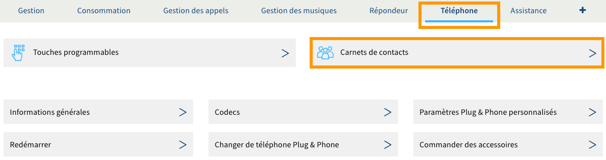
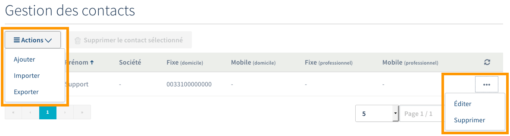
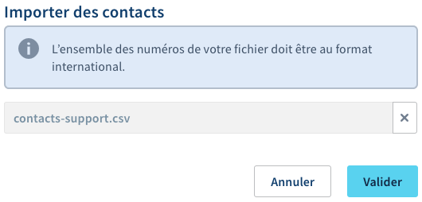

**Dernière mise à jour le 03/06/2020**

## Objectif

Votre ligne SIP OVHcloud vous permet de recevoir et d’émettre des appels. Afin de rendre les interactions avec vos correspondants plus faciles, vous avez la possibilité de créer un carnet de contacts permettant de retrouver ou d'identifier ceux-ci directement depuis vos téléphones, dans le répertoire ou lors d'un appel entrant.

**Apprenez à gérer le carnet de contacts et les numéros abrégés de vos lignes SIP OVHcloud.**

## Prérequis

- Disposer au moins d'une [ligne SIP OVHcloud](https://www.ovhtelecom.fr/telephonie/voip/){.external}.
- Être connecté à l'[espace client OVHcloud](https://www.ovhtelecom.fr/manager/auth/?action=gotomanager){.external}, partie `Télécom`{.action}.

## En pratique

### Étape 1 : accéder à la gestion du carnet de contacts

Vous avez la possibilité de gérer le carnet de contacts d'une seule ligne ou d'un groupe de lignes, permettant ainsi à toutes les lignes rattachées à ce groupe d'en bénéficier.

- **Pour accéder à la gestion du carnet de contacts d'une seule ligne** :

Connectez-vous à votre [espace client OVHcloud](https://www.ovhtelecom.fr/manager/auth/?action=gotomanager){.external} et assurez-vous de vous situer dans la section `Télécom`. Cliquez sur `Téléphonie`{.action} dans la barre de services à gauche, puis sélectionnez la ligne concernée. Positionnez-vous sur l'onglet `Téléphone`{.action} et cliquez sur `Carnets de contacts`{.action}.
 
{.thumbnail}

- **Pour accéder à la gestion du carnet de contacts d'un groupe de lignes** :

Connectez-vous à votre [espace client OVHcloud](https://www.ovhtelecom.fr/manager/auth/?action=gotomanager){.external} et assurez-vous de vous situer dans la section `Télécom`. Cliquez sur `Téléphonie`{.action} dans la barre de services à gauche, puis cliquez sur le groupe de lignes concerné. Cliquez enfin sur le bouton `Carnet de contacts`{.action}.
 
{.thumbnail}

### Étape 2 : gérer le carnet de contacts

La gestion du carnet de contacts s'effectue de la même manière, que vous ayez sélectionné une seule ligne ou un groupe de lignes. Poursuivez en fonction de la manipulation que vous souhaitez réaliser.

#### Créer un carnet de contact

Pour créer un carnet de contact, renseignez le nom du carnet dans la zone de texte en dessous de « Nom du carnet de contacts », puis cliquez sur le bouton `Créer le carnet de contacts`{.action}.

{.thumbnail}

#### Ajouter ou modifier un contact

Pour ajouter un nouveau contact, cliquez sur le bouton `Actions`{.action}, puis sur `Ajouter`{.action}. Pour modifier un contact existant, cliquez sur le bouton représentant trois points à droite du contact concerné, puis sur `Éditer`{.action}.

{.thumbnail}

Remplissez ensuite les informations demandées. Les numéros doivent être renseignés au format international (par exemple, « 0033100000000 » pour un numéro français). Une fois les informations complétées, cliquez sur le bouton `Valider`{.action} pour ajouter le contact. Répétez cette manipulation autant de fois que nécessaire.

{.thumbnail}

#### Importer des contacts

Pour importer des contacts dans le carnet de contacts, cliquez sur le bouton `Actions`{.action}, puis sur `Importer`{.action}. Dans la fenêtre qui s'affiche, cliquez sur le bouton `Fichier de contact`{.action}. Pour être accepté par l'outil d'import, le fichier doit être au format .csv et respecter une forme précise dans son contenu. Vous trouverez un exemple ci-dessous :

|group|surname|name|workPhone|workMobile|homePhone|homeMobile|countryCode|
|---|---|---|---|---|---|---|---|
|Aucune|OVH|Support|100000000| | |6000000000|33|

Vous pouvez également utiliser une version texte en séparant chaque celulle du tableau par un point-virgule (donnant par exemple : « Aucune;OVH;Support;100000000;;;6000000000;33 »). Une fois le fichier sélectionné dans la fenêtre d'import, cliquez sur le bouton `Valider`{.action}.

> [!warning]
>
> Si aucun indicatif pays n'est renseigné dans la colonne « countryCode », nous y ajouterons automatiquement l'indicatif correspondant au pays de votre identifiant client. 
>

{.thumbnail}

#### Télécharger le carnet de contacts

Pour télécharger la liste actuelle des contacts ajoutés dans le carnet, cliquez sur le bouton `Actions`{.action}, puis sur `Exporter`{.action}. Une fenêtre vous invitant à enregistrer le fichier apparaît alors.

Le fichier obtenu sera au format .csv.

#### Supprimer un ou plusieurs contacts

Pour supprimer un seul contact, cliquez sur le bouton représentant trois points à droite du contact concerné, puis sur `Supprimer`{.action}. Pour en supprimer plusieurs, cochez la case à gauche des contacts concernés, puis cliquez sur `Supprimer les contacts sélectionnés`{.action}.

{.thumbnail}

#### Supprimer un carnet de contacts

Pour supprimer un carnet de contacts, cliquez sur le bouton `Supprimer le carnet de contacts`{.action}, puis sur `Valider`{.action}.

### Étape 3 : utiliser le carnet de contacts sur votre téléphone

Afin que votre téléphone puisse utiliser le carnet de contacts ou récupérer les éventuelles modifications effectuées dans celui-ci, commencez par le redémarrer. Une fois votre téléphone redémarré, il devrait avoir téléchargé le nouveau carnet de contacts.

À noter que si vous utilisez un téléphone Cisco, seul le numéro du contact sera affiché (et non son nom et son prénom) lors d'un appel entrant, même si ce dernier est présent dans le carnet de contacts dans votre espace client. Ce comportement est spécifique aux téléphones Cisco. Si vous souhaitez afficher le nom de vos correspondants, vous devrez enregistrer ces informations dans votre téléphone. 

## Aller plus loin

Échangez avec notre communauté d'utilisateurs sur <https://community.ovh.com>.