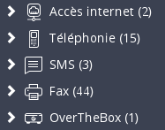
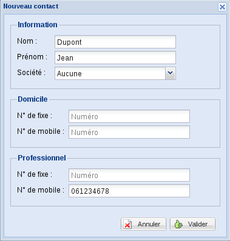
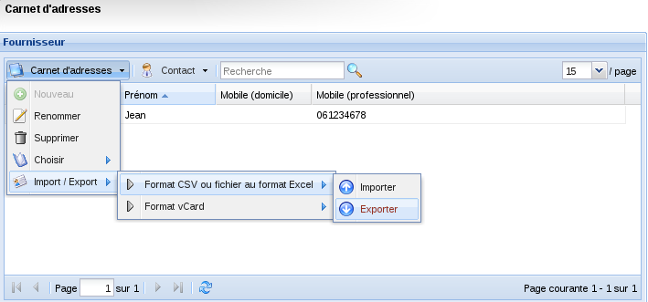

## Connexion à votre Espace Client

Afin de pouvoir importer votre carnet de contacts afin que celui-ci s'implémente sur votre téléphone, rendez-vous sur votre [espace client](https://www.ovhtelecom.fr/manager/#/), rubrique Télécom. 

Sélectionnez ensuite Téléphonie dans les menus de gauche.

{.thumbnail}

## 
Vous avez deux possibilités :

- Mettre un carnet de contacts par ligne (seul l'utilisateur de la ligne aura accès à celui-ci)
- Mettre un carnet de contacts par groupe (l'ensemble des lignes se trouvant dans le groupe possédera alors ce carnet)

Rendez vous sur la partie Carnet de contacts dans la navigation de la ligne ou dans la partie groupe.

{.thumbnail}
Cliquez sur Carnet d'adresses puis sur Nouveau.
Nommez alors votre nouveau carnet.

{.thumbnail}
Cliquez sur Contact puis sur Nouveau.

{.thumbnail}
Remplissez les champs nécessaires.

{.thumbnail}

## Prérequis

- Tout caractère accentué est automatiquement remplacé par son équivalent non accentué.

- Les caractères spéciaux ne sont pas acceptés dans l'import du fichier. Les contacts comprenant ce type de caractères ne seront pas importés et seront indiqués dans le mail de compte-rendu.

- Nous conseillons des carnets d'adresses ne dépassant pas 2000 contacts. 

- Tous vos contacts devront être sur la même feuille de votre tableur.

- L'import de votre carnet s'effectue de façon asynchrone, un message vous indique que votre carnet est en cours d'import et un rapport par mail sera effectué quelques minutes plus tard.

## Format du tableur

Si vous souhaitez intégrer un carnet déjà existant, ce dernier devra avoir la forme ci-contre dans un tableur.

{.thumbnail}
Si vous ouvrez ce fichier avec le bloc-notes vous aurez la forme ci-contre.

{.thumbnail}
Vous pouvez renseignez vos numéros au format +33xxxxxxxxx / 0033xxxxxxxxx / 0123456789 ou tout autre indicatif. 
Attention : Si aucun indicatif n'est renseigné sur vos numéros ou dans la colonne "countryCode" nous rajoutons automatiquement l'indicatif du pays de votre identifiant client.
Exemple : Votre identifiant client est renseigné en pays "Belgique", si dans votre carnet vous renseignez un numéro de type national "031111111" celui-ci sera automatiquement convertie en "+3231111111"
Vous avez également la possibilité d'exporter un carnet d'adresses déjà créé depuis l'espace client afin de disposer du patron.

{.thumbnail}

## Importation dans l'espace client
Afin d'effectuer un import de votre fichier, cliquez sur Carnet d'adresses puis sur import/export, Format CSV ou fichier au format Excel, Importer.

{.thumbnail}
Cliquez sur l'icône d'exploration, puis allez chercher votre fichier sur votre ordinateur.

{.thumbnail}
Importez ensuite votre fichier.

{.thumbnail}

