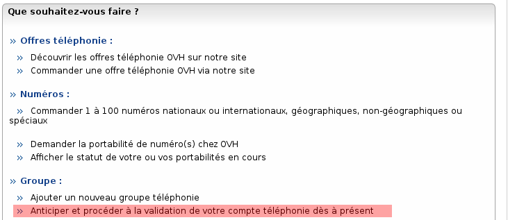

### Préambule {#préambule}

Lorsque vous réalisez votre première commande ou que vous souhaitez changer le NIC de facturation pour vos services de VoIP, une procédure de validation de compte est à réaliser.

Cette procédure vous permet de valider l'identifiant sur lequel nous allons réaliser la facturation de la VoIP.

**Sommaire :**

Niveau : Débutant

------------------------------------------------------------------------

### **Comment générer la procédure** {#comment-générer-la-procédure}

Lorsque**vous passez commande**, la procédure de validation VoIP est **automatiquement générée**. Cette procédure vous est envoyée au format PDF par **e-mail** à l'adresse définie sur le **NIC** (identifiant client OVH) Facturation.

L'objet du mail reçu est : **\[OVH - IMPORTANT\] Nous attendons votre procédure VoIP pour finaliser votre commande.**Vous pouvez également retrouver le mail depuis votre Manager via ces étapes :

-   Connectez-vous à votre Espace Client OVH : <https://www.ovhtelecom.fr/espaceclient/>.
-   Cliquez sur le lien "**Accéder à l'ancienne interface**".
-   Cliquez sur l'icône "**Administration**".
-   Cliquez sur l'icône "**Mes paramètres**".
-   Cliquez sur "**Historique des e-mails**".

Si vous souhaitez générer la procédure manuellement (dans le cadre d'un changement de NIC Facturation) :

-   Connectez-vous à votre Espace Client OVH : <https://www.ovhtelecom.fr/espaceclient/>.
-   Cliquez sur le lien "**Accéder à l'ancienne interface**".
-   Cliquez sur l'icône "**Téléphonie**".
-   Cliquez sur le bouton "**Ajouter**".
-   Cliquez sur le lien "**Anticiper et procéder à la validation de votre compte téléphonie dès à présent**".{.thumbnail}
-   Un formulaire est à remplir avec les coordonnées du propriétaire du compte bancaire à utiliser.
-   Une fois le formulaire validé, le **Manager**(Espace Client OVH) vous propose le **téléchargement** du **PDF** de la procédure.

------------------------------------------------------------------------

### **Réaliser la procédure** {#réaliser-la-procédure}

La procédure pour les clients **Français** est à renvoyer par **voiepostale** obligatoirement avec les **justificatifsdemandés**. Dans le cadre de la procédure, les justifications demandés sont :

-   ***Client particulier :***
    -   Dater et signer l'autorisation de prélèvement
    -   Joindre un chèque annulé **original** (Si vous ne possédez pas de chèque annulé, vous pouvez joindre une attestation de bon fonctionnement du compte bancaire à prélever, émise par votre conseiller bancaire)
    -   Photocopie recto/verso de votre pièce d'identité
-   ***Société :***
    -   Dater et signer l'autorisation de prélèvement
    -   Joindre un chèque annulé **original** (Si vous ne possédez pas de chèque annulé, vous pouvez joindre une attestation de bon fonctionnement du compte bancaire à prélever émise par votre conseiller bancaire)
    -   Photocopie recto/verso de votre pièce d'identité du gérant ou d'un dirigeant de la société
    -   Un papier entête de l'entreprise certifiant que la personne dépositaire du dossier est habilité à agir au nom de l'entreprise
    -   Un extrait K-Bis de moins de 3 mois
-   ***Association* :**
    -   Dater et signer l'autorisation de prélèvement
    -   Joindre un chèque annulé **original** (Si vous ne possédez pas de chèque annulé, vous pouvez joindre une attestation de bon fonctionnement du compte bancaire à prélever émise par votre conseiller bancaire)
    -   Photocopie recto/verso de votre pièce d'identité du président de l'association
    -   Copie de la publication au journal officiel des status de l'association
    -   Attestation du président de l'association indiquant que la personne dépositaire du dossier est habilitée à agir au nom de l'association

------------------------------------------------------------------------

### **Les variantes selon le pays** {#les-variantes-selon-le-pays}

Nos clients **Belges** et **Suisses** peuvent également commander des services VoIP. La procédure et les justificatifs demandés peuvent, pour ces pays, être envoyés par **e-mail** à l'adresse :

-   **procedure-be@ovh.com** pour les procédures **Belges**.
-   **procedure-ch@ovh.com** pour les procédures **Suisses**.

Les justificatifs à fournir sont :

-   ***Client particulier :***
    -   Photocopie recto/verso de votre pièce d'identité
    -   Preuve de domiciliation dans le pays (facture gaz, eau, électricité ou téléphone)
-   ***Société :***
    -   Photocopie recto/verso de votre pièce d'identité du gérant ou d'un dirigeant de la société.
    -   Un papier entête de l'entreprise certifiant que la personne dépositaire du dossier est habilitée à agir au nom de l'entreprise ou un document d'identification de l'entreprise.
    -   Preuve de domiciliation dans le pays (facture gaz, eau, électricité ou téléphone)
-   ***Association :***
    -   Photocopie recto / verso de votre pièce d'identité du président de l'association.
    -   Copie de la publication au journal officiel des statuts de l'association.
    -   Attestation du président de l'association indiquant que la personne dépositaire du dossier est habilitée à agir au nom de l'association.

------------------------------------------------------------------------

### Je n'arrive pas à ouvrir la procédure {#je-narrive-pas-à-ouvrir-la-procédure}

La procédure est générée au **formatPDF**, il vous faut donc utiliser un **lecteur** de **fichierPDF** pour pouvoir l'ouvrir. Nous vous **recommandons** d'utiliser **AdobeActobatReader** qui est gratuit et disponible sur Windows, Mac OS et Linux.

Vous pouvez le télécharger **gratuitement** via ce lien : <http://www.adobe.com/fr/products/reader.html>.
