Préambule {#préambule}
---------

La configuration en **file d'appel** vous permet de rediriger un appel entrant vers plusieurs lignes et donc vers **plusieurs de vos collaborateurs**. La ligne qui décroche prend l'appel. Différentes stratégies et configurations avancées sont possibles, nous développerons cela dans ce guide.Ce type de configuration est optimisée pour ne **pas perdre d'appel**. C'est idéal pour un petit support téléphonique, par exemple.Pour cela, l'appelant doit composer le numéro alias comme sur le schéma suivant :

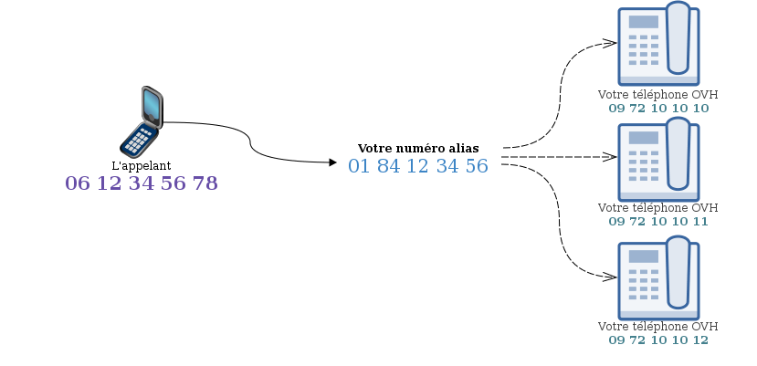{.thumbnail}

**Sommaire :**

Niveau : Intermédiaire

------------------------------------------------------------------------

### Prérequis {#prérequis}

-   Disposer d'un **numéro alias**
-   Disposer d'une ou plusieurs **lignes téléphoniques**

------------------------------------------------------------------------

### Configurer mon alias en file d'appel {#configurer-mon-alias-en-file-dappel}

Voici les manœuvres à exécuter pour configurer un alias en mode file d'appel :

-   Rendez vous sur le **manager Téléphonie.**
-   Cliquez sur "**Numéro**".
-   Choisissez le numéro alias concerné.
-   Cliquez sur "**Modifier le type du numéro**".
-   Cochez la case "**File d'appels**".
-   Cliquez sur "**Valider**".

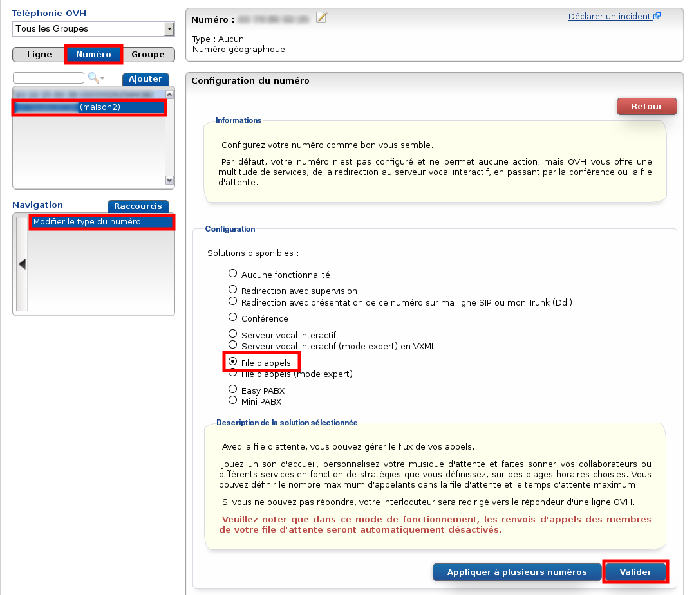{.thumbnail}

------------------------------------------------------------------------

### Configurer ma file d'appel {#configurer-ma-file-dappel}

Une fois que votre alias est en file d'appel, vous devez configurer cette dernière pour définir le comportement lors d'un appel entrant :

-   Connectez-vous à votre Espace Client OVH : <https://www.ovhtelecom.fr/espaceclient/>
-   Cliquez sur le lien "**Accéder à l'ancienne interface**".
-   Cliquez sur l'icône "**Téléphonie**".
-   Cliquez sur "**Numéro**".
-   Choisissez le numéro alias concerné.

Deux options seront obligatoirement utilisées, "**Gérer les options**" et "**Gérer les membres**".

#### Gérer les membres {#gérer-les-membres}

Dans ce menu, nous allons simplement définir les membres actifs de la file d'appel, c'est à dire les lignes qui vont sonner lors d'un appel entrant sur votre alias.

-   Cliquez sur "**Gérer les membres".**
-   Cliquez sur **"Gérer".**
-   Cliquez sur **"Ajouter un membre"**.
-   Cliquez sur les membres à ajouter.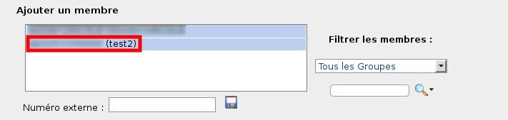{.thumbnail}

    Vous pouvez configurer un **membre externe** (ligne non OVH ou qui ne figure pas sur votre compte client). Cela est utile si vous souhaitez que votre mobile soit membre de la file d'appel par exemple.

    Indiquez ce numéro dans la partie**"Numéro externe"** et cliquez sur {.thumbnail} pour **valider** l'ajout.

    Les appels qui seront décrochés par ce membre externe seront automatiquement facturés en hors-forfait. Les offres que vous pouvez avoir sur vos lignes ne rentrent pas en compte pour un alias.

-   Cliquez ensuite sur **"Enregistrer"**

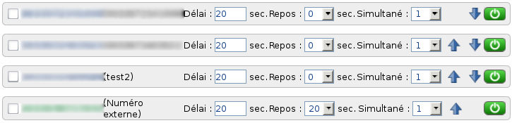{.thumbnail}

Les renvois d'appels paramétrés sur ces lignes seront automatiquement désactivés lors de cet enregistrement. Vous pourrez cependant les reconfigurer par la suite si besoin.

Une fois les membres enregistrés, il est possible de :

-   **Activer/désactiver** un membre via la bouton {.thumbnail}, Cette ligne ne sonnera pas lors d'un appel entrant, quelle que soit la stratégie.
-   **Changer l'ordre** des membres via les boutons {.thumbnail} . **L'ordre des membres peut être très important selon la stratégie choisie**, nous verrons cela dans le paragraphe suivant.
-   **Changer le délai** : Si la stratégie est de faire sonner les membres dans l'ordre, le téléphone de votre membre va sonner pendant ce temps défini avant de passer au suivant.
-   **Configurer le repos** : Votre membre ne pourra pas sonner pendant le temps de repos qui commence après avoir raccroché le dernier appel.

**Changer le nombre d'appels simultanés** : permet de définir le nombre maximum d'appels provenant de la file d'appel que votre membre peut avoir en même temps. Si vous ne souhaitez pas que vos membres gèrent plusieurs appels en même temps, laissez ce paramètre à 1.

Qu'importe le nombre d'appels simultanés de vos membres, la file d'appel priorisera toujours les membres qui ne sont pas en communication pour éviter les pertes d'appels.

**Gérer les options**

Une fois les membres définis, il faut indiquer la stratégie d'appel. C'est-à-dire le comportement de la file d'appel lors d'un appel entrant.

-   Cliquez sur **"Gérer les membres"**.
-   Cliquez sur **"Gérer"**.

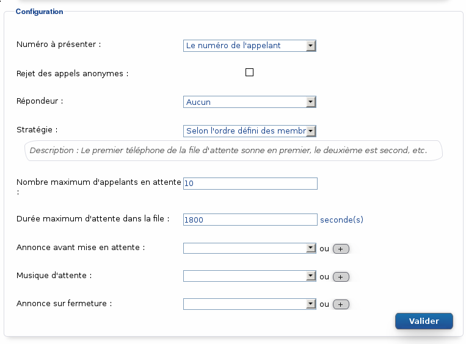{.thumbnail}

Détaillons ce qu'il est possible de configurer :

-   **Numéro à présenter :** Il est possible de paramétrer la présentation du numéro sur la ligne qui reçoit un appel entrant provenant de la file d'appel. Vous pouvez présenter le numéro de l'appelant, le numéro de l'alias en file d'appel, ou les deux.

    Parmi les téléphones fournis par OVH, seuls les téléphones Cisco SPA5XXG sont compatibles avec la présentation des deux numéros lors d'un appel entrant.

    ****

-   **Rejet des appels anonymes :**Si l'appelant est anonyme, l'appel sera directement rejeté, sans appliquer la stratégie choisie.

-   **Répondeur :** Choisissez un répondeur qui sera déclenché lorsque la durée maximum d'attente sera dépassée. L'appel sera rejeté après cette durée d'attente si vous ne choisissez pas de répondeur.

<!-- -->

-   **Stratégie :** Cela vous permet de choisir comment vont sonner vos membres définis. Tous en même temps ou les un après les autres, dans un ordre particulier.
-   **Nombre maximum d'appelants en attente :** Lorsque tous vos membres actifs sont occupés et indisponibles, les appels entrants sont parqués dans une file d'attente le temps qu'un membre se libère. Cette option permet de définir le nombre maximum d'appels dans cette file d'attente.Passé ce nombre, les appels entrants seront rejetés ou redirigés vers le répondeur paramétré.
-   **Durée maximum d'attente dans la file :**Cela définit le temps maximum qu'attendra un appelant avant d'être rejeté ou redirigé vers un répondeur si aucun membre ne décroche.
-   **Annonce avant mise en attente :** Définit le message qu'entendra l'appelant.
-   **Musique d'attente :** Cette musique sera entendue par l'appelant pendant l'attente dans la file.
-   **Annonce sur fermeture :** Cette musique sera entendue par l'appelant lorsque l'appel est rejeté si aucun répondeur n'est paramétré (à la fin du temps d'attente maximum par exemple).

    Pour ajouter une musique, cliquer sur {.thumbnail} et ajoutez un fichier son.Taille max. : 10 Mo.Formats principaux autorisés : wav, mp3, mp4, ogg et wma.

------------------------------------------------------------------------

### Configuration avancée {#configuration-avancée}

Avec ce que nous avons déjà vu, nous savons configurer une file d'appel prête à l'emploi qui fera sonner plusieurs téléphones selon la stratégie choisie et qui laissera les appelants en attente si tous vos membres sont occupés.

Il existe aussi des **options avancées** afin de personnaliser le comportement :

-   **Plages horaires**
-   **Jours de fermetures**
-   **Filtrages d'appels**

Nous allons voir ces différentes options dans cette partie.

#### Plages horaires {#plages-horaires}

Cette option vous permet de planifier les horaires d'utilisation de votre file d'appel chaque semaine.

-   Cliquez sur **"Gérer les plages horaires".**
-   Cliquez sur **"Gérer".**
-   Cochez la case **"Activation"**.

Exemple {#exemple}
-------

Si votre société possède un petit support téléphonique ouvert du lundi au vendredi, de 9h à 18h, la configuration des plages horaires vous permet de rediriger une personne qui appellerait à 18h30 ou le samedi directement vers un répondeur ou une autre ligne.

Voici ce que cela donne dans le manager :

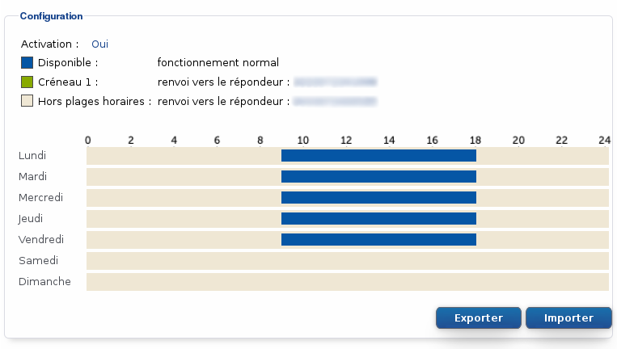{.thumbnail}

Dans cet exemple, nous utilisons deux types de créneaux :

-   **Disponible**, en bleu : C'est le fonctionnement normal de la file d'appel comme vu précédemment.
-   **Hors plages horaires**, en gris : L'appel sera renvoyé vers la cible choisie.

-   Cliquez sur **"Gérer"**.
-   Cliquez sur l'onglet**"Hors plages horaires"**.
-   Choisissez le **type de renvoi** : Répondeur, Ligne (OVH), Numéro Externe.

    Au même titre qu'un membre externe dans la file d'appel, la redirection vers un numéro externe dans le cadre d'une plage horaire sera forcement facturée en hors-forfait.

-   Indiquez le **numéro cible**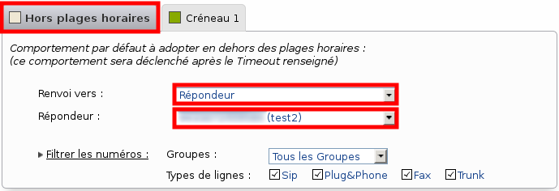{.thumbnail}
-   Cliquez sur un jour de la semaine.
-   Choisissez le type **"Disponible".**
-   Indiquez votre plage de disponibilité.
-   Cliquez sur **"OK"**.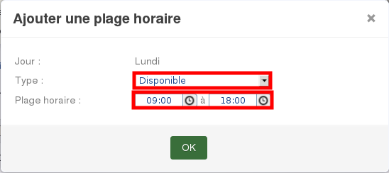{.thumbnail}
-   Répéter l'action pour les autres jours de la semaine.
-   Cliquez sur **"Valider".**

Autre Exemple {#autre-exemple}
-------------

Lorsque le support est fermé, je souhaite recevoir les appels entrant sur mon portable au 0033648XXXXXX jusqu'à 20h et le samedi matin de 9h à 12h.

Voici ce que j'obtiens dans le manager :

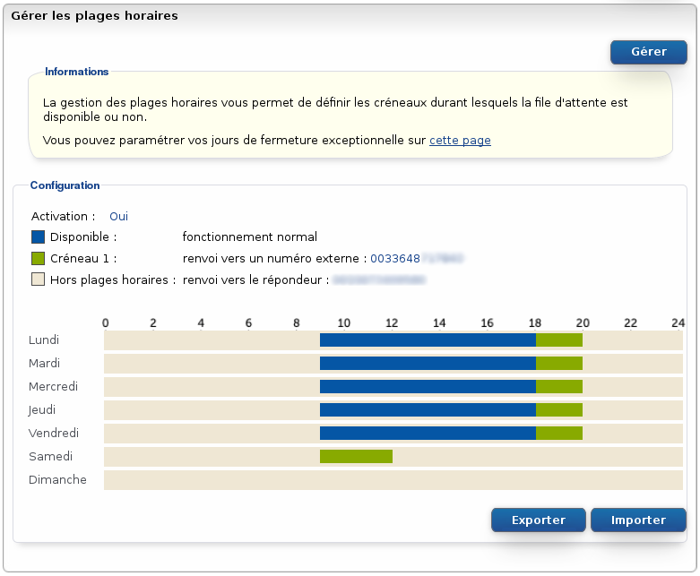{.thumbnail}

Nous avons utilisé un troisième type de créneaux, appelé**Créneau 1**.

La configuration est rigoureusement identique mis à part que nous devons choisir le type **Créneau 1** pour la cible de redirection et le jour de la semaine :

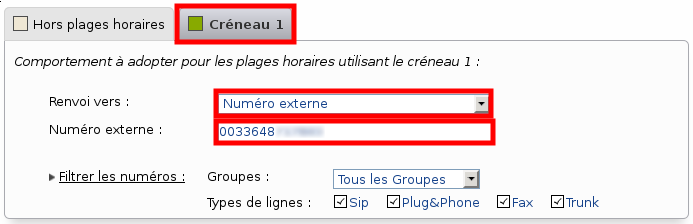{.thumbnail}

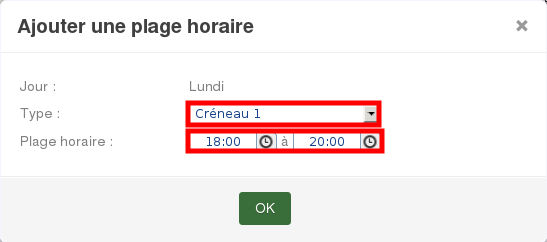{.thumbnail}

Pour désactiver la plage horaire, il suffit de :

-   Cliquer sur **"Gérer"**.
-   Décocher le case**"Activation"**.
-   Cliquer sur **"Valider"**.

#### Jours de fermetures {#jours-de-fermetures}

L'option **Jours de fermetures** est en fait un supplément aux plages horaires. Elle permet de rediriger les appels selon une fermeture exceptionnelle (qui n'arrivera qu'une seule fois). Vous pouvez ainsi anticiper jusqu'à plusieurs années à l'avance si vous le souhaitez.

-   Cliquez sur **"Gérer les fermetures"**.

Exemple {#exemple-1}
-------

Vos besoins :

-   Votre société est fermée du 6 au 10 avril 2015, vous souhaitez donc renvoyer tous les appels de cette semaine sur un répondeur.
-   Aussi, votre support sera exceptionnellement indisponible le 24 avril 2015, vous souhaitez donc rediriger les appels vers votre mobile ce jour-là.
-   La stratégie normale de file d'appel devra être jouée le reste du temps (plages horaires comprises).

Voici le résultat dans le manager :

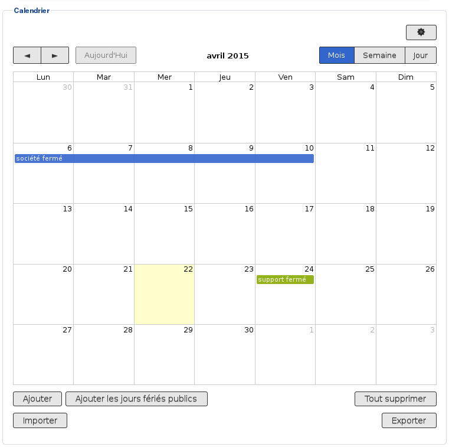{.thumbnail}

Les cibles de redirections étant celles des plages horaires, veuillez consulter la partie **[Plages Horaires](#Lesfilesd'appels-PlageHoraire)** afin de les configurer.

Voici ce qu'il faut indiquer pour répondre à nos besoins :

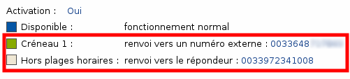{.thumbnail}

Le créneau bleu des jours de fermeture ne correspond pas au créneau "Disponible", il correspond au créneau "Hors plages horaires".Par conséquent, le créneau vide (blanc) correspond à la stratégie de file d'appel (sans exception).

Afin de rajouter ces périodes de fermetures exceptionnelles, il suffit de :

-   Cliquez sur **"Ajouter".**
-   Choisir le **type de créneaux** (voir la partie [Plages Horaires](#Lesfilesd'appels-PlageHoraire)).
-   Choisir la période.
-   Choisir si cette exception durera toute la journée ou pour un horaire défini.
-   Cliquez sur **"Créer"**.

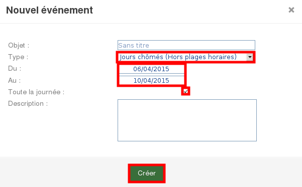{.thumbnail}

Il faut absolument que les plages horaires soit activées pour que les jours de fermetures soient pris en compte.

#### Filtrages d'appels {#filtrages-dappels}

En plus du rejet des appels anonymes, il est possible d'établir une liste noire ou une liste blanche pour les appels entrants sur votre file d'appel.

Liste blanche = Autoriser uniquement les numéros de la liste à appeler.

Liste noire = Interdire les numéros de la liste à appeler.

-   Cliquez sur **"Gérer les filtrages d'appels".**
-   Cliquez sur**"Gérer".**

Exemple {#exemple-2}
-------

Vous souhaitez n'autoriser que les numéros **français (indicatif +33)** et **belges (indicatif +32)** à appeler votre file d'appel :

-   Choisissez **"Activer la liste blanche"**;****
-   cliquez sur**"Valider"** ;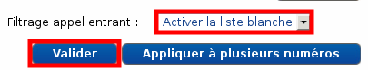{.thumbnail}
-   cliquez sur **"Manuellement"**;****
-   cochez le **numéro alias concerné** (votre file d'appel) ;
-   cochez **"Appels entrants - Liste blanche"**;****
-   indiquez **+33** dans **"Numéro"**;****
-   cliquez sur "**Valider"**.

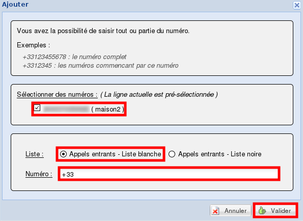{.thumbnail}

-   Recommencez avec **+32**.

Le bouton {.thumbnail} vous permet de configurer très rapidement plusieurs numéros dans la liste de filtrage.

Pour retirer un numéro d'une liste de filtrage :

-   Cochez ce numéro ;
-   cliquez sur **"Supprimer"**.

Pour désactiver la file d'appel ou basculer de liste noire à liste blanche :

-   Choisissez le **"Filtrage appel entrant"**;****
-   cliquez sur**"Valider"**.

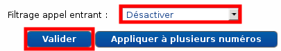{.thumbnail}

------------------------------------------------------------------------

### Résumé du fonctionnement global {#résumé-du-fonctionnement-global}

Dans les parties précédentes, nous avons vu en détail comment configurer les différentes options disponibles et leur action :

-   **stratégie de base ;**
-   **plages horaires ;**
-   **jours exceptionnels ;**
-   **filtrages d'appels.**

Voici un organigramme représentant la gestion globale de ces différentes options et leurs priorités lors d'un appel entrant sur une file d'appel :

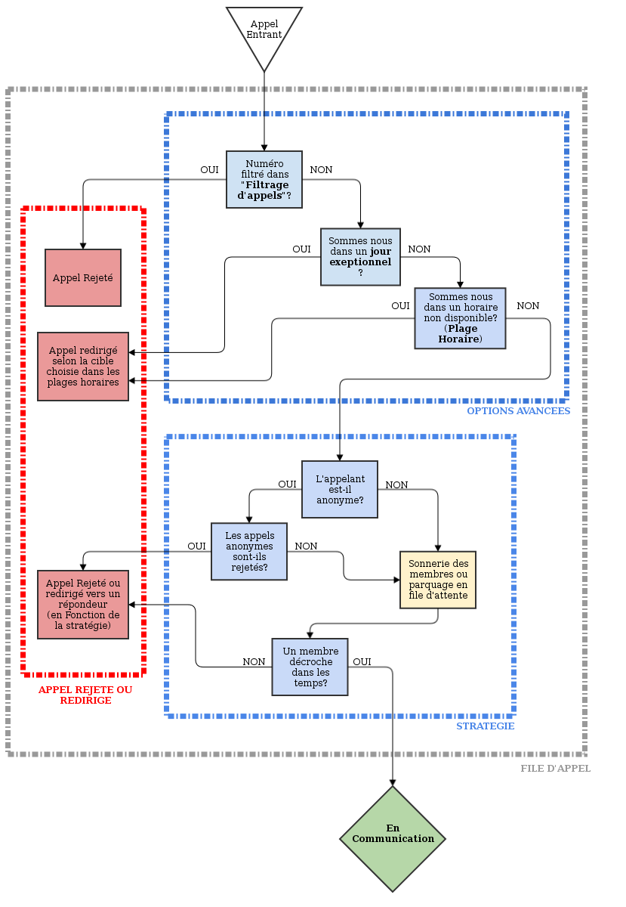{.thumbnail}

------------------------------------------------------------------------

### File d'appel mode Expert {#file-dappel-mode-expert}

Nous avons vu que la file d'appel permet de réceptionner les appels sur plusieurs téléphones de façon intelligente.

Il existe un autre type de file d'appel qui permet de personnaliser d'avantage le comportement avec par exemple la possibilité de :

-   **créer plusieurs étapes ;**
-   **temporiser ;**
-   **jouer un son à n’importe-quel moment ;**
-   **etc.**

------------------------------------------------------------------------

