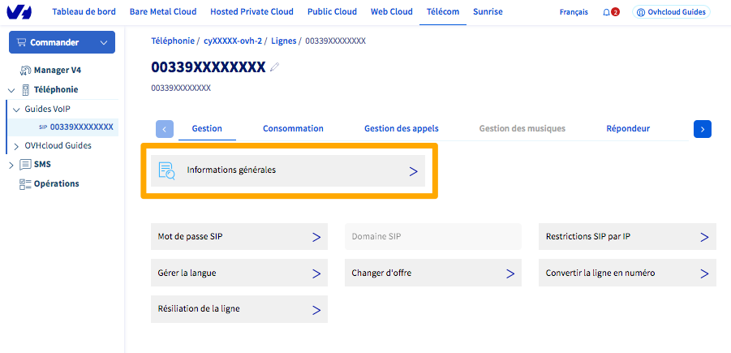
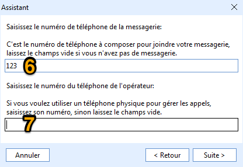
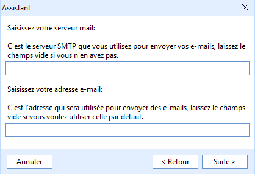
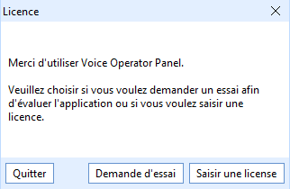
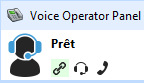

**Dernière mise à jour le 04/08/2022**

## Objectif

Le POPC ou « Poste Opérateur PC » est un logiciel qui virtualise un standard téléphonique, idéalement pour le traitement des appels entrants et des transferts internes/externes.

Il se présente sous la forme d'une application, installée sur votre PC sous Windows, qui prend la place d'un téléphone physique. Ainsi vous appelez, décrochez et gérez vos appels non pas en pianotant sur un combiné physique, mais depuis l'application sur votre PC.

**Découvrez comment installer et configurer le logiciel POPC pour l'utiliser avec une ligne SIP OVHcloud**

## Prérequis

- Disposer d'un PC sous Windows (7, 8, 10).
- Disposer de la [solution POPC OVHcloud](https://www.ovhtelecom.fr/telephonie/standard/) ainsi que de la ligne SIP associée.
- **Uniquement pour la version d'essai de POPC** : disposer d'une [ligne SIP OVHcloud](https://www.ovhtelecom.fr/telephonie/voip/) sans téléphone Plug & Phone associé.
- Être connecté à l'[espace client OVHcloud](https://www.ovh.com/auth?onsuccess=https%3A%2F%2Fwww.ovhtelecom.fr%2Fmanager&ovhSubsidiary=fr){.external}, partie `Télécom`{.action}.

{.thumbnail}

## En pratique

### Étape 1 : Retrouver et définir les identifiants de votre ligne SIP 

Vous devez disposer des trois informations suivantes afin de pouvoir enregistrer votre ligne :

|Information|Description|
|---|---|
|Login / User name|Il s'agit du numéro de votre ligne, au format international (exemple: 0033987654321)|
|Mot de passe SIP|Si vous ne le connaissez pas, vous devez modifier ce mot de passe depuis votre espace client OVHcloud.|
|Domain / Registrar|Le nom du serveur de téléphonie qui héberge votre ligne.|

#### Login et domain

Afin de retrouver votre **login** et votre **domain**, connectez-vous à votre [espace client OVHcloud](https://www.ovh.com/auth?onsuccess=https%3A%2F%2Fwww.ovhtelecom.fr%2Fmanager&ovhSubsidiary=fr). Dans la partie `Télécom`{.action}, cliquez sur `Téléphonie`{.action} puis sur votre groupe de téléphonie et enfin sur votre ligne SIP. Dans l'onglet `Gestion`, cliquez sur `Informations générales`{.action}.

{.thumbnail}

Vous retrouvez alors, dans le cadre « Informations SIP », votre **login** et votre **domain**.

{.thumbnail}

> [!primary]
>
> Dans l'image ci-dessus, le domain renseigné l'est à titre d'exemple. Veillez à bien vérifier quel **domain** est associé à votre ligne SIP.
>

#### Mot de passe SIP

Si vous ne connaissez pas votre **mot de passe SIP** ou que vous ne l'avez jamais modifié au profit d'un mot de passe fort, consultez notre guide pour [Modifier le mot de passe d'une ligne SIP](../modifier-mot-de-passe-ligne-sip/).

Vous pouvez utiliser un coffre-fort de mots de passe, comme [Keepass](https://keepass.info/){.external} afin de sauvegarder en toute sécurité votre mot de passe SIP.

### Étape 2 : télécharger le logiciel POPC

> [!primary]
>
> Si vous avez commandé une offre POPC OVHcloud, le dongle USB qui vous a été fourni fait office de clé de licence pour utiliser le logiciel. Le dongle USB ne contient pas le logiciel POPC. Vous devez donc le télécharger en suivant les étapes décrites ci-dessous.
>

Vous pouvez retrouver le lien de téléchargement du logiciel POPC sur [la page de présentation du logiciel](https://www.ovhtelecom.fr/telephonie/standard/popc_standard_votre_offre.xml) ou via ce [lien direct](http://www.voiceoperatorpanel.com/priv/VoiceOperatorPanel-OVH-setup.exe).

Comme indiqué sur la page de présentation, il est possible de tester une version d'essai du logiciel POPC. Celle-ci est valable pendant 30 jous à compter de son installation. Au delà de ce délai, l'enregistrement d'une ligne SIP sera automatiquement désactivé.

### Étape 3 : installation de POPC

Pour lancer l'installation du logiciel, sur votre PC, faites un clic droit sur le fichier nommé `VoiceOperatorPanel-OVH-setup.exe` et sélectionnez `Exécuter en tant qu'administrateur`{.action}.

Lancez l'installation et acceptez les contrats.

{.thumbnail}

Installez les pilotes du dongle USB en cochant la case appropriée, celle-ci étant décochée par défaut.
Si vous utilisez le logiciel sans avoir souscrit à l’offre POPC, il n'est pas nécessaire de la cocher.

{.thumbnail}

Choisissez le mode d'installation. Vous pouvez installer le logiciel `en tant qu'administrateur` ou choisir de l'`installer et exécuter avec l'utilisateur en cours`.

{.thumbnail}

Choisissez enfin le chemin d'installation. Par défaut, il s'agira de Program Files si vous avez choisi le mode d'installation `en tant qu'administrateur`.

Une fois validé, cliquez sur `Next`{.action} puis sur `Finish`{.action}.

Si vous avez choisi d’installer les pilotes pour le dongle USB, une nouvelle fenêtre apparaîtra pour effectuer cette procédure.

### Étape 4 : configuration de POPC

### Configuration via l'assistant d'installation

> [!primary]
>
> Les notions de **login**, **domain** et **mot de passe SIP** sont détaillées dans la [première partie de ce guide](#sip-credentials).
>

Lors de la première installation, un assistant vous permet de paramétrer votre ligne SIP.

Le `display` (1) est votre **login** au format international (exemple: 0033987654321).

Dans le champ `Nom d'utilisateur` (2), saisissez également votre **login** au format international (exemple: 0033987654321).

Dans le champ `Domaine` (3), saisissez le **domain** de votre ligne SIP.

Le port du serveur SIP est, par défaut, défini sur `5962`. Vous pouvez laisser cette valeur telle quelle.

{.thumbnail}

L'assistant vous propose ensuite de saisir un `nom d'utilisateur pour votre serveur SIP` (4). Il n'est pas nécessaire d'en définir un.

Veillez par contre à bien renseigner votre mot de passe SIP dans le champ prévu à cet effet (5).

{.thumbnail}

Laissez le `numéro de téléphone de la messagerie` (6) défini sur `123` car il s'agit bien du numéro pour joindre la messagerie de votre ligne SIP OVHcloud.

Laissez le champ `numéro de téléphone de l'opérateur` (7) vide.

{.thumbnail}

Si vous le souhaitez, vous pouvez configurer une adresse e-mail via le menu suivant pour synchroniser vos contacts. Sinon, laissez ces deux champs vides.

{.thumbnail}

Enfin, dans le dernier volet de configuration, choisissez vos périphériques d’entrée et de sortie audio par défaut ainsi que leurs niveaux.

{.thumbnail}

Un message vous confirmera la fin de la configuration. L'assistant vous proposera alors d'importer vos contacts Outlook si vous disposez d'un compte Office365.

Le dernier écran vous invite à choisir si vous effectuez un essai de 30 jours du logiciel POPC ou si vous disposez d'une licence.

- Si vous avez commandé l'offre POPC, veillez à ce que le dongle USB soit bien branché sur votre PC et cliquez sur `Saisir une licence`{.action}.
- Si vous avez installé le logiciel POPC dans le but de le tester, cliquez sur `Demande d'essai`{.action}.

{.thumbnail}

Vous quitterez alors l'assistant d'installation. L'interface principale de POPC s'ouvre alors et, si votre configuration SIP est correcte, l'icône de statut, en haut à gauche de l'interface, doit vous indiquer que votre compte est « prêt ».

{.thumbnail}

### Configuration dans le logiciel

> [!primary]
>
> Les notions de **login**, **domain** et **mot de passe SIP** sont détaillées dans la [première partie de ce guide](#sip-credentials).
>

En cas d'erreur de configuration initiale de votre ligne SIP ou si vous êtes amené à modifier votre mot de passe SIP, vous pouvez paramétrer votre ligne SIP depuis l'interface du logiciel POPC.

Une fois le logiciel ouvert, cliquez sur l'onglet `Paramètres`{.action} dans la partie droite de l'interface principale. Ouvrez alors le menu déroulant `Compte`{.action} pour retrouver les champs de configuration.

Aidez-vous du tableau et de l'image ci-dessous pour renseigner les informations de votre ligne SIP nécessaires à son enregistrement sur POPC.

{.thumbnail}

|Champ numéroté dans l'image|Information à renseigner|
|---|---|
| 1 |Votre **login** au format international (exemple: 0033987654321)|
| 2 |Votre **login** au format international (exemple: 0033987654321)|
| 3 |Le numéro `123` de la messagerie OVHcloud|
| 4 |Le **domain** de votre ligne|
| 5 |Le port du serveur SIP doit être `5962` ou `5060`|
| 6 |Le protocole doit être `UDP`|
| 7 |Votre **mot de passe SIP**|
| 8 |Le délai d'expiration d'enregistrement de la ligne doit être de minimum **1800** secondes|

Une fois que vous avez défini ces informations, cliquez sur `Sauvegarder`{.action}. Le logiciel va redémarrer et appliquer la nouvelle configuration SIP que vous avez définie.

Si votre configuration SIP est correcte, l'icône de statut vous indique que votre compte est « prêt ».

{.thumbnail}

Une fois votre configuration terminée, vous pouvez consulter notre guide dédié à la [prise en main du logiciel POPC](../popc-utilisation).

## Aller plus loin

Échangez avec notre communauté d'utilisateurs sur <https://community.ovh.com>.
