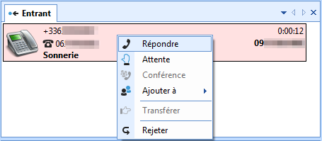
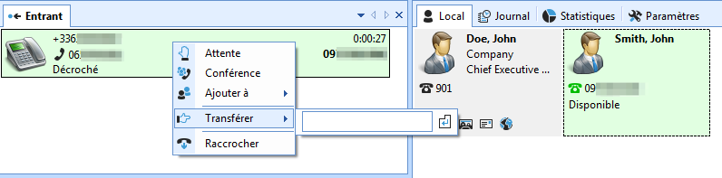
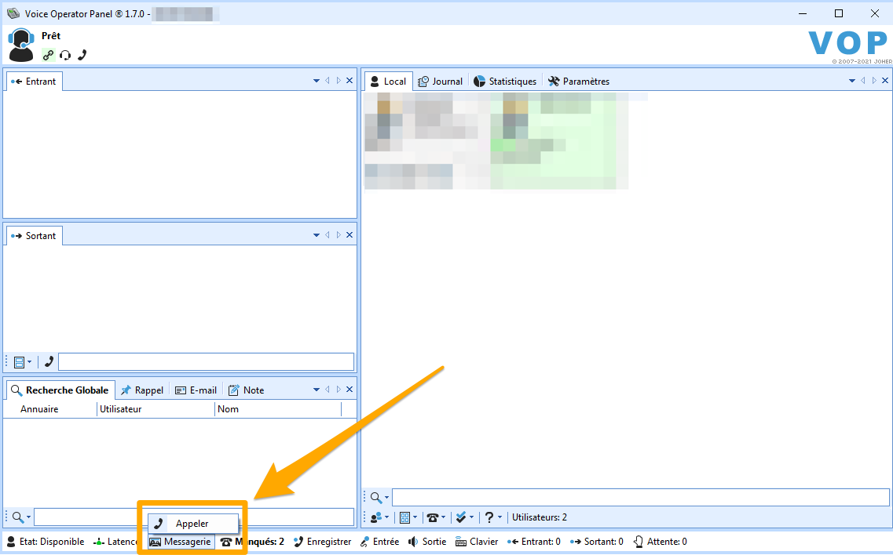

**Dernière mise à jour le 25/06/2021**

## Objectif

Le POPC ou « Poste Opérateur PC » est un logiciel qui virtualise un standard téléphonique, idéalement pour le traitement des appels entrants et des transferts internes/externes.

Il se présente sous la forme d'une application, installée sur votre PC sous Windows, qui prend la place d'un téléphone physique. Ainsi vous appelez, décrochez et gérez vos appels non pas en pianotant sur un combiné physique, mais depuis l'application sur votre PC.

**Découvrez comment utiliser les fonctionnalités de base du logiciel POPC**

> [!primary]
>
> Ce guide détaille les fonctionnalités basiques du logiciel et n'a pas vocation à être exhaustif quant à toutes les fonctions offertes. Vous retrouverez des modes d'emploi détaillés dans un dossier nommé « documentation » et situé dans le répertoire d'installation de votre logiciel.
>

## Prérequis

- [Avoir installé le logiciel POPC](/pages/telecom/voip/popc-installation) sur votre PC sous Windows.

## En pratique

L'interface du logiciel est composée de plusieurs zones pouvant être agencées et redimensionnées selon vos besoins. À des fins de compréhénsion, ce guide se base sur la version « par défaut » de l'interface, telle qu'elle est une fois le logiciel installé pour la première fois.

{.thumbnail}

Si vous avez modifié la disposition des zones et souhaitez revenir à la disposition initiale, cliquez sur la flèche pointant vers le bas, située en haut à droite de chaque zone, puis cliquez sur `Disposition` et `Réinitialiser`.

{.thumbnail}

### Gestion des appels

#### Répondre à un appel

Les appels entrants apparaissant dans la zone `Entrant`. Pour répondre à un appel, deux méthodes sont possibles :

- faites un double clic sur l'appel qui apparaît en rouge;
- faites un clic droit sur l'appel puis cliquer sur `Répondre`{.action}.

{.thumbnail}

#### Émettre un appel

Pour émettre un appel, depuis la zone `Sortant`, entrez le numéro dans le bandeau situé en bas de la zone. Cliquez ensuite sur le bouton « téléphone » à gauche ou appuyez sur votre touche « Entrée ».

{.thumbnail}

#### Mettre fin à un appel

Pour mettre fin à un appel entrant ou sortant, faites un clic droit sur l'appel en cours puis cliquez sur `Raccrocher`{.action}.

{.thumbnail}

#### Mettre un appel en attente

Pour mettre un appel en attente, deux méthodes sont possibles :

- faites un double clic sur l'appel en cours, celui-ci devient alors orange;
- faites un clic droit sur l'appel puis cliquez sur `Attente`{.action}.

{.thumbnail}

#### Reprendre un appel

Pour reprendre un appel qui a été mis en attente, deux méthodes sont possibles :

- faites un double clic sur l'appel en attente, celui-ci devient alors vert;
- faites un clic droit sur l'appel en attente puis cliquez sur `Décrocher`{.action}.

{.thumbnail}

#### Mettre en relation

Pour mettre deux correspondants en relation, plusieurs méthodes sont possibles :

- faites un « glisser-déposer » d'un appel sur l'autre;
- faites un « glisser-déposer » d'un appel vers un contact d'un annuaire;
- faites un clic-droit sur l'appel à transférer, placez votre curseur sur `Transférer`{.action} puis saisissez le numéro de destination.

{.thumbnail}

#### Accéder à la messagerie vocale

Pour accéder à la messagerie de votre ligne OVHcloud, deux méthodes sont possibles :

- composez et appelez le `123`;
- cliquez sur le bouton `Messagerie` dans la barre inférieure du logiciel. Cette méthode ne fonctionne que si vous avez correctement renseigné le numéro `123` dans les paramètres du logiciel (plus d'informations sur [ce guide](/pages/telecom/voip/popc-installation#configuration-dans-le-logiciel)).

{.thumbnail}

### Gestion des services

#### Les annuaires

L'onglet « Local » vous permet d'ajouter ou importer un ou plusieurs annuaires de contacts.

La distinction est faite ici entre :

- un annuaire **local** qui répertorie les numéros de téléphone de votre entreprise;
- un annuaire **externe** qui répertorie, par exemple, vos clients ou fournisseurs.

Par défaut, un annuaire local est déjà créé dans votre interface

- Pour créer un nouvel annuaire, cliquez sur le bouton en bas à gauche de la zone puis cliquez sur `Annuaire` > `Ajouter` > `Local` ou `Externe` et nommez cet annuaire. Cela créera alors un onglet séparé dans lequel vous pourrez créer ou importer des contacts.

- Pour importer un annuaire, cliquez sur le bouton en bas à gauche de la zone puis cliquez sur `Annuaire` > `Importer`. Choisissez alors le format de votre annuaire à importer.

- Pour importer un contact existant dans un annuaire déjà défini, sélectionnez l'onglet de cet annuaire puis cliquez sur `Utilisateur` > `Importer`. Choisissez alors le format de votre contact à importer.

- Pour ajouter un contact individuel, sélectionnez l'onglet de l'annuaire de votre choix puis cliquez sur `Utilisateur` > `Ajouter`.

Des menus similaires vous permettent de supprimer, renommer, exporter un contact ou un annuaire.

#### Le journal d'appels

Les différents appels que vous avez reçus et émis sont tous en mémoire dans votre journal d'appels.

Vous pouvez appeler directement l'un de vos correspondants depuis le journal en faisant un double clic sur l'appel ou un clic droit puis `Appeler`{.action}.
 Vous pouvez également ajouter l'un des numéros à un annuaire en faisant un clic droit sur l'appel puis en cliquant sur `Ajouter à`{.action} et en choisissant l'annuaire.

Les boutons situés en haut du journal vous permettent d'afficher le journal des appels des périodes précédentes.

- Utilisez les boutons `<` et `>` pour passer d'une journée à une autre.
- Utilisez les boutons `<<` et `>>` pour passer d'une semaine à une autre.

{.thumbnail}

En bas de cette zone, un bouton vous permet de filtrer les entrées du journal par types d'appels (entrants, sortants, etc...). Vous y trouverez également un bouton permettant d'afficher une légende des pictogrammes affichés à gauche de chaque appel

{.thumbnail}

#### Supervision des lignes

Vous pouvez voir en temps réel, dans votre annuaire **local**, si des postes supervisés sont soit en communication soit disponibles.
 Ainsi, vous pouvez aisément savoir si vous pouvez ou non transférer un appel à l'un(e) de vos collègues.

Vous pouvez aussi intercepter un appel à destination d'une ligne supervisée, par exemple si l'un(e) de vos collègues est absent(e) et que son téléphone sonne.

> [!warning]
> Pour que la supervision soit fonctionnelle, la ligne supervisée et votre compte SIP doivent se trouver dans le même groupe de facturation OVHcloud. Retrouvez plus d'informations dans notre guide pour [gérer vos groupes de téléphonie](/pages/telecom/voip/regrouper_services_telephonie#regrouper-lignes).
>

Pour activer la supervision, faites un clic droit sur une ligne à superviser, cliquez sur `Contact`{.action} puis `Présence`{.action} et enfin sur `Activer`{.action}.

{.thumbnail}

Des pictogrammes vous permettent de distinguer l'état de la ligne.

{.thumbnail}

##### **Intercepter un appel**

Vous pouvez intercepter un appel en vous rendant dans l'annuaire **local**. Faites un clic droit sur la ligne en train de sonner puis cliquez sur `Intercepter`{.action}.

{.thumbnail}

### Gestion des paramètres

De nombreux paramètres peuvent être modifiés. Si vous rencontrez des difficultés à utiliser le logiciel suite à une personnalisation des paramètres, nous vous conseillons de réinitialiser ces derniers en cliquant sur le bouton `Réinitialiser`{.action} situé en bas à droite du volet `Paramètres`.

Vous pourrez alors rétablir les paramètres nécessaires à la configuration de votre ligne SIP OVHcloud en vous aidant de notre guide pour [installer le logiciel POPC](/pages/telecom/voip/popc-installation#configuration-dans-le-logiciel).

### Optimisation des codecs

Pour améliorer la qualité de vos communications ou résoudre d'éventuelles anomalies lors de reprises d'appels mis en attente, nous vous conseillons d'optimiser les codecs dans les paramètres du logiciel.

Pour cela, cliquez sur `Paramètres`{.action} puis sur `Réseau`{.action}. Sélectionnez `G.711A` comme codec préféré.

{.thumbnail}

Validez les modifications en cliquant sur `Sauvegarder`{.action}. Le logiciel va alors redémarrer pour appliquer cette nouvelle configuration.

## Aller plus loin

Échangez avec notre communauté d'utilisateurs sur <https://community.ovh.com>.
