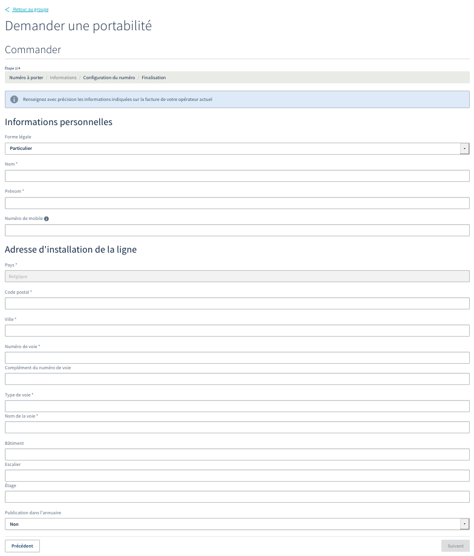
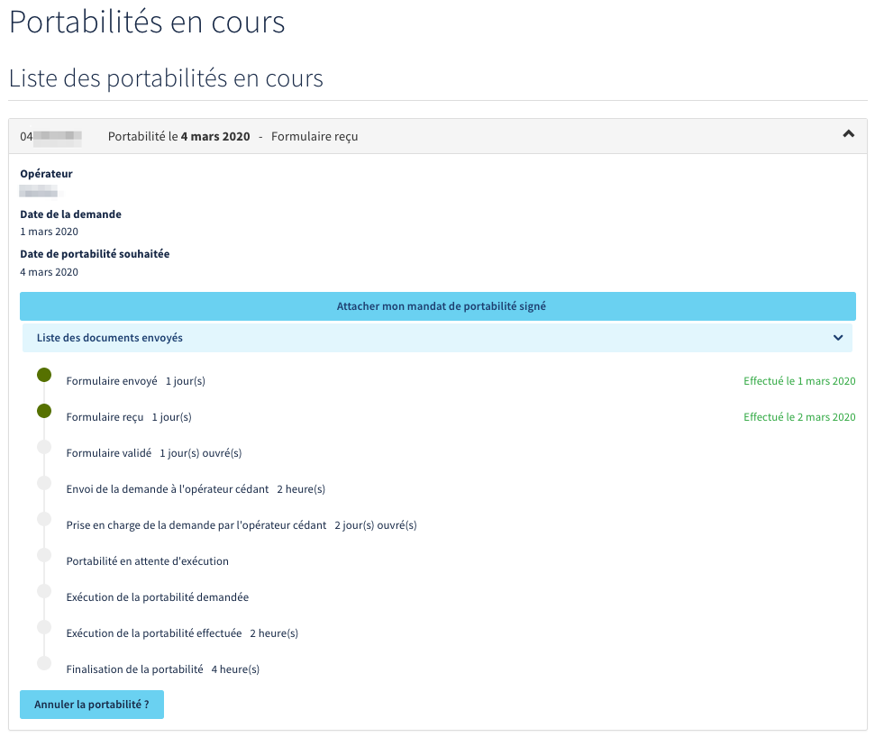

**Dernière mise à jour le 02/03/2020**

## Objectif
La portabilité permet à un abonné de conserver son numéro de téléphone lorsqu'il souhaite changer d'opérateur. Toute demande doit alors suivre un processus comportant plusieurs étapes.

**Découvrez comment porter un ou plusieurs numéros belges chez OVHcloud et suivre l'avancement de votre demande de portabilité.**

## Prérequis

- Disposer d'au moins un numéro de téléphone chez un autre opérateur en Belgique.
- Pour les numéros géographiques, justifier d'une adresse postale correspondant à la zone du ou des numéros concernés.
- Disposer d'une offre [VoIP OVHcloud](https://www.ovhtelecom.fr/telephonie/){.external}.
- Être connecté à l'[espace client OVHcloud](https://www.ovhtelecom.fr/manager/auth/?action=gotomanager){.external}, partie `Télécom`{.action}.

## En pratique

### Étape 1 : préparer sa demande de portabilité

Selon le type du ou des numéros que vous souhaitez porter chez OVHcloud, le processus à suivre sera différent. Afin que votre demande de portabilité arrive au plus vite à son terme, nous vous invitons à prendre en considération les recommandations suivantes :

- assurez-vous de connaître les informations du titulaire actuel de la ou des lignes concernées (comme son nom et prénom, son adresse, etc.) ;

- entamez de préférence la démarche de portabilité lorsque le ou les numéros concernés sont toujours actifs chez votre opérateur actuel. N'en demandez pas la résiliation durant le processus de portabilité ;

- assurez-vous de connaître le type du ou des numéros que vous souhaitez porter : celui-ci déterminera le processus à effectuer (si vous avez un doute, votre opérateur actuel peut vous confirmer le type de numéro que vous possédez).

|Type de numéro|Description|
|---|---|
|Numéro isolé|Il s'agit d'un numéro ne faisant pas partie d'une tranche de numéros (comme celui d'une ligne ADSL ou d'une ligne téléphonique seule). Un mandat de portabilité est nécessaire pour effectuer la demande. Celui-ci vous sera transmis par OVHcloud durant les étapes du processus de portabilité.|
|Tranche de numéros (SDA)|Comme son nom l'indique, il s'agit d'une tranche de plusieurs numéros. La totalité des numéros de la tranche doit être portée, la portabilité partielle étant impossible. Un mandat de portabilité est nécessaire pour effectuer la demande. Celui-ci vous sera transmis par OVHcloud durant les étapes du processus de portabilité.|

### Étape 2 : demander la portabilité

Connectez-vous à votre [espace client OVHcloud](https://www.ovhtelecom.fr/manager/auth/?action=gotomanager){.external}, partie `Télécom`. Cliquez sur `Téléphonie`{.action} dans la barre de services à gauche, puis sélectionnez le groupe de facturation dans lequel le ou les numéros portés seront intégrés. 

Assurez-vous d'être positionné sur l'onglet `Tableau de bord`{.action} et cliquez sur `Demander une portabilité`{.action}.

{.thumbnail}

Dans la page qui apparaît, les deux types de demandes de portabilité sont proposés. 

Choisissez la demande selon que votre demande concerne  **Un numéro isolé** ou **Un ou plusieurs numéros appartenant à une tranche de numéros (SDA)**.

- Pour un numéro isolé, renseignez le numéro à porter au format international (il doit nécessairement commencer par 0032). 
- Dans le cas d'une tranche de numéros, renseignez le numéro de tête de ligne de la tranche concernée au format international (il doit nécessairement commencer par 0032). En cas de doute, votre opérateur actuel peut vous communiquer ce numéro. Cochez ensuite le bouton `Porter votre numéro principal et une partie des numéros Sélection Directe à l'Arrivée (SDA)`{.action} et renseignez successivement, dans la case prévue à cet effet, **chacun des numéros de votre tranche de numéros (SDA)**.

Sélectionnez enfin la date souhaitée de la portabilité, puis cliquez sur `Suivant`{.action}.

{.thumbnail}

Dans la page suivante, renseignez avec précision les informations personnelles du titulaire de la ligne ainsi que l'adresse complète d'installation de cette dernière. Précisez également si vous souhaitez voir apparaître vos numéros dans l'annuaire. Une fois ces données complétées, cliquez sur le bouton `Suivant`{.action}.

{.thumbnail}

Assurez-vous maintenant que le groupe de facturation qui apparaît est bien celui dans lequel les numéros portés doivent être intégrés. Si ce n'est pas le cas, modifiez-le en choisissant le bon groupe dans le menu déroulant.

Vous pouvez également configurer une redirection, effective une fois le numéro de tête de ligne porté, des appels réceptionnés sur ce numéro uniquement vers une de vos lignes. Utilisez le bouton `Choisir une ligne`{.action} pour la définir.

Si vous souhaitez utiliser un autre type de configuration pour ce numéro (comme une file d'appels par exemple), sachez que vous pourrez l'appliquer depuis votre espace client OVHcloud 48 heures avant la date effective de sa portabilité.

Vos choix faits, cliquez sur `Suivant`{.action}.

{.thumbnail}

La dernière étape vérifie l'exactitude des informations que vous avez renseignées. Si celles-ci sont valides, il ne vous reste plus qu'à finaliser votre demande de portabilité en cliquant sur `Commander`{.action} puis en validant le bon de commande qui vous sera présenté. 

### Étape 3 : joindre votre mandat de portabilité

Une fois votre demande de portabilité validée, vous recevrez un mandat de portabilité autorisant OVHcloud à porter les numéros souhaités. Complétez puis retournez-nous ce mandat **depuis votre espace client**, au format PDF. 

Pour cela, sélectionnez votre groupe de téléphonie dans la barre de services à gauche puis cliquez sur `Consulter mes portabilités en cours`{.action}. Cliquez alors sur `Attacher mon mandat de portabilité signé`{.action}, sous la demande de portabilité concernée, pour importer le mandat au format PDF. Celui-ci sera alors validé manuellement par nos services techniques.

> [!warning]
>
> - Dans le cas d'une portabilité d'une tranche de numéros (SDA), l'ensemble des numéros de la tranche doit être noté sur le mandat de portabilité. Tout mandat incomplet serait rejeté par votre opérateur cédant, ce qui entraînerait une annulation de votre demande de portabilité.
>
> - Le délai d'une portabilité pour un numéro belge étant relativement court, il est important de nous retourner votre mandat de portabilité le jour même de votre demande.

Avant cette validation du mandat par nos soins, vous pouvez, en cas d'erreur, supprimer le mandat actuel pour en attacher un autre. Pour cela, cliquez sur `Liste des documents envoyés`{.action} puis sur le bouton `...`{.action} à droite du mandat actuel et enfin sur `Supprimer`{.action}. 

{.thumbnail}

Pour suivre l'avancement de votre demande de portabilité, reportez-vous aux informations décrites dans l'étape 3 « [Suivre une demande de portabilité](https://docs.ovh.com/fr/voip/demander-la-portabilite-de-mon-numero/#etape-3-suivre-une-demande-de-portabilite){.external} » de cette documentation.

### Étape 4 : suivre une demande de portabilité

Connectez-vous à votre [espace client OVHcloud](https://www.ovhtelecom.fr/manager/auth/?action=gotomanager){.external}, partie `Télécom`. Cliquez sur `Téléphonie`{.action} dans la barre de services à gauche, puis sélectionnez le groupe de facturation sur lequel a été demandée la portabilité.

Assurez-vous d'être positionné sur l'onglet `Tableau de bord`{.action} et cliquez sur `Consulter mes portabilités en cours`{.action}.

{.thumbnail}

Dans la page qui apparaît, vous trouverez l'état de vos demandes de portabilité.

{.thumbnail}

Si, durant le processus, vous souhaitez annuler votre demande de portabilité, vous pouvez le faire grâce au bouton `Annuler la portabilité ?`{.action}.

Nous vous recommandons également de consulter régulièrement votre adresse e-mail. Des notifications peuvent en effet vous y être envoyées si une action de votre part est requise. 

> [!primary]
> En cas d'erreur ou de rejet de votre demande de portabilité, celle-ci sera automatiquement close. 
>
> Vous devrez alors procéder à nouvelle demande de portabilité, en tenant compte du motif de rejet de la première demande. 
>
> Le cas échéant, vous pouvez contacter notre support en cliquant successivement, dans votre espace client, sur `Besoin d'aide`{.action} puis `Demande d'assistance`{.action}. Une facture récente (moins de 3 mois) de votre opérateur cédant vous sera alors systématiquement demandée par nos services techniques.
> 

Vous trouverez ci-dessous un récapitulatif des différentes étapes du processus de portabilité d'un numéro belge chez OVHcloud :

|Avancement dans le processus|Description|Délai estimé|
|---|---|---|
|Demande envoyée à l'opérateur|La demande est envoyée à l'opérateur cédant|2 heures|
|Rapport intermédiaire de l'opérateur reçu|Après vérification des informations, l'opérateur confirme le lancement de la procédure de portabilité vers OVHcloud|1 jour ouvré|
|Numéro activé|48 heures avant la finalisation de la portabilité, le numéro est disponible dans votre espace client pour être configuré. Pour vous aider, reportez-vous aux informations décrites dans l'étape 5 « [Préparer la configuration des numéros portés](https://docs.ovh.com/fr/voip/portabilite-numero-belge/#etape-5-preparer-la-configuration-des-numeros-portes){.external} »|2 jours ouvrés|
|Rapport final de l'opérateur cédant|L'opérateur cédant confirme la portabilité. OVHcloud configure le numéro sur son réseau (routage). La portabilité est terminée et le numéro opérationnel|3 jours ouvrés|

### Étape 5 : préparer la configuration des numéros portés

Vous avez la possibilité de préparer la configuration du ou des numéros portés 48 heures avant que celle-ci soit effective. Ceci peut vous permettre de limiter, voire d'éviter, une coupure de service lors de votre changement d'opérateur pour OVHcloud.

Pour cela, et selon la configuration que vous souhaitez mettre en place sur vos numéros, reportez-vous aux instructions décrites dans notre documentation « [Choisir et appliquer une configuration pour un numéro alias](https://docs.ovh.com/fr/voip/quelle-configuration-est-adaptee-a-mes-besoins/){.external} ».

## Aller plus loin

Échangez avec notre communauté d'utilisateurs sur <https://community.ovh.com>.
