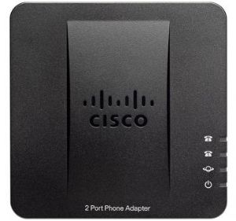
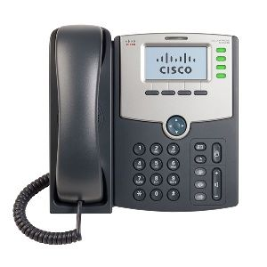
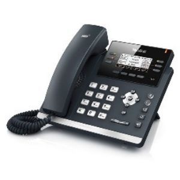

**Dernière mise à jour le 28/04/2020**

## Objectif

Les gammes de téléphones VoIP fournies par OVHcloud sont régulièrement renouvelées. 

**Retrouvez dans ce guide plusieurs références de téléphones précédemment fournis par OVHcloud ainsi que leurs guides d'utilisation.**

> [!warning]
>
Les guides de **dépannage** listés ci-dessous peuvent ne plus être à jour. Pour tout dépannage d'un téléphone fourni par OVHcloud, nous vous conseillons de consulter en priorité le guide [Dépanner son téléphone Plug and Phone](https://docs.ovh.com/fr/voip/depannage-telephone-plug-and-phone/){.external}.
>

## Les téléphones Cisco

### Cisco CP8851

{.thumbnail}

- [Utiliser le Cisco CP8851](https://docs.ovh.com/fr/voip/utiliser-cisco-8851/){.external}

### Cisco CP7841

{.thumbnail}

- [Utiliser le Cisco CP7841](https://docs.ovh.com/fr/voip/utiliser-cisco-7841/){.external}

### Cisco SPA112

{.thumbnail}
 
 - [Fiche technique de l'adaptateur Cisco SPA112](https://docs.ovh.com/fr/voip/adaptateur-spa112/){.external}
 - [Branchements de l'adaptateur Cisco SPA112](https://docs.ovh.com/fr/voip/branchements-spa112/){.external}
 - [Dépannage de l'adaptateur Cisco SPA112](https://docs.ovh.com/fr/voip/depannage-spa112/){.external}

### Cisco SPA504G

{.thumbnail}

- [Branchements du Cisco SPA504G](https://docs.ovh.com/fr/voip/branchements-spa504g/){.external}
- [Fonctionnalités du Cisco SPA504G](https://docs.ovh.com/fr/voip/fonctionalites-spa504g/){.external}
- [Dépannage du Cisco SPA504G](https://docs.ovh.com/fr/voip/depannage-spa504g/){.external}

## Les téléphones Gigaset

### Gigaset C530IP

{.thumbnail}

- [Branchements du Gigaset C530IP](https://docs.ovh.com/fr/voip/branchements-du-c530-ip/){.external}
- [Utiliser le Gigaset C530IP](https://docs.ovh.com/fr/voip/utiliser-gigaset-c530ip/){.external}
- [Dépannage du Gigaset C530IP](https://docs.ovh.com/fr/voip/depannage-c530-ip/){.external}

## Les téléphones LG

### LG8820

{.thumbnail}

- [Branchements du LG8820](https://docs.ovh.com/fr/voip/branchements-lg-8820/){.external}
- [Fonctionnalités du LG8820](https://docs.ovh.com/fr/voip/fonctionalites-lg-8820/){.external}
- [Dépannage du LG8820](https://docs.ovh.com/fr/voip/depannage-lg-8820/){.external}

## Les téléphones Polycom

### Polycom IP5000

{.thumbnail}

- [Branchements du Polycom IP5000](https://docs.ovh.com/fr/voip/branchements-ip5000/){.external}
- [Dépannage du Polycom IP5000](https://docs.ovh.com/fr/voip/depannage-ip5000/){.external}
 
## Les téléphones Yealink

### Yealink CP860

{.thumbnail}

- [Utiliser le Yealink CP860](https://docs.ovh.com/fr/voip/utiliser-yealink-cp860/){.external}

### Yealink T4X

{.thumbnail}

- [Utiliser le Yealink T4X](https://docs.ovh.com/fr/voip/utiliser-yealink-t4x/){.external}

### Yealink W56P

{.thumbnail}

- [Utiliser le Yealink W56P](https://docs.ovh.com/fr/voip/utiliser-yealink-w56p/){.external}

## Aller plus loin

[Dépanner son téléphone Plug and Phone](https://docs.ovh.com/fr/voip/depannage-telephone-plug-and-phone/){.external}

Échangez avec notre communauté d'utilisateurs sur <https://community.ovh.com>