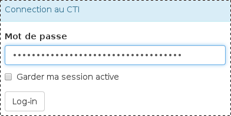
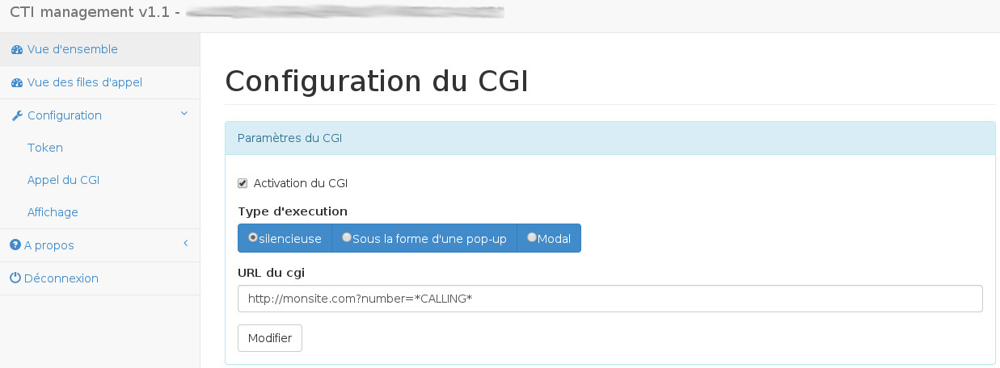

## Téléchargement

Il existe une démonstration qui exploite les évenements reçus sous la forme d'une interface web.

Celui-ci peut-être téléchargé [ici](https://events.voip.ovh.net/demo/cti_1.1.tar.gz)

Le projet sera prochainement disponible sur github.

## Page de login

Dans le champ mot de passe, saisissez le token.

{.thumbnail}

## Vue d'ensemble

Il est possible de voir les événements en cours et l'historique.

{.thumbnail}

## Vue des files d'appel

Dans la vue des files d'appel, l'ensemble des easyHunting/cloudHunting avec le token.

{.thumbnail}

## Configuration de l'affichage

Dans la configuration de l'affichage,

* Afficher seulement les numéros en cours d'appel" permet de filter dans la vue d'ensemble uniquement les files d'appels et les lignes avec des appels en cours.
* Réinitialiser le cache à minuit permet de réinitialiser l'ensemble des informations (statistiques, numéros enregistrés, etc...) à minuit.
* Réinitialiser le cache permet de procéder à la suppression du cache instantanément.

## Configuration du CGI

L'activation du CGI permet la remonté de fiches clientes lors de l'émission ou de la réception d'un appel en faisant appel à une URL. Celui-ci peut-être paramétré depuis le menu :
Configuration => Appel du CGI

Le site propose trois types d'éxecution d'URL :
Modal => dans le cas de l'ouverture d'une URL de manière "modale". 
 Il est parfois nécessaire d'ajouter une en-tête : Access-Control-Allow-Origin sur le site distant.
Popup => dans les cas de l'ouverture d'une URL sous la forme d'une popup.
Silencieux => dans le cas où la page ne contient pas de page visible (dans le cadre de l'execution d'un script CGI).
Certaines variables peuvent être déclarées comme dynamique dans l'URL :
*CALLING* => Le numéro de l'appelant
*CALLED* => Le numéro de l'appelé
*EVENT* => Le type d'évenement (start_ringing)

{.thumbnail}

