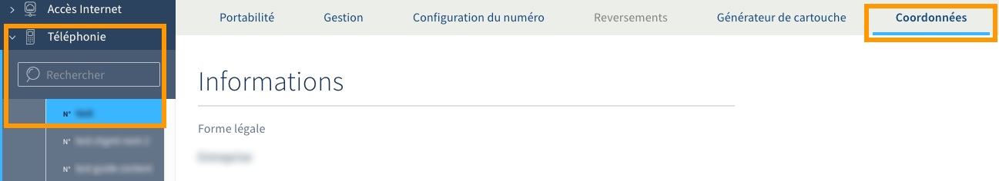
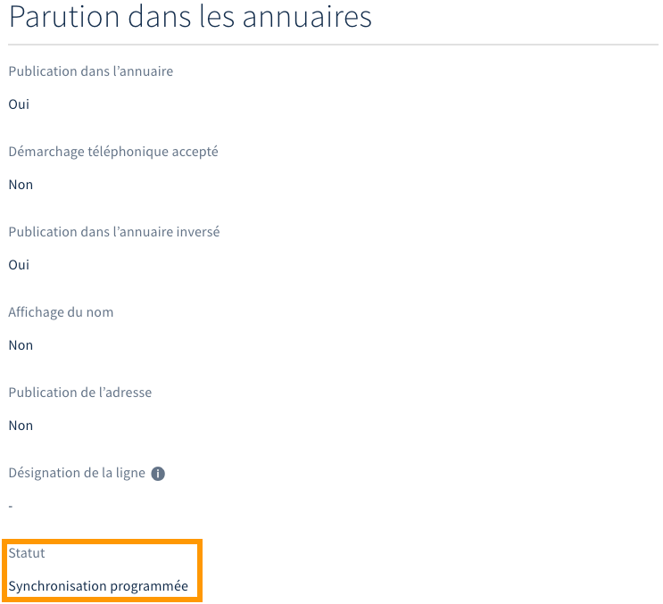

**Dernière mise à jour le 22/06/2022**

## Objectif

Lorsque vous disposez d'une ligne ou d'un numéro chez un opérateur, il est obligatoire d'y rattacher des coordonnées. Chez OVHcloud, vous avez la possibilité de réaliser cette démarche lors de votre commande ou par la suite, depuis votre espace client. Vous pouvez même choisir de publier ces informations dans les annuaires en ligne.

**Découvrez comment rattacher des informations à votre ligne ou numéro OVHcloud et les faire paraître dans les annuaires.**

## Prérequis

- Disposer d’un [numéro alias](https://www.ovhtelecom.fr/telephonie/numeros/){.external} ou d'une [ligne VoIP OVHcloud](https://www.ovhtelecom.fr/telephonie/){.external}.
- Être connecté à l'[espace client OVHcloud](https://www.ovh.com/auth/?action=gotomanager&from=https://www.ovh.com/fr/&ovhSubsidiary=fr){.external}, partie `Télécom`{.action} :

{.thumbnail}

## En pratique

### Étape 1 : comprendre l'obligation de renseigner ses coordonnées

Renseigner vos coordonnées est obligatoire pour l'ensemble de vos lignes et numéros OVHcloud. Si vous n'avez pas fourni ces informations lors de votre commande, vous serez invité à le faire par la suite depuis votre espace client.

Cette démarche est nécessaire pour deux raisons :

- **permettre à OVHcloud d'assurer la liaison vers les bons services d'urgence** : lorsque vous composez un numéro d'urgence sur votre téléphone, votre opérateur assure l'acheminement de cet appel vers le service d'urgence le plus proche de l'adresse d'installation de votre ligne ou de votre numéro ;

- **permettre à OVHcloud d'assurer la liaison vers votre nouvel opérateur lors d'une portabilité** : si vous décidez de porter votre numéro chez un autre opérateur, vous devrez alors lui fournir les informations de ce numéro. Celles-ci doivent correspondre aux données renseignées chez OVHcloud.

Assurez-vous ainsi d'indiquer et de maintenir à jour les coordonnées de l'ensemble de vos lignes et numéros OVHcloud.

### Étape 2 : modifier ses coordonnées et demander leur parution

Connectez-vous à votre [espace client OVHcloud](https://www.ovh.com/auth/?action=gotomanager&from=https://www.ovh.com/fr/&ovhSubsidiary=fr){.external}, partie `Télécom`. Cliquez sur `Téléphonie`{.action} puis sélectionnez la ligne ou le numéro OVHcloud concerné.

Positionnez-vous ensuite sur l'onglet `Coordonnées`{.action}. L'image ci-dessous montre l'accès pour modifier les coordonnées d'un numéro OVHcloud. Vous pourriez avoir davantage d'onglets si vous réalisez la manipulation pour une ligne OVHcloud.

{.thumbnail}

Descendez en bas de la page qui apparaît puis cliquez sur le bouton `Modifier les coordonnées`{.action}. 

Dès lors, complétez ou modifiez avec précision les champs se trouvant dans les sections `Informations` et `Adresse`. Dans la dernière section `Parution dans les annuaires`, deux possibilités s'offrent à vous :

- **vous souhaitez publier vos informations dans les annuaires en ligne** : choisissez `Oui`{.action} dans le menu déroulant en dessous de « Publication dans l’annuaire », puis complétez les champs supplémentaires ;

- **vous ne souhaitez pas publier vos informations dans les annuaires en ligne** : choisissez `Non`{.action} dans le menu déroulant en dessous de « Publication dans l’annuaire ».

Une fois toutes les informations complétées, cliquez sur le bouton `Appliquer les modifications`{.action}. Si vous avez choisi de publier vos informations, la parution dans les annuaires en ligne sera effective sous 1 à 30 jours. Ce délai est inhérent aux annuaires eux-mêmes, qui mettent à jour leur base de données une fois par mois.  

{.thumbnail}

### Étape 3 : suivre la parution de vos coordonnées

> [!primary]
>
> Cette étape s'applique uniquement si vous avez choisi de publier vos informations dans les annuaires en ligne. 
>

Vous avez la possibilité de suivre la parution de vos informations dans les annuaires en ligne depuis votre [espace client OVHcloud](https://www.ovh.com/auth/?action=gotomanager&from=https://www.ovh.com/fr/&ovhSubsidiary=fr){.external}, partie `Télécom`. Pour cela, une fois connecté, positionnez-vous sur l'onglet `Coordonnées`{.action} de la ligne ou du numéro OVHcloud concerné.

Descendez en bas de la page jusqu'à la section `Parution dans les annuaires`. Vérifiez alors le statut qui s'affiche : 

- **le statut est vierge** : ceci indique que vous n'avez pas demandé la parution de vos informations dans les annuaires en ligne ;

- **le statut indique « Synchronisation programmée »** : la mise à jour de vos informations est toujours en cours dans les annuaires en ligne. Pour rappel, celle-ci peut nécessiter un délai de 1 à 30 jours avant d'être effective ;

- **le statut indique « Synchronisé »** : les informations renseignées dans votre espace client sont celles qui s'affichent dans les annuaires en ligne. La dernière modification est donc arrivée à son terme.

Pour vérifier la parution de vos coordonnées, vous pouvez également vous rendre directement sur le site de l'annuaire concerné. Vous devrez alors rechercher votre ligne ou numéro OVHcloud.

{.thumbnail}

## Aller plus loin

Échangez avec notre communauté d'utilisateurs sur <https://community.ovh.com>.