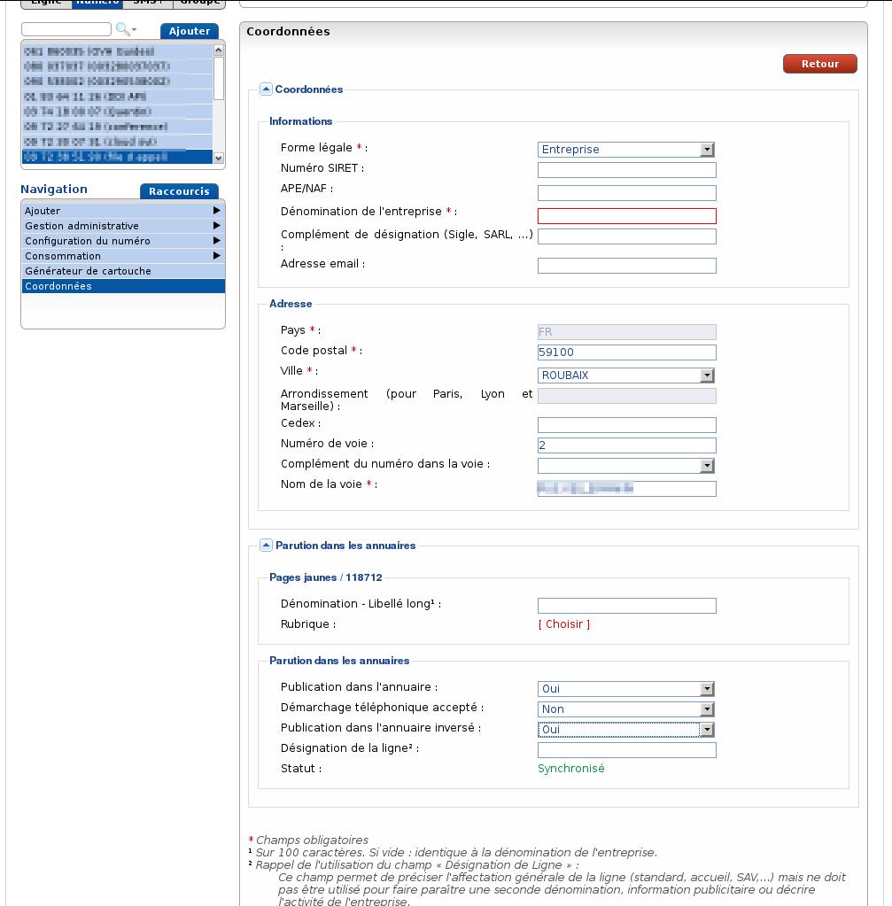
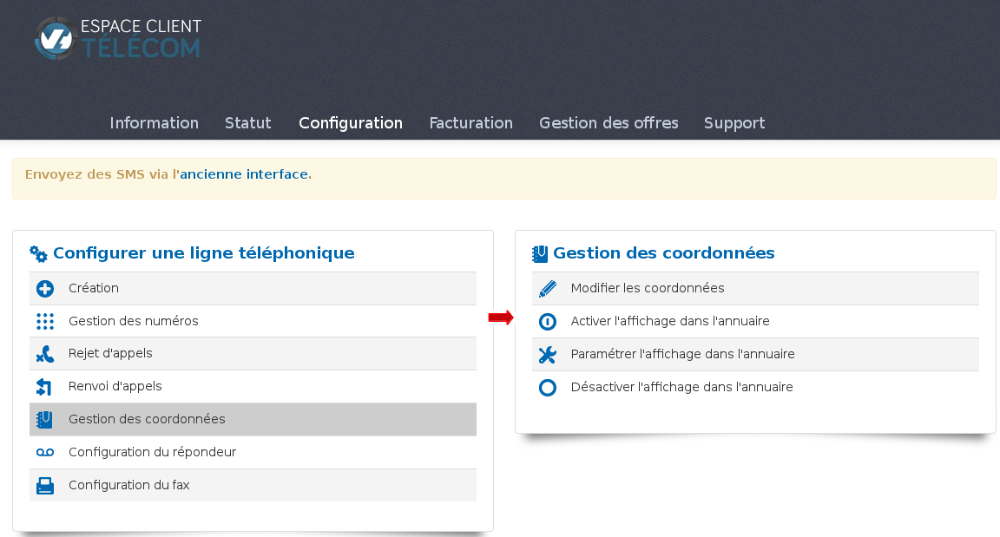
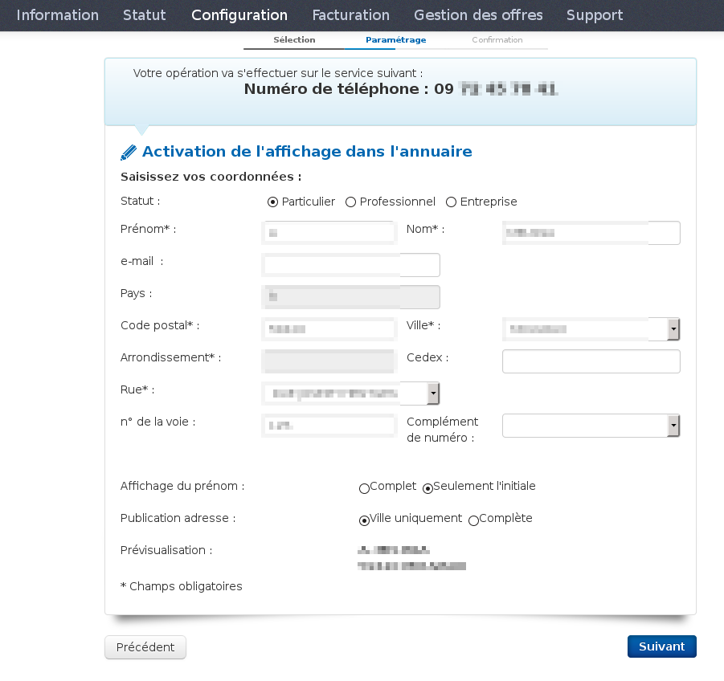

### Préambule {#préambule}

Lors de l'activation d'un numéro alias ou d'une ligne VoIP, vous avez la possibilité de choisir ou non la parution dans les annuaires.

Niveau : Débutant

------------------------------------------------------------------------

### Prérequis {#prérequis}

-   Disposer d'un numéro alias ou d'une ligne VoIP

------------------------------------------------------------------------

### Parution des annuaires via le manager V3 {#parution-des-annuaires-via-le-manager-v3}

-   **Particulier :**

Afin de pouvoir accéder à vos coordonnées ainsi qu'à la parution des annuaires, cliquez sur la rubrique coordonnées puis sur **gérer** :

{.thumbnail}

Dans le formulaire, vous devez remplir obligatoirement les champs : nom, prénom, code postal, ville, nom de la voie.

Ensuite, dans la rubrique "**parution dans les annuaires**", vous devez spécifier si vous acceptez ou non le **démarchage téléphonique**, si vous souhaitez la publication dans l'**annuaire inversé,** et comment vous souhaitez faire paraître votre **identité** ainsi que la **localité**.

Pour finir, pour valider la parution, cliquer sur **valider**.

{.thumbnail}

-   **Entreprise/Professionnel**

{.thumbnail}

Dans ce formulaire, vous retrouverez les mêmes champs que celui du "particulier" sauf que vous pourrez spécifier la **dénomination de votre entreprise**.

Si vous souhaitez faire paraître votre numéro dans les **pages jaunes/118712**, vous devez spécifier votre numéro **SIRET**. La catégorie dans les pages jaunes est prédéfinie par rapport à la déclaration de votre entreprise.

-   Pour désactiver la parution, il suffit de passer le champ "**publication dans l'annuaire**" à **non** et de **valider.**

------------------------------------------------------------------------

### Parution des annuaires via l'espace client Telecom {#parution-des-annuaires-via-lespace-client-telecom}

-   **Activer l'affichage dans l'annuaire** :

{.thumbnail}

Pour pouvoir activer votre parution, rendez vous dans la rubrique configuration -&gt; Téléphonie -&gt; Gestion des coordonnées, et sélectionnez "Activer l'affichage dans l'annuaire"

Ensuite, sélectionnez le numéro ou la ligne sur lequel vous souhaitez activer la parution dans l'annuaire.

-   **Particulier :**

Une fois la ligne sélectionnée, un formulaire à compléter vous est proposé :

{.thumbnail}

Champs obligatoires : le prénom, le nom ainsi que l'adresse postale. Toutefois, vous pouvez choisir de faire apparaître uniquement la ville ou votre adresse complète, et pour l'affichage du prénom, vous pouvez spécifier l'initiale ou le prénom entier.

Sur le formulaire suivant, il vous sera demandé si vous acceptez le démarchage et/ou d'apparaître dans l'annuaire inversé. Pour finir, une dernière confirmation vous sera demandée afin de valider les informations saisies précédemment.

-   **Professionnel/Entreprise** :

{.thumbnail}

Par rapport au formulaire "particulier", vous allez pouvoir renseigner le nom de votre entreprise. Si vous souhaitez apparaître dans une catégorie des pages jaunes, vous devez spécifier votre numéro SIRET. Une fois le SIRET renseigné, les champs "APE/NAF", "Entreprise" se renseignent automatiquement et une liste vous est proposée dans la désignation des pages jaunes (elles ne sont pas modifiables).

La différence entre le formulaire professionnel et entreprise tient au fait que vous avez le champ "profession" à remplir, si nécessaire.

Une fois les coordonnées saisies, une demande de paramétrage de la publication est demandé (annuaire inversé, démarchage) ainsi qu'une validation de la parution.

-   **Paramétrer l'affichage dans l'annuaire** :{.thumbnail}

    Dans cette rubrique vous pouvez modifier uniquement la partie annuaire inversé et le démarchage téléphonique.

-   **Désactiver l'affichage dans l'annuaire** : permet d'annuler la parution dans les annuaires

**Il faut compter un délai moyen de 10 jours ouvrés pour la parution dans les annuaires.**
