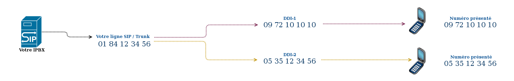
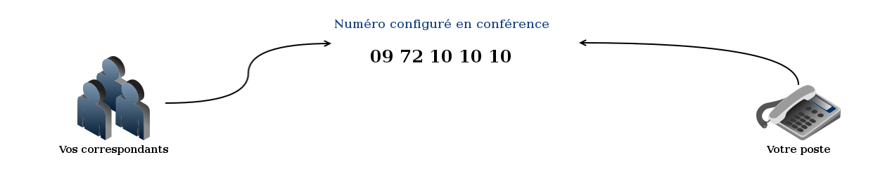
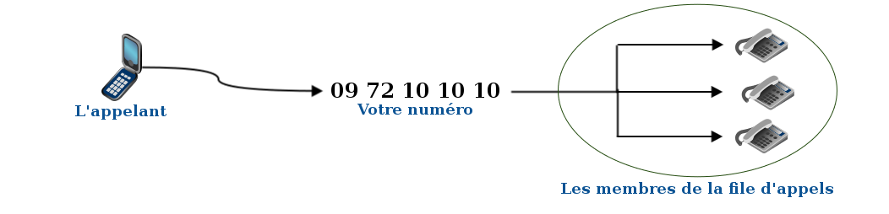

### Préambule {#préambule}

Maintenant que la [portabilité]({legacy}7536746) est réalisée ou que vous avez **commandé votre numéro alias**, il faut le configurer. Plusieurs configurations sont possibles selon vos besoins.

Votre numéro alias peut être simplement **redirigé** vers votre **ligne** de téléphone, être utilisé en tant que numéro pour votre **standard** et faire s**onner plusieurs lignes** ou bien il peut être utilisé en mode conférence. Les schémas ci-dessous, ainsi que les cas d'usages vont vous permettre de choisir la solution la mieux adaptée à vos besoins.

**Sommaire :**

****

****

Niveau : Débutant

------------------------------------------------------------------------

### Quelle configuration choisir ? {#quelle-configuration-choisir}

Vous retrouverez ici la liste des options possibles et des différentes fonctions afin de faire votre choix.

-   **La redirection avec supervision (Redirection redirect)**

Cette **redirection** vous permet de rediriger les appels vers la ligne de votre choix en toute transparence. Elle permet également de gérer la **supervision** de la ligne destinataire dans le cas **d'un appel depuis ce numéro**.

Cette redirection est idéale si vous préférez une redirection simple ou, dans le cadre d'une entreprise, pour rediriger un numéro vers une seule ligne uniquement.

{.thumbnail}

------------------------------------------------------------------------

-   **La redirection avec présentation de ce numéro sur ma ligne SIP ou mon Trunk (Ddi)**

Cette redirection permet de présenter **à la volée** sur votre client SIP / IPBX vos alias.

{.thumbnail}

-   **Le mode conférence**

La conférence vous permet d'être en relation par téléphone avec plusieurs interlocuteurs simultanément.Protégez la conférence par un code, définissez une annonce personnalisée, enregistrez les participants et recevez un rapport par e-mail à la fin de la conférence. Une interface vous propose également de suivre en temps réel les discussions des participants, de leur couper l'audio ou le micro.

{.thumbnail}

-   **Le Serveur vocal interactif**

Le serveur vocal interactif vous propose une interface simple pour créer un menu interactif.

L'appelant est invité, via des messages préenregistrés, à interagir avec le serveur grâce aux touches de son téléphone. Selon la configuration, il est alors possible de le transférer vers un autre numéro, de lire des sons, de le renvoyer vers une messagerie OVH ou de raccrocher.

-   **Le serveur vocal interactif (mode expert) en VXML**

Le serveur vocal interactif en VXML permet, via une configuration VXML 2.1, d'utiliser un menu interactif avancé. L'appelant est invité par des messages préenregistrés ou de la synthèse vocale à interagir avec le serveur grâce aux touches de son téléphone. Selon la configuration, il sera alors possible de lui lire des sons ou de le transférer vers d'autres numéros. Veuillez noter que seuls les transferts vers les numéros OVH sont possibles.

-   **La file d'appels**

Avec la file d'attente, vous pouvez gérer le flux de vos appels.

Jouez un son d'accueil, personnalisez votre musique d'attente et faites sonner vos collaborateurs ou différents services en fonction de stratégies que vous définissez, sur des plages horaires choisies. Vous pouvez définir le nombre maximum d'appelants dans la file d'attente et le temps d'attente maximum.

Si vous ne pouvez pas répondre, votre interlocuteur sera redirigé vers le répondeur d'une ligne OVH.

{.thumbnail}

-   **La file d'appels (mode expert)**

Avec le mode expert de la file d'attente, vous pouvez gérer le flux de vos appels de bout en bout.

Sur une interface similaire à celle du serveur vocal interactif, programmez étape par étape le déroulement de vos appels entrants.

En fonction des numéros des appels entrants ou des plages horaires, jouez des sons d'accueils, personnalisez votre musique d'attente, faites sonner vos collaborateurs ou différents services en fonction des stratégies que vous définissez.

-   **L'easy PABX**

Avec l'easyPAPBX, ne perdez plus d'appels. Redirigez votre numéro vers une ou plusieurs lignes OVH ou vers des numéros externes. Vous dispatchez vos appels entrants suivant une stratégie que vous définissez. Si vous ne pouvez pas répondre, votre interlocuteur sera redirigé vers un répondeur.

-   **Le mini PABX**

Avec le miniPABX, gérez un flux d'appels vers différents services ou collaborateurs en fonction de leur disponibilité. Vous choisissez la répartition des appels, le nombre et le temps maximum des appels dans la file d'attente.

------------------------------------------------------------------------

