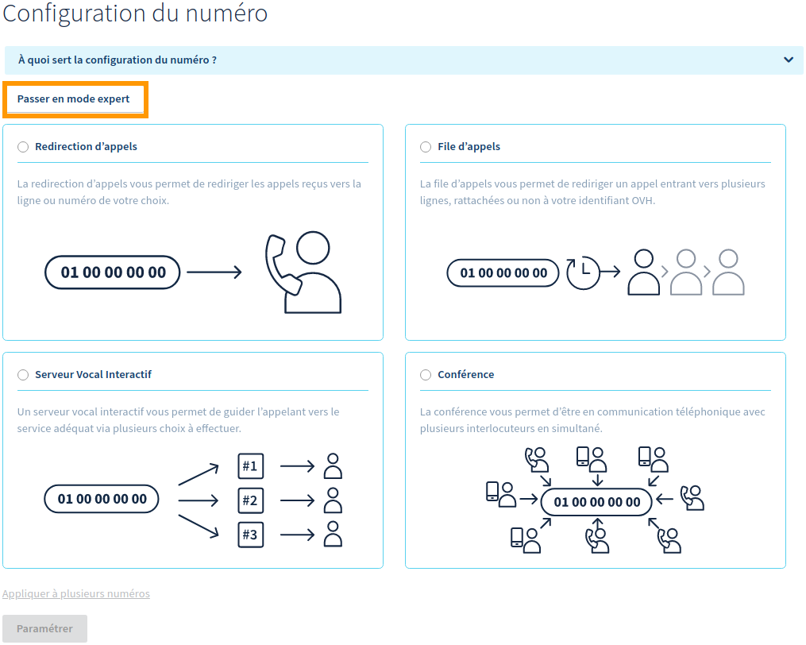

**Dernière mise à jour le 18/02/2019**

## Objectif

Lorsque vous disposez d'un numéro alias chez OVH, qu'il soit nouvellement commandé ou porté, vous pouvez le configurer. Plusieurs types de configuration existent, ces dernières vous permettant de répondre au mieux à vos besoins.

**Ce guide vous montre comment choisir et appliquer une configuration sur votre numéro.**

## Prérequis

- Disposer d'un [numéro alias](https://www.ovhtelecom.fr/telephonie/numeros/){.external}.
- Être connecté à l'[espace client OVH](https://www.ovhtelecom.fr/manager/auth/?action=gotomanager){.external}, partie `Télécom`{.action}.

## En pratique

### Étape 1 : accéder à la gestion de votre numéro

Pour débuter la manipulation, connectez-vous à votre [espace client OVH](https://www.ovhtelecom.fr/manager/#/){.external} et assurez-vous de vous situer dans la partie « Télécom ». Cliquez sur `Téléphonie`{.action} dans la barre de services à gauche, puis sélectionnez parmi les numéros OVH qui s’affichent celui sur lequel vous souhaitez configurer la conférence.

Dès lors, deux possibilités existent selon la configuration du numéro concerné :

- **le numéro ne possède pas de configuration** : positionnez-vous alors sur l'onglet `Configuration`{.action}, puis suivez les instructions ci-dessous ;
- **le numéro possède déjà une configuration** : cliquez sur l'onglet `Configuration`{.action}, puis sur `Changer de configuration`{.action}. Suivez ensuite les instructions ci-dessous.
 
{.thumbnail}

### Étape 2 : définir la configuration la plus adaptée à votre besoin

Dans la nouvelle fenêtre qui apparaît, plusieurs configurations sont possibles. Ces dernières sont réparties entre deux modes :

- **le mode simple** : les configurations de ce mode s'affichent par défaut. OVH sera en mesure de vous apporter de l'assistance à leur propos ;
- **le mode expert** : les configurations de ce mode sont accessibles en cliquant sur le bouton `Passer en mode expert`{.action}. OVH ne sera pas en mesure de vous apporter de l'assistance concernant ces dernières. Cliquez sur le bouton `Passer en mode simple`{.action} pour retourner aux configurations du mode simple.

{.thumbnail}

Vous trouverez ci-dessous un récapitulatif des différentes configurations. Poursuivez vers celle(s) que vous souhaitez consulter.

|Configuration en « mode simple »|Configuration en « mode expert »| 
|---|---| 
|[Redirection d'appels](./#21-redirection-dappels)|[SVI VXML](./#25-svi-vxml)|
|[File d'appels](./#22-file-dappels)|[Contact Center Solution](./#26-le-contact-center-solution)|
|[Conférence](./#23-conference)| |
|[Serveur vocal interactif](./#24-serveur-vocal-interactif)| |

#### 2.1 Redirection d'appels

La redirection permet de rediriger les appels reçus sur un numéro OVH vers une ligne OVH. Pour diverses raisons, vous pouvez être amené à vouloir configurer cette option afin de rediriger tous les appels reçus sur votre numéro vers la ligne OVH de votre choix.

Cette configuration est accessible en mode simple uniquement. Reportez-vous aux instructions décrites dans notre documentation « [Configurer une redirection d’appels](../creer-redirection-avec-presentation/){.external} » si vous désirez en apprendre plus.

#### 2.2 File d'appels

La file d'appels vous permet de gérer le flux de vos appels entrants. Elle vous permet de créer une file d'attente avant de mettre en relation avec vos collaborateurs les interlocuteurs qui vous contactent. Cette solution s’adapte à vos besoins et à votre propre organisation en fonction de ce que vous souhaitez paramétrer.

Cette configuration n'est accessible qu'en mode simple. Reportez-vous aux instructions décrites dans notre documentation « [Configurer une file d’appels](../les-files-d-appels/){.external} » si vous désirez en apprendre plus.

#### 2.3 Conférence

La conférence permet à toutes les personnes composant un numéro donné d’être en communication simultanément. Différentes fonctionnalités sont alors disponibles : protéger la conférence par un code, définir une annonce personnalisée, enregistrer les participants et recevoir un rapport par e-mail à la fin de celle-ci. Une interface spécifique vous propose également de suivre en temps réel les discussions des participants, mais aussi de gérer leur audio et leur micro.

Cette configuration n'est accessible qu'en mode simple uniquement. Reportez-vous aux instructions décrites dans notre documentation « [Créer et gérer des conférences téléphoniques](../conference/){.external} » si vous désirez en apprendre plus.

#### 2.4 Serveur vocal interactif

Le serveur vocal interactif (SVI) vous propose une interface simple pour créer un menu interactif. L’appelant est invité, via des messages pré-enregistrés, à interagir avec le serveur grâce aux touches de son téléphone. Selon la configuration, il est alors possible de transférer votre interlocuteur vers un autre numéro, de le renvoyer vers une messagerie OVH, de raccrocher ou de lire des sons.

Cette configuration n'est accessible qu'en mode simple.

#### 2.5 SVI VXML

Le serveur vocal interactif en VXML permet, via une configuration VXML 2.1, d’utiliser un menu interactif avancé. L’appelant est invité, par des messages pré-enregistrés ou de la synthèse vocale, à interagir avec le serveur grâce aux touches de son téléphone. Selon la configuration choisie, il sera alors possible de lire des sons ou de transférer l'appelant vers d’autres numéros. Veuillez noter que seuls les transferts vers les numéros OVH sont possibles.

Cette configuration n'est accessible qu'en mode expert uniquement.

#### 2.6 Le Contact Center Solution

En cours de développement chez OVH, le Contact Center Solution (ou CCS) est une évolution de la file d'appels. Il permet de gérer les flux d'appels entrants et sortants et d'en obtenir des statistiques détaillées. Étape par étape, vous pouvez définir votre stratégie afin de décrocher les appels comme bon vous semble.

Via une interface unique, vous avez la possibilité de gérer une file d'appels, de définir des services (par exemple : service commercial, technique, production, etc.), de personnaliser vos sons (musique d'attente, musique de prédécroché), mais aussi de mettre en place une supervision de l’ensemble de vos postes téléphoniques.

Ce mode apporte également au Contact Center Solution des options supplémentaires disponibles uniquement via l'API OVH : 

- l'enregistrement des appels entrants et sortants ; 
- la mise en place d’une bannière de supervision ;
- la mise en place d'une supervision intergroupe.

Cette configuration n'est accessible qu'en mode expert.

### Étape 3 : appliquer la configuration souhaitée

Une fois votre choix effectué, sélectionnez dans le menu déroulant la configuration que vous souhaitez appliquer à votre numéro, puis cliquez sur le bouton `Paramétrer`{.action}.

Patientez quelques instants afin que le changement soit pris en compte.

## Aller plus loin

Échangez avec notre communauté d'utilisateurs sur <https://community.ovh.com>.
