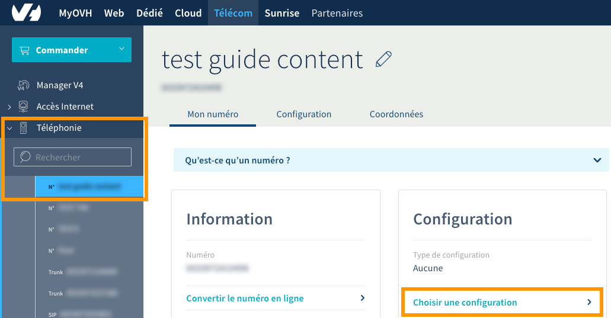
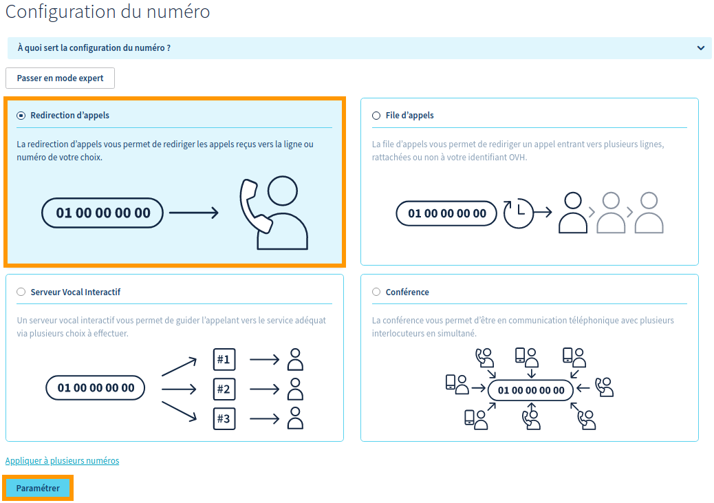
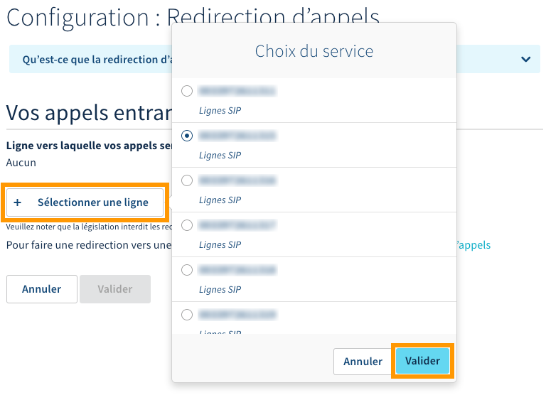
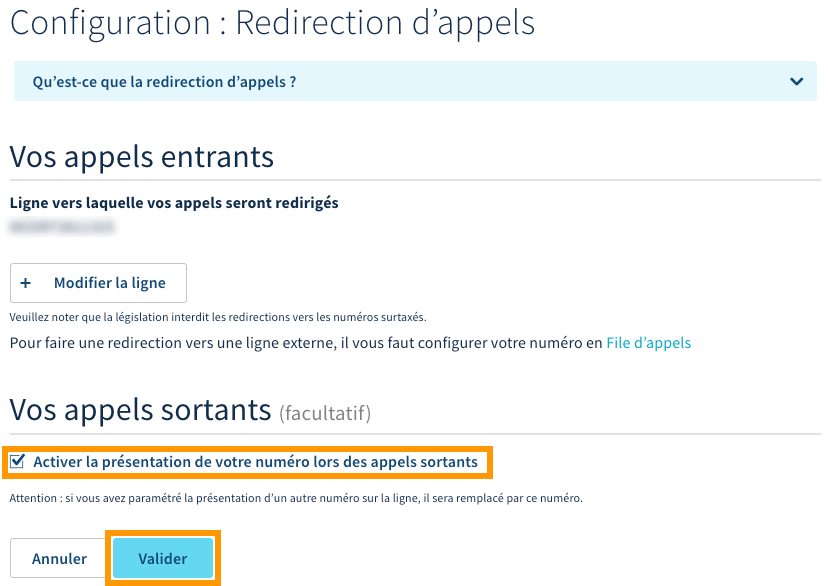

**Dernière mise à jour le 11/01/2019**

## Objectif

La redirection permet de rediriger les appels reçus sur un numéro OVH vers une ligne OVH. Pour diverses raisons, vous pouvez être amené à devoir configurer cette redirection afin de rediriger tous les appels reçus sur votre numéro vers la ligne OVH de votre choix.

**Découvrez comment configurer une redirection d'appels sur votre numéro OVH.**

## Prérequis

- Disposer d'un [numéro chez OVH](https://www.ovhtelecom.fr/telephonie/numeros/){.external} (porté ou un alias).
- Disposer d'une offre [VoIP OVH](https://www.ovhtelecom.fr/telephonie/voip/){.external}.
- Être connecté à votre [espace client OVH](https://www.ovhtelecom.fr/manager/#/){.external}, partie `Télécom`{.action}.
 
## En pratique

Pour débuter la manipulation, connectez-vous à votre [espace client OVH](https://www.ovhtelecom.fr/manager/#/){.external} et assurez-vous de vous situer dans la partie « Télécom ». Cliquez sur `Téléphonie`{.action} dans la barre de services à gauche, puis sélectionnez parmi les numéros OVH qui s'affichent celui sur lequel vous souhaitez configurer la redirection de vos appels entrants.

Sur la fenêtre qui s'affiche, assurez-vous d'être bien positionné sur l'onglet « Mon numéro ». Dans la partie « Configuration », cliquez sur `Choisir une configuration`{.action}.

{.thumbnail}

Sur la nouvelle fenêtre qui apparaît, assurez-vous d'avoir coché la case `Redirection d'appels`{.action}, puis cliquez sur le bouton `Paramétrer`{.action} situé en bas de la page.

{.thumbnail}

Dans la partie « Vos appels entrants », cliquez d'abord sur le bouton `Sélectionner une ligne`{.action}. Dans la fenêtre qui apparaît, choisissez parmi les lignes affichées celle vers laquelle vous souhaitez rediriger les appels reçus. Cliquez ensuite sur le bouton `Valider`{.action} pour confirmer votre sélection.

Le numéro sélectionné apparaît alors en tant que « Ligne vers laquelle vos appels seront redirigés ».

{.thumbnail}

Choisissez ensuite dans la partie « Vos appels sortants » si vous souhaitez activer ou non la présentation de votre numéro lors d'un appel sortant. 

Ceci aura pour effet d'afficher le numéro pour lequel vous paramétrez actuellement la redirection lorsque vous passerez un appel depuis la ligne que vous avez sélectionnée comme étant celle où les appels seront redirigés.

Si vous souhaitez activer ce mode de fonctionnement, cochez la case située à côté de « Activer la présentation de votre numéro lors des appels sortants ».

{.thumbnail}

Une fois la configuration sélectionnée et personnalisée, cliquez sur `Valider`{.action} afin de l'appliquer. Patientez quelques instants afin que celle-ci soit prise en compte.

## Aller plus loin

Échangez avec notre communauté d'utilisateurs sur <https://community.ovh.com>.
