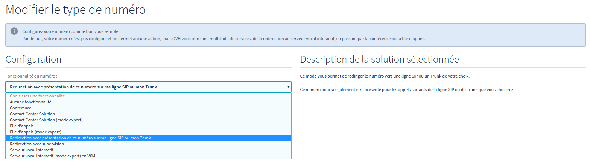
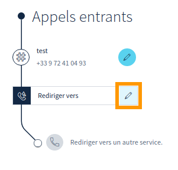

**Dernière mise à jour le 14/06/2018**

## Objectif

Ce type de redirection vous permet de rediriger les appels vers la ligne de votre choix, en présentant le numéro redirigé (et donc composé par l'appelant) sur cette ligne lors d'un appel entrant.

L’intérêt est de pouvoir identifier, grâce à la présentation, le numéro composé par l'appelant et de pouvoir paramétrer des actions différentes en conséquence dans votre client SIP ou IPBX.

**Ce guide vous explique comment mettre en place cette redirection avec présentation.**

## Prérequis

- Souscrire à une [offre VoIP](https://www.ovhtelecom.fr/telephonie/voip/){.external}.
- Posséder un [numéro alias](https://www.ovhtelecom.fr/telephonie/numeros/){.external}.
- Être connecté sur l'[espace client OVH](https://www.ovhtelecom.fr/manager/#/){.external} partie `Téléphonie`{.action}.

## En pratique

Une fois connecté dans l'[espace client OVH](https://www.ovhtelecom.fr/manager/#/){.external} partie `Téléphonie`{.action}, choisissez le numéro à configurer, puis `Configuration du numéro`{.action}. Choisissez ensuite `Modifier le type de numéro`{.action} et dans la liste déroulante, sélectionnez `Redirection avec présentation de ce numéro sur ma ligne SIP ou mon Trunk`{.action}, puis validez. 

{.thumbnail}

La redirection avec présentation est désormais configurée. Il reste maintenant à configurer la ligne cible. Pour cela, il faut retourner dans la partie `Configuration du numéro`{.action} comme précédemment. Cliquez ensuite sur l’icône en forme de crayon comme indiqué ci-dessous :

{.thumbnail}

Il reste à sélectionner la ligne cible de cette redirection dans la liste et à cliquer sur `Valider`{.action}.

> [!primary]
>
> La législation interdit les redirections vers des numéros surtaxés, faites donc bien attention à ce point. 
>

## Aller plus loin

Échangez avec notre communauté d'utilisateurs sur <https://community.ovh.com>.