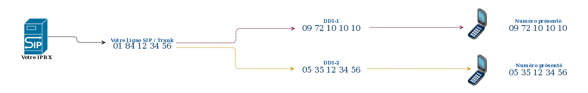
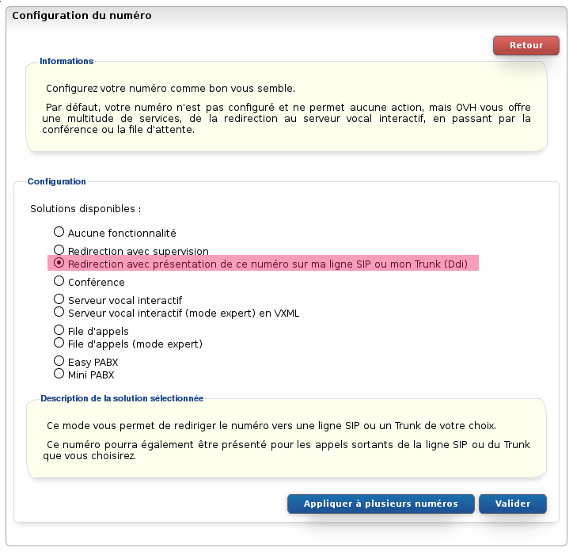
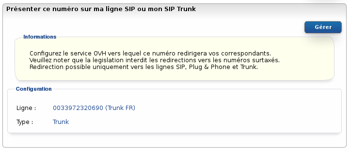

### Préambule {#préambule}

Ce type de redirection vous permet de rediriger les appels vers la ligne de votre choix en présentant le numéro redirigé (et donc composé par l'appelant) sur cette ligne lors d'un appel entrant.

L’intérêt est de pouvoir identifier le numéro composé par l'appelant et de pouvoir paramétrer des actions différentes en conséquence dans votre client SIP / IPBX.

{.thumbnail}

**Sommaire :**

****

Niveau : Intermédiaire

------------------------------------------------------------------------

### Prérequis {#prérequis}

Pour effectuer cette configuration vous devez posséder :

-   une ligne VoIP ;
-   un numéro alias.

------------------------------------------------------------------------

### Configuration {#configuration}

Pour configurer la redirection sur le numéro :

-   Connectez-vous à votre Espace Client OVH : <https://www.ovhtelecom.fr/espaceclient/>
-   Cliquez sur le lien "**Accéder à l'ancienne interface**".
-   Cliquez sur l'icône "**Téléphonie**".
-   Cliquez sur l'onglet "**Numéro**".
-   Cliquez sur le **numéro** à configurer.
-   Cliquez sur "**Configuration du numéro**" dans le menu "**Navigation**".
-   Cliquez sur "**Modifier le type de numéro**".
-   Cliquez sur le bouton "**Gérer**".
-   Sélectionnez dans la liste "**Redirection avec présentation de ce numéro sur ma ligne SIP ou mon Trunk (Ddi)**".
-   Cliquez sur le bouton "**Valider**" pour appliquer la configuration.

{.thumbnail}

Le numéro est maintenant configuré en redirection avec supervision. Il faut à présent configurer la ligne cible de cette redirection :

Veuillez noter que la législation interdit les redirections vers les numéros surtaxés.

-   Cliquez sur l'onglet "**Gérer la redirection**".
-   Cliquez sur le bouton "**Gérer**".
-   Sélectionnez la ligne destinataire de la redirection dans la liste "**Ligne :**".
-   Validez la configuration en appuyant sur le bouton "**Valider**".

{.thumbnail}

------------------------------------------------------------------------

