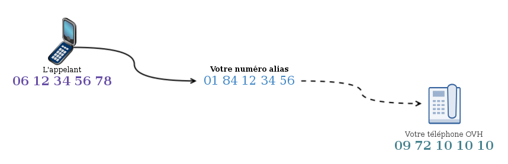
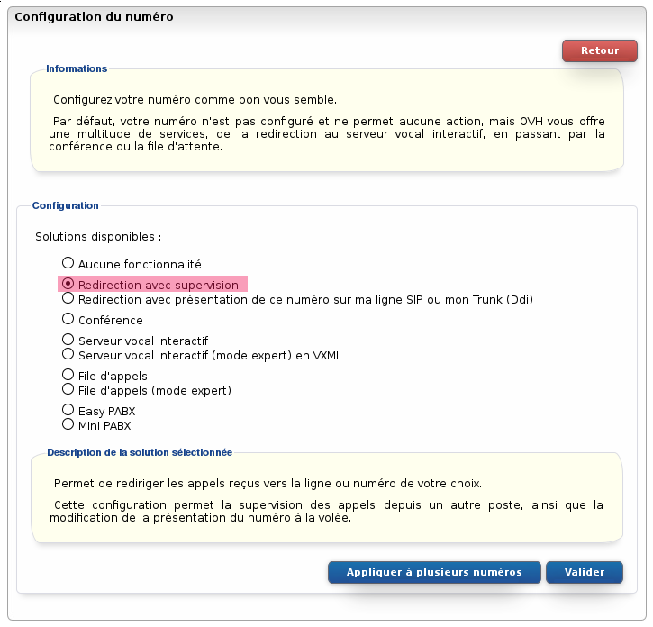
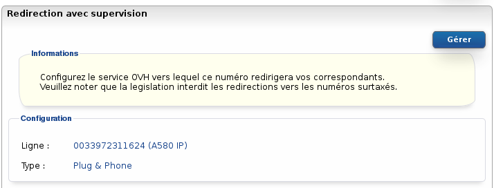

### Préambule {#préambule}

Ce **type de redirection** vous permet de rediriger les appels vers la ligne de votre choix en toute transparence. Elle permet également de gérer la **supervision** de cette ligne destinataire dans le cas **d'un appel via le numéro redirigé** (contrairement à la redirection avec présentation).

Cette redirection est idéale si vous souhaitez simplement rediriger un numéro vers une seule ligne.

{.thumbnail}

**Sommaire :**

****

****

**Niveau : Débutant**

------------------------------------------------------------------------

### Prérequis {#prérequis}

Pour effectuer cette configuration vous devez posséder :

-   une ligne VoIP ;
-   un numéro alias.

------------------------------------------------------------------------

### Configuration {#configuration}

Pour configurer ce type de redirection :

-   Connectez-vous à votre Espace Client OVH : <https://www.ovhtelecom.fr/espaceclient/>
-   Cliquez sur le lien "**Accéder à l'ancienne interface**".
-   Cliquez sur l'icône "**Téléphonie**".
-   Cliquez sur l'onglet "**Numéro**".
-   Cliquez sur le **numéro** à configurer.
-   Cliquez sur "**Configuration du numéro**" dans le menu "**Navigation**".
-   Cliquez sur "**Modifier le type de numéro**".
-   Cliquez sur le bouton "**Gérer**".
-   Sélectionnez dans la liste "**Redirection avec supervision**".
-   Cliquez sur le bouton "**Valider**" pour appliquer la configuration.

{.thumbnail}

Le numéro est maintenant configuré en redirection avec supervision. Il faut à présent configurer la ligne cible de cette redirection :

Veuillez noter que la législation interdit les redirections vers des numéros surtaxés.

-   Cliquez sur l'onglet "**Gérer la redirection**".
-   Cliquez sur le bouton "**Gérer**".
-   Sélectionnez la ligne destinataire de cette redirection dans la liste "**Ligne**"**.**
-   Validez la configuration en appuyant sur le bouton "**Valider**".

{.thumbnail}

------------------------------------------------------------------------

