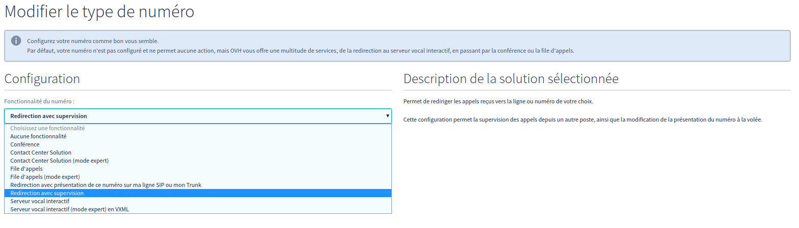

**Dernière mise à jour le 11/06/2018**

## Objectif

Une redirection avec supervision (ou redirection simple supportant la supervision) vous permet de rediriger les appels vers la ligne de votre choix en toute transparence. Elle permet également de gérer la supervision de cette ligne destinataire dans le cas d’un appel via le numéro redirigé (contrairement à la redirection avec présentation). Cette redirection est idéale si vous souhaitez simplement rediriger un numéro vers une seule ligne.

**Ce guide vous explique comment créer ce type de redirection depuis votre espace client.**

## Prérequis

- Activer une [ligne VoIP](https://www.ovhtelecom.fr/telephonie/voip/){.external}.
- Avoir créé un [numéro alias](https://www.ovhtelecom.fr/telephonie/numeros/){.external}.
- Être connecté à votre l'[espace client OVH](https://www.ovhtelecom.fr/manager/#/){.external}.

## En pratique

Une fois connecté dans l'[espace client OVH](https://www.ovhtelecom.fr/manager/#/){.external} partie `Téléphonie`{.action}, choisissez le numéro à configurer, puis `Configuration de numéro`{.action}. Cliquez sur `Modifier le type de numéro`{.action} puis, dans la liste déroulante, choisissez `Redirection avec supervision`{.action} et validez.

{.thumbnail}

Le numéro est maintenant configuré avec une redirection avec supervision. Il reste maintenant à configurer la ligne cible. Pour cela, il faut retourner dans la partie `Configuration du numéro`{.action} comme précédemment. Cliquez ensuite sur l'icône en forme de crayon comme indiqué ci-dessous :

{.thumbnail}

Il reste à sélectionner la ligne cible de cette redirection dans la liste et à cliquer sur `Valider{.action}.

> [!primary]
>
> La législation interdit les redirections vers des numéros surtaxés, faites donc bien attention à ce point.
>

## Aller plus loin

Échangez avec notre communauté d'utilisateurs sur <https://community.ovh.com>.