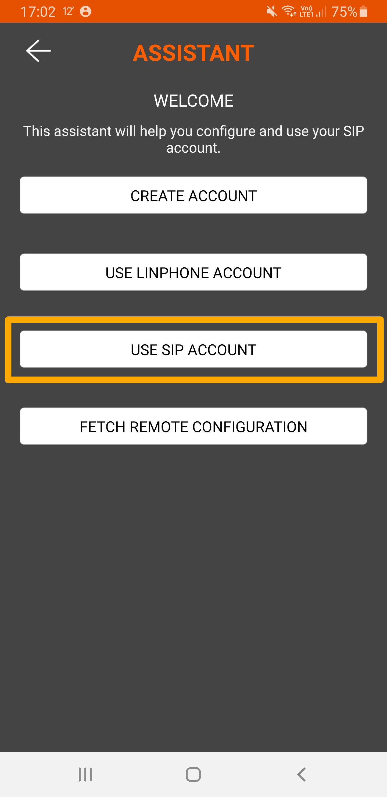
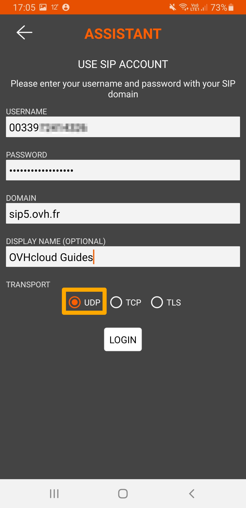
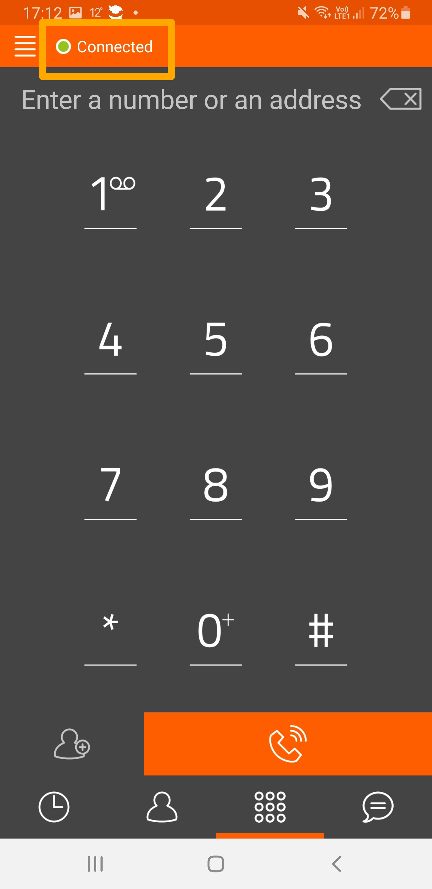

**Dernière mise à jour le 31/03/2022**

## Objectif

Le logiciel [Linphone](https://www.linphone.org/){.external} est un softphone (logiciel de téléphonie) open-source et gratuit permettant d'enregistrer une ligne SIP fixe OVHcloud, afin d'émettre et recevoir des appels via cette ligne, depuis un ordinateur ou un smartphone.

**Découvrez comment enregistrer votre ligne SIP OVHcloud sur Linphone**

> [!warning]
>
> OVHcloud met à votre disposition des services dont la configuration, la gestion et la responsabilité vous incombent. Il vous revient de ce fait d'en assurer le bon fonctionnement.
> 
> Nous mettons à votre disposition ce tutoriel afin de vous accompagner au mieux sur des tâches courantes. Néanmoins, nous vous recommandons de faire appel à un prestataire spécialisé et/ou de contacter l'éditeur du service si vous éprouvez des difficultés. En effet, nous ne serons pas en mesure de vous fournir une assistance. Plus d'informations dans la section « Aller plus loin » de ce guide.
> 

## Prérequis

- Disposer d'une [ligne SIP OVHcloud](https://www.ovhtelecom.fr/telephonie/voip/){.external}
- [Disposer des identifiants de votre ligne SIP OVHcloud](../enregistrer-ligne-sip-softphone)
- Avoir installé le logiciel [Linphone](https://www.linphone.org/){.external} sur un smartphone ou un ordinateur

## En pratique

Ce tutoriel décrit la méthode pour enregistrer votre ligne sur la version Android de Linphone.
 La méthode d'enregistrement est similaire sur les autres systèmes d'exploitation.

### Enregistrer votre ligne SIP

Une fois Linphone ouvert, un assistant vous permet de configurer votre compte SIP. Sélectionnez `Utiliser un compte SIP`{.action}.

{.thumbnail}

Renseignez alors vos identifiants SIP OVHcloud dans les champs correspondants. Vous pouvez également définir un nom d'affichage qui sera présenté lors de vos émissions d'appels. 
Cochez `UDP`{.action} pour le transport et appuyez sur `Connexion`{.action}.

{.thumbnail}

Si la connexion a réussi, la notification `Connecté` apparaît en haut de l'application. 

{.thumbnail}

Vous pouvez dès lors être joint et composer des appels depuis votre ligne SIP OVHcloud.

### Dépannage

Si l'enregistrement a échoué, vérifiez que vous avez bien saisi les identifiants SIP OVHcloud, notamment le mot de passe SIP. En cas d'échecs répétés, [modifiez votre mot de passe SIP depuis l'espace client OVHcloud](https://docs.ovh.com/fr/voip/modifier-mot-de-passe-ligne-sip/) et refaites un essai d'enregistrement avec un nouveau mot de passe SIP.

Vérifiez également que l'adresse IP depuis laquelle vous utilisez Linphone fait partie des adresses IP autorisées à utiliser votre ligne SIP. Pour plus de détails, consultez le guide [Restreindre sa ligne SIP OVHcloud par IP](https://docs.ovh.com/fr/voip/restreindre-ligne-sip-par-ip/).

Vous pouvez aussi tester l'enregistrement de votre ligne [sur un autre softphone](../enregistrer-ligne-sip-zoiper).

## Aller plus loin

[Utiliser une ligne SIP OVHcloud sur un softphone](../enregistrer-ligne-sip-softphone)

[Enregistrer une ligne SIP OVHcloud sur Zoiper](../enregistrer-ligne-sip-zoiper)

Échangez avec notre communauté d'utilisateurs sur <https://community.ovh.com>.
