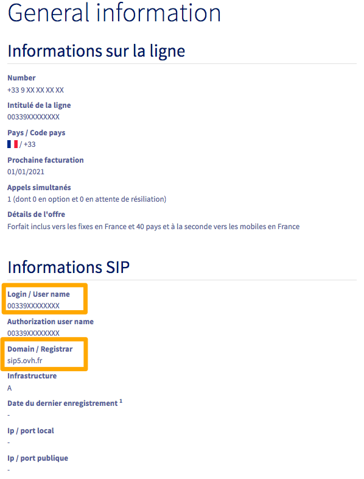

**Dernière mise à jour le 31/03/2022**

## Objectif

OVHcloud propose des lignes SIP sans matériel pouvant être enregistrées sur des téléphones compatibles SIP ou des *softphones* (logiciels de téléphonie).

Le softphone est une application ou un logiciel qui vous permet d'enregistrer votre ligne SIP et de l'utiliser depuis un ordinateur, un smartphone ou une tablette.

**Découvez comment enregistrer et utiliser votre ligne SIP OVHcloud sur un softphone.**

> [!warning]
>
> OVHcloud met à votre disposition des services dont la configuration, la gestion et la responsabilité vous incombent. Il vous revient de ce fait d'en assurer le bon fonctionnement.
> 
> Nous mettons à votre disposition ce tutoriel afin de vous accompagner au mieux sur des tâches courantes. Néanmoins, nous vous recommandons de faire appel à un [prestataire spécialisé](https://partner.ovhcloud.com/fr/) et/ou de contacter l'éditeur du service si vous éprouvez des difficultés. En effet, nous ne serons pas en mesure de vous fournir une assistance. Plus d'informations dans la section « Aller plus loin » de ce guide.
>

## Prérequis

- Disposer d'une [ligne SIP OVHcloud](https://www.ovhtelecom.fr/telephonie/voip/){.external}.
- Être connecté à l'[espace client OVHcloud](https://www.ovh.com/auth/?action=gotomanager&from=https://www.ovh.com/fr/&ovhSubsidiary=fr){.external}, partie `Télécom`{.action}.

> [!primary]
> Une ligne SIP **fournie avec un téléphone OVHcloud** ne peut pas être enregistrée sur un softphone. Si c'est le cas de votre ligne et que vous souhaitez utiliser un softphone, nous vous invitons à [commander une ligne SIP supplémentaire](https://www.ovhtelecom.fr/telephonie/voip/), fournie sans téléphone OVHcloud.
>

## En pratique

Avant toute utilisation d'une ligne SIP sans matériel fournie par OVHcloud, nous vous recommandons de **sécuriser** celle-ci. Consultez notre guide pour [sécuriser une ligne SIP OVHcloud](https://docs.ovh.com/fr/voip/securiser-ligne-sip/).

Contrairement aux lignes pré-configurées sur des téléphones OVHcloud, vous avez accès, depuis l'espace client OVHcloud, à la gestion du **mot de passe SIP** d'une ligne sans matériel. Il est primordial de définir un mot de passe SIP **fort**. Retrouvez plus d'informations sur notre guide pour [Modifier le mot de passe d'une ligne SIP](https://docs.ovh.com/fr/voip/modifier-mot-de-passe-ligne-sip/).

### Etape 1 : retrouver vos identifiants SIP

Vous devez **impérativement** disposer des trois informations suivantes afin de pouvoir enregistrer votre ligne :

|Information|Description|
|---|---|
| Login / User name | Il s'agit du numéro de votre ligne, au format international.|
| Mot de passe SIP | Vous pouvez modifier ce mot de passe depuis votre espace client OVHcloud.|
| Domain / Registrar | Le nom du serveur de téléphonie qui héberge votre ligne.|

#### Login et Domain

Afin de retrouver votre **Login** et votre **Domain**, connectez-vous à votre [espace client OVHcloud](https://www.ovh.com/auth/?action=gotomanager&from=https://www.ovh.com/fr/&ovhSubsidiary=fr){.external}, partie `Télécom`{.action}. Cliquez sur `Téléphonie`{.action} puis sur votre groupe de téléphonie et enfin sur votre ligne SIP.

Dans l'onglet `Gestion`{.action}, cliquez sur `Informations générales`{.action}.

{.thumbnail}

Vous retrouvez alors, dans le cadre « Informations SIP », votre **Login** et votre **Domain**.

{.thumbnail}

> [!warning]
> Dans l'exemple ci-dessus, le **Domain** est `sip5.ovh.fr`. Prenez soin de vérifier quel est le **Domain** de votre ligne, celui-ci pouvant être différent.
>

#### Mot de passe SIP

Si vous ne connaissez pas votre mot de passe SIP ou que vous ne l'avez jamais modifié au profit d'un **mot de passe fort**, consultez notre guide pour [Modifier le mot de passe d'une ligne SIP](https://docs.ovh.com/fr/voip/modifier-mot-de-passe-ligne-sip/).

> [!success]
> Vous pouvez utiliser un coffre-fort de mots de passe, comme [Keepass](https://keepass.info/){.external} afin de sauvegarder en toute sécurité votre mot de passe SIP.

### Étape 2 : enregistrer la ligne SIP sur le softphone

Une fois vos identifiants connus, vous pouvez procéder à l'enregistrement de votre ligne sur le softphone de votre choix.

De nombreuses logiciels de ce type sont disponibles. Nous vous proposons de suivre des méthodes pour deux d'entre eux, **Linphone** et **Zoiper**. 
Cliquez sur les liens ci-dessous pour lire les tutoriels :

- [Tutoriel - Enregistrer une ligne SIP OVHcloud sur Linphone](../enregistrer-ligne-sip-linphone).
- [Tutoriel - Enregistrer une ligne SIP OVHcloud sur Zoiper](../enregistrer-ligne-sip-zoiper).

## Aller plus loin

Échangez avec notre communauté d'utilisateurs sur <https://community.ovh.com>.
