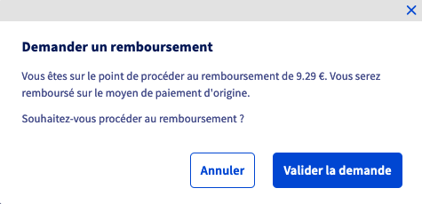
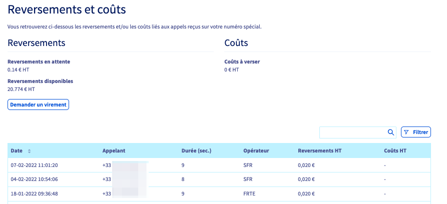

**Dernière mise à jour le 21/02/2022**

## Objectif

Les numéros spéciaux SVA surtaxés génèrent des rémunérations à chaque appel passé par vos appelants.
A l'inverse, un numéro vert entraîne un coût pour chaque appel reçu.
L'espace client OVHcloud vous permet de consulter et modifier votre palier tarifaire, de retrouver l'historique des coûts et reversements liés à vos numéros et, le cas échéant, de récupérer les reversements disponibles.

**Découvrez comment gérer les reversements et les coûts de vos numéros spéciaux SVA depuis l'espace client OVHcloud.**

## Prérequis

- Posséder au moins [un numéro spécial](https://www.ovhtelecom.fr/telephonie/numeros/numeros-speciaux/) dans votre compte OVHcloud.
- Être connecté à l'[espace client OVHcloud](https://www.ovh.com/auth/?action=gotomanager&from=https://www.ovh.com/fr/&ovhSubsidiary=fr){.external}, partie `Télécom`{.action}.

## En pratique

Connectez-vous à votre [espace client OVHcloud](https://www.ovh.com/auth/?action=gotomanager&from=https://www.ovh.com/fr/&ovhSubsidiary=fr){.external} et assurez-vous de vous situer dans la partie « Télécom ». Cliquez sur `Téléphonie`{.action}, puis sélectionnez votre groupe de téléphonie. 
Pour plus d'informations sur les groupes de téléphonie, consultez notre guide « [Gérer vos groupes de téléphonie](https://docs.ovh.com/fr/voip/gestion-des-groupes-de-telephonie/)».

### Consulter et/ou modifier le palier tarifaire de votre numéro spécial

> [!primary]
> Vous pouvez consulter la liste complète des paliers tarifaires OVHcloud applicables aux numéros spéciaux en France sur [cette page](https://www.ovhtelecom.fr/telephonie/numeros/numeros-speciaux/numeros-francais.xml).
>
> La première modification du palier tarifaire est offerte. 
> **Par la suite, la modification sera facturée 20 € HT**. 
> Effectuée avant le 20 du mois, cette modification sera effective le 1er du mois suivant.
>

Sélectionnez votre numéro SVA et cliquez sur `Reversements`{.action} puis `Tarification du numéro`{.action}.

{.thumbnail}

Sélectionnez soit un `Tarif par minute (décompté à la seconde)`{.action}, soit un `Forfait par appel`{.action} puis sélectionnez un palier tarifaire parmi ceux proposés dans le menu déroulant.

{.thumbnail}

Validez ensuite votre choix en cliquant sur `Confirmer`{.action}.

> [!primary]
> Il n'est pas possible de modifier le palier tarifaire d'un numéro vert 0805 gratuit.

### Numéros surtaxés

#### Reversements SVA

Sélectionnez votre groupe de téléphonie dans le menu de gauche puis cliquez sur `Facturation`{.action}. Cliquez ensuite sur `Reversements SVA du groupe`{.action}.

{.thumbnail}

Vous pouvez ici consulter le détail des reversements des numéros du groupe. 
Les reversements ne sont disponibles qu'après un délai de 60 jours (après la réception d'un appel). 
Dans l'attente de ce délai, les reversements sont affichés comme « Différés » (1 dans l'image ci-dessous). 
Une fois le délai de 60 jours écoulé, les reversements sont « Disponibles » (2 dans l'image ci-dessous) et vous pouvez effectuer une demande de reversement de la somme concernée (3 dans l'image ci-dessous). Renseignez un numéro personnalisé de facture et cliquez sur `Valider`{.action} pour générer un virement vers votre compte prépayé OVHcloud. 

{.thumbnail}

Une fois le reversement effectué par vos soins, cette somme est ajoutée à votre compte prépayé OVHcloud. Elle peut servir ainsi à régler vos prochaines factures de manière automatique. 
Si vous le souhaitez , vous pouvez en demander le versement sur votre moyen de paiement par défaut. Dans ce cas, depuis l'onglet `Facturation`{.action} de votre groupe de téléphonie, cliquez sur `Virement vers un compte bancaire`{.action}.

{.thumbnail}

Le résumé des mouvements sur votre compte prépayé OVHcloud vous est alors présenté.
Le montant de votre reversement s'affichera alors dans la colonne `Crédit`. 
Cliquez sur le bouton `...`{.action} à droite puis sur `Demander un remboursement`{.action}.

{.thumbnail}

Lisez le récapitulatif et cliquez sur `Valider la demande`{.action} pour procéder au remboursement sur votre moyen de paiement par défaut.

{.thumbnail}

##### **Détail des reversements par numéro**

Pour consulter le détail complet des appels entrants et les reversements liés **par numéro**, sélectionnez ce numéro dans le volet de gauche puis cliquez successivement sur `Reversements`{.action} puis `Reversement et coûts`{.action}.

{.thumbnail}

Le tableau qui vous est alors présenté récapitule tous les appels entrants.

{.thumbnail}

#### Historique des reversements

Sélectionnez votre groupe de téléphonie dans le menu de gauche puis cliquez sur `Facturation`{.action}. Cliquez ensuite sur `Historique des reversements`{.action}.

{.thumbnail}

Vous retrouvez sur cette page l'historique des reversements effectués par le passé sur votre groupe de téléphonie.

{.thumbnail}

### Numéros verts gratuits

#### Coûts SVA

Sélectionnez votre groupe de téléphonie dans le menu de gauche puis cliquez sur `Facturation`{.action}. Cliquez ensuite sur `Coûts SVA du groupe`{.action}.

{.thumbnail}

Sur cette page sont affichés les coûts SVA liés aux appels entrants du mois en cours sur les numéros verts de votre groupe de téléphonie.

#### Historique des coûts SVA

Sélectionnez votre groupe de téléphonie dans le menu de gauche puis cliquez sur `Facturation`{.action}. Cliquez ensuite sur `Historique des coûts SVA`{.action}.

{.thumbnail}

Vous retrouvez sur cette page l'historique des coûts générés par les appels entrants sur les numéros verts de votre groupe de téléphonie.

{.thumbnail}

## Aller plus loin

Échangez avec notre communauté d'utilisateurs sur <https://community.ovh.com>.
