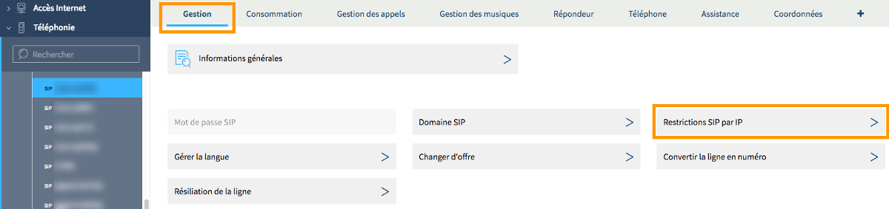
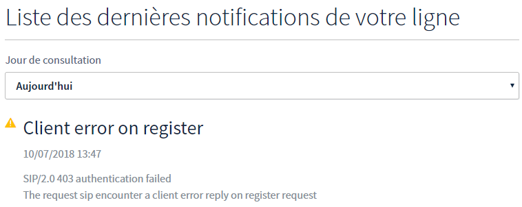

**Dernière mise à jour le 20/07/2018**

## Objectif

La téléphonie sur IP utilise le web pour transmettre des communications. Elle capte des conversations voix, les transforme en données, pour finalement les transmettre à un interlocuteur. Du fait de son côté connecté, il est fortement conseillé de sécuriser votre téléphonie sur IP, surtout si celle-ci fait partie intégrante de votre activité d'entreprise.
 
**Découvrez comment sécuriser l’accès à vos lignes SIP grâce à une restriction par IP et apprenez à récupérer les logs d'erreurs qui vous permettent de vérifier les tentatives d'authentification.**

## Prérequis

- Disposer d'une [ligne SIP OVH](https://www.ovhtelecom.fr/telephonie/voip/){.external} (Découverte ou Entreprise).
- Connaître ses adresses IP publiques ou être en mesure de les récupérer.
- Être connecté à l'[espace client OVH](https://www.ovhtelecom.fr/manager/auth/?action=gotomanager){.external}, partie `Télécom`{.action}.

## En pratique

Une solution fiable pour sécuriser votre téléphonie sur IP est de restreindre son utilisation à une ou plusieurs adresses IP publiques. Ceci vous permet par exemple de limiter l'utilisation de vos lignes uniquement à des adresses IP utilisées dans votre entreprise. Vous interdirez ainsi que vos lignes soient utilisables à partir d'autres adresses IP que celles autorisées.

### Étape 1 : configurer la restriction par IP

Pour démarrer la manipulation, connectez-vous à votre [espace client OVH](https://www.ovhtelecom.fr/manager/auth/?action=gotomanager){.external}, partie Télécom. Cliquez sur `Téléphonie`{.action} dans la barre de services à gauche, puis sélectionnez la ligne SIP concernée.

Si vous souhaitez appliquer la configuration à plusieurs lignes SIP vous serez prévenu du choix dans la suite de ce guide. Pour le moment, sélectionnez-en une pour laquelle vous voulez appliquer la modification.

Une fois la ligne SIP sélectionnée, depuis l'onglet `Gestion`{.action}, cliquez sur le bouton `Restrictions SIP par IP`{.action}.

{.thumbnail}

Sur la nouvelle page qui apparaît, deux possibilités s'offrent à vous selon la configuration que vous souhaitez mettre en place.

- **La configuration souhaitée doit s'appliquer à une seule ou plusieurs lignes SIP (mais pas à la totalité des lignes)** :

Dans la section `Restrictions SIP de la ligne` de la page, complétez les adresses IP ou les plages d'IP concernées. Cliquez sur le bouton `Ajouter une adresse IP`{.action} pour faire apparaître jusqu'à six cases au maximum. 

> [!primary]
>
> Lors de la complétion, utilisez le format **XXX.XXX.XXX.XXX/32** pour une adresse IP publique et le format **XXX.XXX.XXX.XXX/29** pour une plage d'adresses IP.
>

Une fois les adresses ou plages d'IP renseignées, cliquez sur le bouton `Appliquer à plusieurs lignes`{.action} si vous souhaitez répliquer la configuration de la ligne sélectionnée à d'autres. Dans ce cas, vous devrez choisir les lignes dans la fenêtre qui apparaît, puis appuyez sur le bouton `Valider`{.action}.

Dès que vous êtes prêt à appliquer les modifications, cliquez sur le bouton `Appliquer les modifications`{.action}.

{.thumbnail}

- **La configuration souhaitée doit s'appliquer à toutes les lignes SIP associées à votre identifiant client OVH** :

Dans la section `Restrictions SIP associées à votre code client` de la page, complétez les adresses IP ou les plages d'IP concernées. Cliquez sur le bouton `Ajouter une adresse IP`{.action} pour faire apparaître jusqu'à six cases au maximum. 

> [!primary]
>
> Lors de la complétion, utilisez le format **XXX.XXX.XXX.XXX/32** pour une adresse IP publique et le format **XXX.XXX.XXX.XXX/29** pour une plage d'adresses IP.
>

Dès que vous êtes prêt à appliquer les modifications, cliquez sur le bouton `Appliquer les modifications`{.action}.

{.thumbnail}

### Étape 2 : accéder aux logs d’erreurs d'authentification de sa ligne SIP

Lorsqu'un téléphone utilisant une ligne SIP souhaite s'identifier par exemple, celui-ci doit communiquer avec un serveur. Durant ce processus, ce dernier prendra en compte plusieurs éléments :

- l'identifiant de la ligne SIP ;
- le mot de passe SIP de la ligne ;
- l'adresse IP source d'où provient la connexion.

Pour diverses raisons, l'authentification peut être refusée par le serveur et l'enregistrement de la ligne sera donc refusé (comme en cas d'utilisation d'IP non autorisée ou mot de passe erroné). Il est possible de visionner pour vos lignes SIP OVH les enregistrements refusés par notre serveur.

Pour y accéder, connectez-vous à votre [espace client OVH](https://www.ovhtelecom.fr/manager/auth/?action=gotomanager){.external}, partie Télécom. Cliquez sur `Téléphonie`{.action} dans la barre de services à gauche puis sélectionnez la ligne SIP pour laquelle vous souhaitez récupérer les logs.

Positionnez-vous ensuite sur l'onglet `Assistance`{.action}, puis cliquez sur le bouton `Consultation des notifications`{.action}.

{.thumbnail}

Sur la page qui apparaît, dans la section `Liste des dernières notifications de votre ligne`, vous pouvez consulter ces logs sur les trois derniers jours. Utilisez la liste déroulante pour sélectionner la plage de temps souhaitée. Si aucun log n'apparaît, c'est qu'aucune erreur n'a été détectée durant le laps de temps sélectionné.

Dans l'exemple ci-dessous, vous retrouverez un message indiquant une erreur d'authentification provoquée par une adresse IP non autorisée.

{.thumbnail}

Afin d'être plus réactif, nous vous conseillons d'activer les paramètres de notification par e-mail afin d'être averti lorsqu'une erreur d'authentification se produit. 

Pour cela, toujours sur la page `Consultation et gestion des notifications`, dans la section `Paramètres de notifications`, cliquez sur le bouton `Modifier les paramètres de notifications`{.action}. Complétez ensuite les informations demandées :

|Information|Description|
|---|---|  
|Réception des notifications par e-mail|Sélectionnez la fréquence où les notifications vous seront envoyées.|
|Envoyer même s'il n'y a aucune notification|Sélectionnez « Oui » ou « Non » selon votre choix.|
|Adresse e-mail|Renseignez l'adresse e-mail sur laquelle vous recevrez les notifications.|

Une fois les informations complétées, cliquez sur `Valider`{.action}. Vous avez la possibilité d'activer ces paramètres de notifications pour d'autres lignes SIP en cliquant sur le bouton `Appliquer à plusieurs lignes`{.action}. Vous devrez choisir les lignes dans la fenêtre qui apparaît puis appuyez sur le bouton `Valider`{.action}.

{.thumbnail}

## Aller plus loin

Échangez avec notre communauté d'utilisateurs sur <https://community.ovh.com>.
