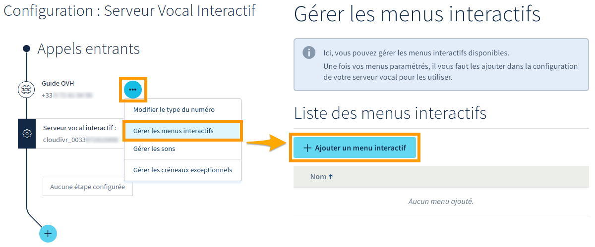
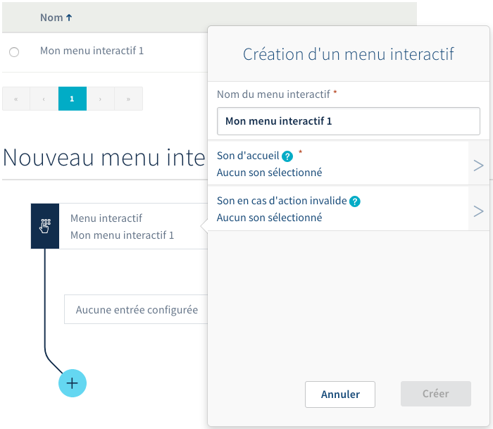
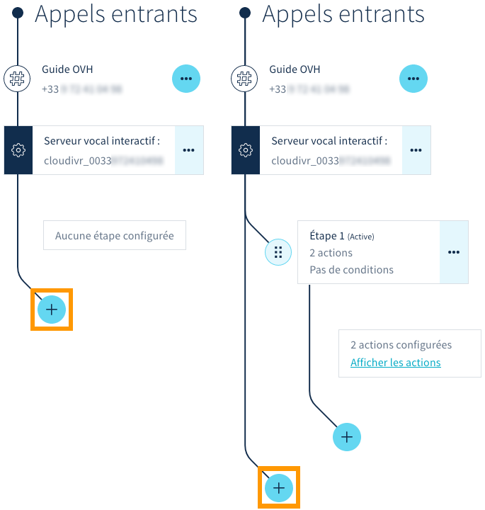
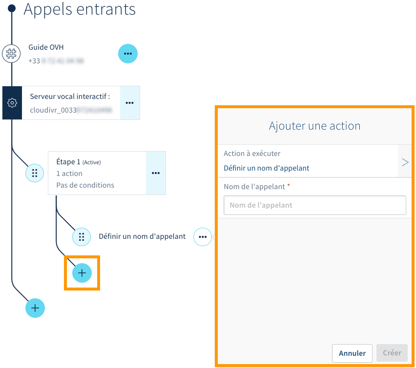
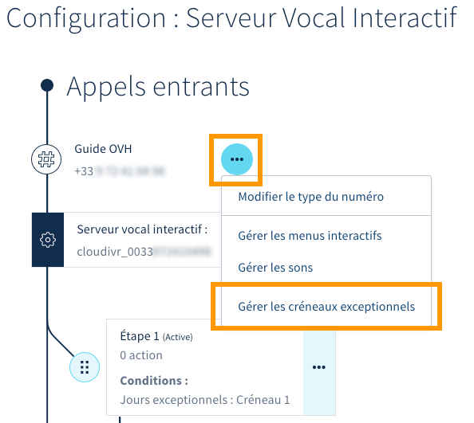
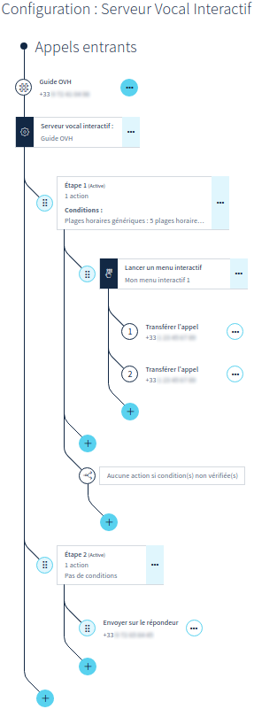

**Dernière mise à jour le 07/03/2019**

## Objectif

Configurer un numéro en tant que « serveur vocal interactif » permet de proposer à vos correspondants un menu avec lequel ils pourront interagir, grâce aux touches de leur téléphone. L'exemple le plus courant consiste à orienter un appelant entre plusieurs services d'une société : « Appuyez sur la touche 1 pour une demande commerciale ou sur la touche 2 pour une demande technique. »

Ce type de configuration offre plusieurs possibilités, comme définir des périodes de disponibilité (plages horaires), jouer un son en particulier durant une attente, définir un transfert d'appel, etc. C'est également une solution idéale si vous souhaitez que tous vos collaborateurs soient joignables via un seul numéro.

**Apprenez à configurer un serveur vocal interactif depuis l'espace client OVH.**

## Prérequis

- Disposer d'un [numéro alias](https://www.ovhtelecom.fr/telephonie/numeros/){.external}.
- [Avoir configué le numéro](../quelle-configuration-est-adaptee-a-mes-besoins/) en tant que « serveur vocal interactif ».
- Être connecté à l'[espace client OVH](https://www.ovhtelecom.fr/manager/auth/?action=gotomanager){.external}, partie `Télécom`{.action}.

## En pratique

### Étape 1 : accéder à la configuration du serveur vocal interactif

Connectez-vous à votre [espace client OVH](https://www.ovhtelecom.fr/manager/#/){.external}, partie « Télécom ». Cliquez sur `Téléphonie`{.action} dans la barre de services à gauche, puis sélectionnez le numéro concerné. Assurez-vous que celui-ci est bien configuré en tant que « Serveur Vocal Interactif », en vérifiant son `Type de configuration` dans le cadre « Configuration ». Dès lors, deux possibilités :

- **le numéro est configuré en tant que « Serveur Vocal Interactif »** : cliquez alors sur `Paramétrer la configuration`{.action} et poursuivez la lecture de cette documentation ;

- **le numéro n'est pas configuré en tant que « Serveur Vocal Interactif »** : vous devez au préalable le configurer correctement avant de poursuivre cette documentation. Reportez-vous à notre guide « [Choisir et appliquer une configuration pour un numéro](../quelle-configuration-est-adaptee-a-mes-besoins/) » si nécessaire.

{.thumbnail}

La configuration d'un serveur vocal interactif se réalise par le biais de plusieurs manipulations. **Il n’existe pas de marche à suivre universelle tant les cas sont différents.** Les éléments ci-dessous vous permettront de mieux appréhender ce qu'il est possible de faire. **Adaptez ces derniers à votre situation personnelle.**

Voici l'affichage que vous devez obtenir pour un serveur vocal interactif non configuré. Il pourrait être différent si des paramètres ont déjà été ajoutés.

{.thumbnail}

### Étape 2 : configurer un menu interactif

Débutez par créer un nouveau menu interactif. Vous devrez ensuite y configurer des entrées : ceci vous permettra de définir des actions qui s'activeront quand un appelant appuiera sur une touche.

#### 2.1 Créer un menu interactif

Cliquez sur le bouton `...`{.action} le plus proche des appels entrants, puis sélectionnez `Gérer les menus interactifs`{.action}. Dans la nouvelle page, cliquez alors sur `+ Ajouter un menu interactif`{.action}.

{.thumbnail}

Une fenêtre de création s'affiche. Complétez les informations demandées :

|Information|Description|
|---|---|
|Nom du menu interactif|Définissez un nom au menu interactif. Celui-ci ne peut contenir que des lettres (sans accents), des chiffres, des tirets bas, ainsi que des espaces.|
|Son d'accueil|Sélectionnez le son qui sera joué dès le début de l'appel. Celui-ci précise à l'appelant les différents choix offerts par les touches.|
|Son en cas d'action invalide|Choisissez le son qui sera joué si l'appelant appuie sur une touche non reconnue par le serveur vocal interactif.|

Une fois les informations renseignées, cliquez sur `Créer`{.action}.

{.thumbnail}

#### 2.2 Ajouter des entrées (actions) au menu interactif

Une fois votre menu interactif créé, vous pouvez y ajouter des entrées. Pour cela, cliquez sur le bouton `+`{.action} situé en bas de celui-ci.

{.thumbnail}

Dans la fenêtre qui s'affiche, complétez les informations demandées :

|Information|Description|
|---|---|
|Touche|Définissez la touche d'entrée du menu que vous souhaitez configurer.|
|Action à exécuter|Sélectionnez l'action qui se réalisera lorsque l'appelant appuiera sur la touche correspondante. Aidez-vous des informations qui s'affichent pour choisir l'option la plus adaptée à votre besoin.|
|Paramètre d'action supplémentaire|Selon l'action que vous avez définie, une case supplémentaire peut apparaître et vous inviter à renseigner un élément complémentaire. Suivez alors les indications qui s'affichent.|

Une fois les informations complétées, cliquez sur `Créer`{.action}. Selon vos besoins, répétez ces manipulations si vous voulez créer plusieurs menus interactifs. Vous pourrez alors les imbriquer dans votre serveur vocal interactif en tant que sous-menus, si vous souhaitez par exemple réaliser plusieurs embranchements.

{.thumbnail}

### Étape 3 : configurer une étape

Une fois le menu interactif créé, vous pouvez y configurer des étapes. Vous devez au préalable [créer une nouvelle étape](./#31-creer-une-etape), puis y [configurer des actions](./#32-ajouter-une-action-a-une-etape) et y [définir des conditions](./#33-ajouter-une-condition-a-une-etape) de déclenchement. Ceci vous permettra d'affiner le fonctionnement de votre serveur vocal interactif.

Vous pourrez par exemple définir des périodes de disponibilité (plages horaires) ou des embranchements qui se déclencheront selon certaines conditions (dans le cadre d'une fermeture de service, il est possible de rediriger les appels entrants vers un répondeur).

#### 3.1 Créer une étape

Débutez par retourner sur la configuration du serveur vocal interactif, en cliquant en haut de la page « Gérer les menus interactifs » sur `Retour à la configuration du numéro`{.action}. Si vous n'êtes plus positionné sur celle-ci, sélectionnez l'onglet `Configuration`{.action}, puis `Serveur Vocal Interactif`{.action}. Voici l'affichage que vous devez obtenir :

{.thumbnail}

Dès lors, ajoutez une étape en cliquant sur le bouton `+`{.action} le plus éloigné des appels entrants. Si vous avez déjà créé des étapes et que vous souhaitez en ajouter d'autres, assurez-vous d'utiliser le bon bouton `+`{.action} et de ne pas le confondre avec celui d'ajout d'actions.

Une fois l'étape créée, vous avez la possibilité d'y [configurer des actions](./#32-ajouter-une-action-a-une-etape) et d'y [définir des conditions](./#33-ajouter-une-condition-a-une-etape).

{.thumbnail}

#### 3.2 Ajouter une action à une étape

Les actions ajoutées à une étape s'activent lorsqu'un appelant est en communication avec votre serveur vocal interactif. Pour ajouter une action à une étape, cliquez sur le bouton `+`{.action} en dessous de l'étape concernée. Une fenêtre s'affiche alors. Complétez les informations demandées :

|Information|Description|
|---|---|
|Action à exécuter|Définissez l'action qui s'effectuera lorsque l'appelant appuiera sur la touche correspondante. Aidez-vous des informations qui s'affichent pour choisir celle la plus adaptée à votre besoin.   Afin de pouvoir utiliser un menu interactif ([créé lors de l'étape 2](./#etape-2-configurer-un-menu-interactif)), vous devez sélectionner l'action « Lancer un menu interactif ».|
|Paramètre d'action supplémentaire|Selon l'action que vous avez définie, une case supplémentaire peut apparaître et vous inviter à renseigner un élément complémentaire. Suivez alors les indications qui s'affichent.|

Une fois les informations complétées, cliquez sur `Créer`{.action}. Selon vos besoins, répétez ces manipulations si vous souhaitez créer plusieurs actions dans une étape. Prenez soin d'utiliser le bouton `+`{.action} situé en dessous de l'étape concerné.

{.thumbnail}

#### 3.3 Ajouter une condition à une étape

Lorsqu'une ou plusieurs conditions sont ajoutées à une étape, celles-ci doivent être atteintes pour que l'étape se déclenche. Si les conditions ne sont pas remplies, le cheminement prévu dans votre serveur vocal interactif passera à l'étape suivante.

Pour ajouter une condition à une étape, cliquez sur le bouton `...`{.action} à côté de l'étape concernée, puis choisissez `Configuration avancée`{.action}. Une fenêtre s'affiche alors ; vous pouvez y définir jusqu'à trois types de conditions. Poursuivez selon la condition que vous désirez paramétrer :

- [Condition de « Jours exceptionnels »](./#condition-de-jours-exceptionnels)
- [Condition de « Plages horaires génériques »](./#condition-de-plages-horaires-generiques)
- [Condition de « Filtrages d'appels »](./#condition-de-filtrages-dappels)

{.thumbnail}

##### Condition de « Jours exceptionnels »

Après avoir cliqué sur `Jours exceptionnels`{.action} depuis la fenêtre de configuration avancée, choisissez le créneau que vous souhaitez appliquer. Vous revenez ensuite automatiquement dans la fenêtre de configuration avancée. Cliquez alors sur `Modifier`{.action}.

{.thumbnail}

Vous devez à présent configurer le créneau que vous venez de sélectionner (ou vous assurer que celui-ci l'est correctement). Pour cela, cliquez sur le bouton `...`{.action} le plus proche des appels entrants, puis choisissez `Gérer les créneaux exceptionnels`{.action}.

{.thumbnail}

La page de gestion des fermetures exceptionnelles apparaît alors. Dans la partie `Planification des jours de fermeture`, positionnez vos fermetures exceptionnelles sur le calendrier en cliquant sur les jours concernés. Complétez les informations demandées :

|Information|Description|
|---|---|
|Plage horaire/journée entière|Choisissez si la fermeture exceptionnelle concerne uniquement une plage horaire ou une journée entière.|
|Objet|Définissez un titre vous permettant d'identifier cette fermeture exceptionnelle dans le calendrier.|
|Catégorie|Choisissez le créneau dans lequel vous souhaitez ajouter la fermeture exceptionnelle.|
|Du/au|Définissez la date et l'heure (le cas échéant) de la fermeture exceptionnelle.|
|Description|Vous pouvez ajouter une description plus détaillée à la fermeture exceptionnelle.|

Une fois les informations renseignées, cliquez sur `Créer l'événement`{.action}. Répétez cette manipulation afin d'ajouter toutes les fermetures exceptionnelles nécessaires. Cliquez enfin sur le bouton `Valider`{.action} pour sauvegarder ces changements.

{.thumbnail}

##### Condition de « Plages horaires génériques »

Après avoir cliqué sur `Plages horaires génériques`{.action} depuis la fenêtre de configuration avancée, deux possibilités existent :

- **vous n'avez aucune plage horaire définie** : vous devez dans ce cas cliquer sur le bouton `Ajouter des plages horaires`{.action} ;
- **vous avez déjà au moins une plage horaire définie** : vous devez alors soit cliquer sur la plage concernée si vous souhaitez la modifier, soit cliquer sur le bouton `Ajouter des plages horaires`{.action} pour en ajouter une nouvelle.

{.thumbnail}

Configurez maintenant les plages horaires qui correspondent à vos besoins. Pour cela, renseignez l'heure de début et l'heure de fin dans les zones prévues à cet effet. Utilisez ensuite le bouton `+`{.action} pour les ajouter. Une fois le paramétrage terminé, utilisez le bouton `<`{.action} situé dans la partie supérieure de la fenêtre des plages horaires génériques, puis cliquez sur le bouton `Modifier`{.action}.

{.thumbnail}

##### Condition de « Filtrages d'appels »

Après avoir cliqué sur `Filtrages d'appels`{.action} depuis la fenêtre de configuration avancée, choisissez si vous souhaitez filtrer vos communications selon une « liste noire » ou une « liste blanche ». 

|Liste|Description|
|---|---|
|Liste noire|Les numéros ou les tranches de numéros inscrits dans la liste ne peuvent plus vous contacter.|
|Liste blanche|Seuls les numéros ou les tranches de numéros inscrits dans la liste sont autorisés à vous contacter.|

Une fois que vous avez sélectionné la liste que vous souhaitez utiliser, complétez-la en ajoutant les numéros ou les tranches de numéros adéquats. Pour cela, utilisez la zone `Ajouter un numéro à la liste`, puis cliquez sur le bouton `Ajouter`{.action}. Vous pouvez supprimer une entrée dans la liste grâce à l'icône représentant une corbeille. 

Pour terminer la manipulation, utilisez le bouton `<`{.action} situé dans la partie supérieure de la fenêtre de filtrage d'appels, puis cliquez sur le bouton `Modifier`{.action}.

{.thumbnail}

### Annexe : cas concret d'utilisation

Pour compléter les éléments de cette documentation, vous trouverez ci-dessous un exemple concret d'utilisation du serveur vocal interactif ainsi que les différentes étapes nécessaires à sa création.

**Le but recherché** : 

- disposer d'un serveur vocal interactif permettant de choisir entre deux services (par le biais des touches `1` et `2`) ;
- les deux services disposent de leur propre numéro ;
- ces deux services sont joignables du lundi au vendredi, de 8 heures à 18 heures ;
- en dehors des horaires de service, les appels doivent être redirigés vers un répondeur.

**Les étapes de création de ce serveur vocal interactif** :

|Étapes|Description|Comment le faire ?|
|---|---|---|
|1|Configurer le numéro en « serveur vocal interactif »|Voir « [Choisir et appliquer une configuration pour un numéro](../quelle-configuration-est-adaptee-a-mes-besoins/) »|
|2|Créer un menu interactif|Voir « [2.1 Créer un menu interactif](./#21-creer-un-menu-interactif) »|
|3|Configurer le menu interactif (touches `1` et `2`)|Voir « [2.2 Ajouter des entrées (actions) au menu interactif](./#22-ajouter-des-entrees-actions-au-menu-interactif) »|
|4|Créer une première étape|Voir « [3.1 Créer une étape](./#31-creer-une-etape) »|
|5|Associer le menu interactif en tant qu'action de la première étape|Voir « [3.2 Ajouter une action à une étape](./#32-ajouter-une-action-a-une-etape) »|
|6|Paramétrer vos plages horaires de service|Voir « [3.3 Ajouter une condition à une étape](./#33-ajouter-une-condition-a-une-etape) »|
|7|Créer une deuxième étape|Voir « [3.1 Créer une étape](./#31-creer-une-etape) »|
|8|Associer le renvoi sur le répondeur à la seconde étape|Voir « [3.2 Ajouter une action à une étape](./#32-ajouter-une-action-a-une-etape) »|

Vous devez ainsi obtenir le résultat suivant :

{.thumbnail}

## Aller plus loin

Échangez avec notre communauté d'utilisateurs sur <https://community.ovh.com>.
