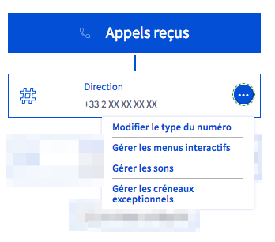
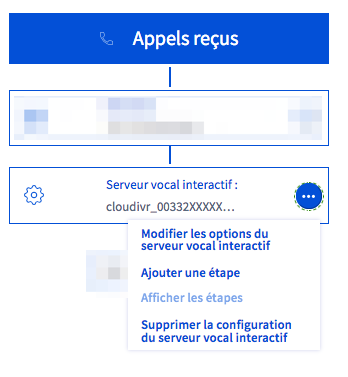
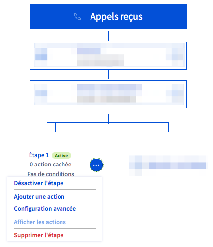
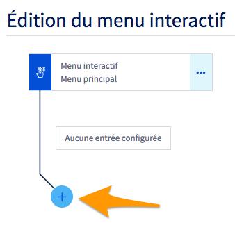

**Dernière mise à jour le 18/06/2021**

## Objectif

Configurer un numéro en Serveur Vocal Interactif (SVI) permet de proposer à vos correspondants un menu avec lequel ils pourront interagir, grâce aux touches de leurs téléphones.
 L'exemple le plus courant consiste à orienter un appelant entre plusieurs services d'une société : « Appuyez sur la touche 1 pour une demande commerciale ou sur la touche 2 pour une demande technique ».

**Découvrez comment configurer un serveur vocal interactif depuis l'espace client OVHcloud.**

## Prérequis

- Disposer d'un [numéro alias](https://www.ovhtelecom.fr/telephonie/numeros/){.external}.
- Être connecté à l'[espace client OVHcloud](https://www.ovh.com/auth?onsuccess=https%3A%2F%2Fwww.ovhtelecom.fr%2Fmanager&ovhSubsidiary=fr){.external}, partie `Télécom`{.action}.

> [!primary]
>
> Consultez notre guide « [Choisir et appliquer une configuration pour un numéro](../quelle-configuration-est-adaptee-a-mes-besoins/) » pour plus de détails sur les différentes configurations applicables à un numéro alias.
>

## En pratique

### Étape 1 : accéder à la configuration du serveur vocal interactif

Connectez-vous à votre [espace client OVHcloud](https://www.ovh.com/auth?onsuccess=https%3A%2F%2Fwww.ovhtelecom.fr%2Fmanager&ovhSubsidiary=fr){.external}, partie `Télécom`{.action}.
 Cliquez sur `Téléphonie`{.action} dans la barre de services à gauche, puis sélectionnez votre groupe de téléphonie et enfin le numéro concerné.
 Assurez-vous que celui-ci est bien configuré en tant que « Serveur Vocal Interactif », en vérifiant son `Type de configuration` dans le cadre « Configuration ». Dès lors, deux possibilités :

- **le numéro est configuré en tant que « Serveur Vocal Interactif »** : cliquez alors sur `Paramétrer la configuration`{.action} et poursuivez la lecture de cette documentation ;

- **le numéro n'est pas configuré en tant que « Serveur Vocal Interactif »** : vous devez au préalable le configurer correctement avant de poursuivre cette documentation. Reportez-vous à notre guide « [Choisir et appliquer une configuration pour un numéro](../quelle-configuration-est-adaptee-a-mes-besoins/) » si nécessaire.

{.thumbnail}

#### Présentation de l'interface

L'interface de configuration du SVI se présente sous la forme d'une arborescence au dessus de laquelle vous disposez de deux menus. Un menu supplémentaire est disponible sur chaque étape de l'arborescence.

|Menu du numéro|Menu de la configuration|Menu d'étape|
|---|---|---|
|{.thumbnail}|{.thumbnail}|{.thumbnail}|
|Permet de gérer les options principales de la configuration.|Permet de gérer les étapes de la configuration ainsi que les options d'affichage des appels.|Permet d'ajouter des actions au sein d'une étape ainsi que des conditions d'exécution de l'étape.|

### Étape 2 : configurer le serveur interactif

Les étapes suivantes peuvent être suivies sans ordre particulier. Néanmoins, à des fins de facilité de prise en main, nous vous recommandons de suivre l'ordre ci-dessous.

#### 2.1 gérer les sons

**L'ajout d'un son d'accueil est la première étape indispensable pour créer votre SVI**. Ce son d'accueil sera joué dès le début de l'appel. Il précise à l'appelant les différents choix offerts par les touches.

Vous pouvez ajouter plusieurs sons si vous souhaitez créer des choix de touches successifs. En effet, il vous faudra alors un son par menu interactif.
  Nous vous conseillons également de créer un son dédié aux actions invalides. Ainsi, si un appelant compose une touche que vous n'avez pas configurée, un son peut lui rappeler les choix de touches possibles.

> [!warning]
>
> La création des fichiers-sons est à votre charge. Nous vous conseillons de faire appel à un [prestataire spécialisé](https://partner.ovhcloud.com/fr/) car OVHcloud ne sera pas en mesure de créer ces fichiers pour vous.
>  Sachez qu'il est également possible de créer des fichiers-sons via le logiciel open source et gratuit [Audacity](https://www.audacityteam.org/){.external}.
>

Ouvrez le **menu du numéro** puis cliquez sur `Gérer les sons`{.action}.

{.thumbnail}

Cliquez alors sur `Ajouter un son`{.action} pour téléverser un son depuis votre poste.

#### 2.2 Créer un menu interactif 

Ouvrez le **menu du numéro** puis cliquez sur `Gérer les menus interactifs`{.action}.

{.thumbnail}

Sur la nouvelle page qui s'affiche, cliquez sur `+ Ajouter un menu interactif`{.action}.

{.thumbnail}

Une fenêtre de création s'affiche. Complétez les informations demandées :

|Information|Description|
|---|---|
|Nom du menu interactif|Définissez un nom pour ce menu interactif. Celui-ci ne peut contenir que des lettres (sans accents), des chiffres, des tirets bas ainsi que des espaces.|
|Son d'accueil|Sélectionnez le son qui sera joué dès le début de l'appel. Celui-ci précise à l'appelant les différents choix offerts par les touches.|
|Son en cas d'action invalide|Choisissez le son qui sera joué si l'appelant appuie sur une touche non reconnue par le serveur vocal interactif.|

Une fois les informations renseignées, cliquez sur `Créer`{.action}.

#### 2.3 Ajouter des entrées dans le menu interactif

Une fois votre menu interactif créé, vous pouvez y ajouter des entrées. Pour cela, cliquez sur le bouton `+`{.action} situé en bas de celui-ci.

{.thumbnail}

Dans la fenêtre qui s'affiche, complétez les informations demandées :

|Information|Description|
|---|---|
|Touche|Définissez la touche d'entrée du menu que vous souhaitez configurer.|
|Action à exécuter|Sélectionnez l'action qui se réalisera lorsque l'appelant appuiera sur la touche correspondante. Aidez-vous des informations qui s'affichent pour choisir l'option la plus adaptée à votre besoin.|
|Paramètre d'action supplémentaire|Selon l'action que vous avez définie, une case supplémentaire peut apparaître et vous inviter à renseigner un élément complémentaire. Suivez alors les indications qui s'affichent.|

Une fois les informations complétées, cliquez sur `Créer`{.action}. Selon vos besoins, répétez ces manipulations si vous voulez créer plusieurs menus interactifs. Vous pourrez alors les imbriquer dans votre serveur vocal interactif en tant que sous-menus, si vous souhaitez par exemple réaliser plusieurs embranchements.

{.thumbnail}

### Étape 3 : configurer les étapes et actions

Une fois vos menus interactifs créés, cliquez sur `Retour à la configuration du numéro`{.action}.

Vous devez à présent créer des étapes pour déclencher vos menus interactifs selon vos besoins. Vous pourrez par exemple définir des périodes de disponibilité (plages horaires) et les actions à déclencher en dehors de ces périodes.

#### 3.1 Créer une étape

Pour créer une première étape, ouvrez le **menu de configuration** puis cliquez sur `Ajouter une étape`{.action}.

{.thumbnail}

> [!primary]
>
> Pour réordonner les étapes et actions de votre plan de configuration, cliquez sur le bouton `Réordonner les étapes et actions`{.action} situé en haut à gauche.
>
> Utilisez le bouton dédié (entre chaque étape) pour modifier l'ordre de vos étapes et actions puis validez ce nouvel ordre en cliquant sur `Valider les modifications`{.action}
>

#### 3.2 Ajouter une action à une étape

Les actions ajoutées à une étape s'activent lorsqu'un appelant contacte votre numéro.

Pour ajouter une action à une étape, cliquez sur le bouton `...`{.action} dans l'étape concernée puis sur `Ajouter une action`{.action}

{.thumbnail}

Complétez les informations demandées :

|Information|Description|
|---|---|
|Action à exécuter|Définissez l'action qui sera effectuée lorsque l'appelant contactera votre numéro. Aidez-vous des informations qui s'affichent pour choisir celle la plus adaptée à votre besoin.   Afin de pouvoir utiliser un menu interactif ([créé lors de l'étape 2](./#creer-menu-interactif)), vous devez sélectionner l'action « Lancer un menu interactif ».|
|Paramètre d'action supplémentaire|Selon l'action que vous avez définie, une case supplémentaire peut apparaître et vous inviter à renseigner un élément complémentaire. Suivez alors les indications qui s'affichent.|

Une fois les informations complétées, cliquez sur `Créer`{.action}.

{.thumbnail}

Selon vos besoins, répétez ces manipulations si vous souhaitez créer plusieurs actions dans une étape.

> [!primary]
>
> A des fins de lisibilité, vous pouvez choisir à tout moment d'afficher ou masquer toutes les actions définies dans vos étapes. Cliquez sur `Options d'affichage`{.action} en haut à gauche de votre interface puis sur `Afficher toutes les actions`{.action} ou `Masquer toutes les actions`{.action}.
>

#### 3.3 Ajouter une condition à une étape

Lorsqu'une ou plusieurs conditions sont ajoutées à une étape, celles-ci doivent être remplies pour que l'étape se déclenche. Si les conditions ne sont pas remplies, soit une action correspondant aux **conditions non-vérifiées** se déclenche, soit l'étape suivante de votre plan de configuration se déclenche.

> [!success]
>
> Vous pouvez ainsi faire en sorte que votre SVI se déclenche uniquement lors de vos horaires d'ouverture. En dehors de ces horaires, vous pouvez, par exemple, diffuser un son rappelant les horaires d'ouverture de votre entreprise ou déclencher le [répondeur d'une ligne SIP OVHcloud](../configurer-consulter-repondeur-ligne-ovh/).
>

Pour ajouter une condition à une étape, ouvrez le menu de l'étape via le bouton `...`{.action}, puis choisissez `Configuration avancée`{.action}.

{.thumbnail}

Le menu qui apparaît vous permet de définir jusqu'à trois types de conditions.

{.thumbnail}

Une fois vos conditions créées, vous pouvez définir une ou plusieurs action(s) correspondant aux conditions non-vérifiées. Ces actions seront alors prises en compte pour les appels ne remplissant pas les conditions.

Ainsi, dans l'exemple ci-dessous, un appel pendant les plages horaires définies pour l'étape 1 lancera le menu interactif nommé « Menu principal ». (1).
 Un appel en dehors de ces plages horaires sera réceptionné sur le répondeur d'une ligne SIP OVHcloud (2).

{.thumbnail}

Poursuivez la lecture de ce guide selon la condition que vous désirez paramétrer :

- [Condition de « Jours exceptionnels »](./#condition-de-jours-exceptionnels)
- [Condition de « Plages horaires génériques »](./#condition-de-plages-horaires-generiques)
- [Condition de « Filtrages d'appels »](./#condition-de-filtrages-dappels)

##### **Condition de « Jours exceptionnels »** 

Après avoir cliqué sur `Jours exceptionnels`{.action} depuis le menu de configuration avancée, choisissez le créneau que vous souhaitez appliquer. Vous revenez ensuite automatiquement dans la fenêtre de configuration avancée. Cliquez alors sur `Modifier`{.action}.

{.thumbnail}

Vous devez à présent configurer le créneau que vous venez de sélectionner (ou vous assurer que celui-ci l'est correctement). Pour cela, ouvrez le **Menu du Numéro** via le bouton `...`{.action} puis cliquez sur `Gérer les créneaux exceptionnels`{.action}.

{.thumbnail}

La page de gestion des fermetures exceptionnelles apparaît alors. Dans la partie `Planification des jours de fermeture`, positionnez vos fermetures exceptionnelles sur le calendrier en cliquant sur les jours concernés. Complétez les informations demandées :

|Information|Description|
|---|---|
|Plage horaire/journée entière|Choisissez si la fermeture exceptionnelle concerne uniquement une plage horaire ou une journée entière.|
|Objet|Définissez un titre vous permettant d'identifier cette fermeture exceptionnelle dans le calendrier.|
|Catégorie|Choisissez le créneau dans lequel vous souhaitez ajouter la fermeture exceptionnelle.|
|Du/au|Définissez la date et l'heure (le cas échéant) de la fermeture exceptionnelle.|
|Description|Vous pouvez ajouter une description plus détaillée sur cette fermeture exceptionnelle.|

Une fois les informations renseignées, cliquez sur `Créer l'événement`{.action}. Répétez cette manipulation afin d'ajouter toutes les fermetures exceptionnelles nécessaires. Cliquez enfin sur le bouton `Valider`{.action} pour sauvegarder ces changements.

{.thumbnail}

##### **Condition de « Plages horaires génériques »** 

Après avoir cliqué sur `Plages horaires génériques`{.action} depuis le menu de configuration avancée, cliquez sur `Ajouter des plages horaires`{.action}.

Configurez maintenant les plages horaires qui correspondent à vos besoins. Pour cela, sélectionnez les jours concernés puis renseignez les horaires dans les cases prévues à cet effet. Cliquez sur le bouton `V`{.action} à droite pour enregistrer la plage.

Une fois toutes vos plages horaires définies, cliquez sur le bouton `Modifier`{.action} pour les valider.

{.thumbnail}

> [!primary]
> Pour modifier une plage horaire déjà créée, il est nécessaire de la supprimer puis de créer une nouvelle plage horaire.
>

##### **Condition de « Filtrages d'appels »** 

Après avoir cliqué sur `Filtrages d'appels`{.action} depuis le menu de configuration avancée, choisissez si vous souhaitez filtrer vos appels entrants selon une « liste noire » ou une « liste blanche ».

|Liste|Description|
|---|---|
|Liste noire|Les numéros ou les tranches de numéros inscrits dans la liste ne peuvent plus vous contacter.|
|Liste blanche|**Seuls** les numéros ou les tranches de numéros inscrits dans la liste sont autorisés à vous contacter.|

Une fois que vous avez sélectionné la liste que vous souhaitez utiliser, complétez-la en ajoutant les numéros ou les tranches de numéros adéquats. Pour cela, utilisez le champ `Ajouter un numéro à la liste`, puis cliquez sur le bouton `Ajouter`{.action}. Vous pouvez supprimer une entrée dans la liste grâce à l'icône représentant une corbeille.

Pour enregistrer vos modifications, cliquez sur `Modifier`{.action}.

{.thumbnail}

## Aller plus loin

Échangez avec notre communauté d'utilisateurs sur <https://community.ovh.com>.
