Préambule {#préambule}
---------

La configuration d'un numéro en **SVI** vous permet, lors d'un appel entrant, de proposer à l'appelant **un menu avec lequel il pourra interagir grâce aux touches de son téléphone**.Exemple de proposition: "*appuyez sur la **touche 1** pour joindre M. Toto ou appuyez sur la **touche 2** pour joindre Mme Tata*".

Différentes actions sont possibles via ce type de configuration (faire jouer un son, transférer l'appel, raccrocher, jouer avec des plages horaires, ...).

Ce type de configuration est idéale si vous souhaitez que tous vos collaborateurs soient joignables en direct via **un seul numéro commun**.

Pour cela, l'appelant doit composer le numéro de l'alias configuré en SVI comme sur l'exemple suivant :

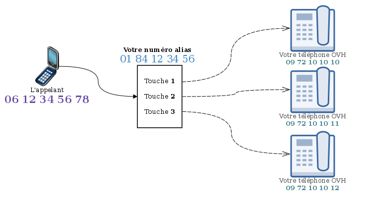{.thumbnail}

**Sommaire :**

Niveau : Intermédiaire

------------------------------------------------------------------------

### Prérequis {#prérequis}

-   Disposer d'un **numéro alias**.****
-   Disposer d'une ou plusieurs **lignes téléphoniques**.****

------------------------------------------------------------------------

### Configurer mon alias en file SVI {#configurer-mon-alias-en-file-svi}

Voici les manœuvres à exécuter pour configurer un alias en mode SVI :

-   Rendez vous sur le **manager Téléphonie.**
-   Cliquez sur **"Numéro".**
-   Choisissez le numéro alias concerné.
-   Cliquez sur **"Modifier le type du numéro"**.
-   Cochez la case **"Serveur vocal interactif"**.
-   Cliquez sur **"Valider"**.

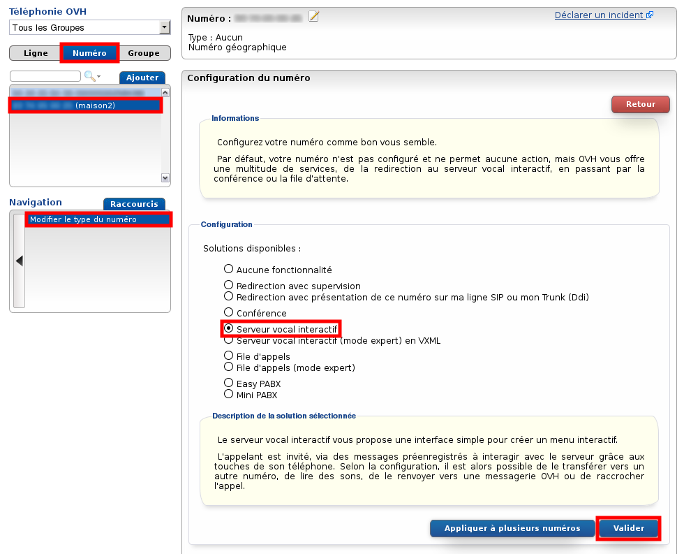{.thumbnail}

------------------------------------------------------------------------

### Créer le plan de numérotation selon un exemple simple {#creer-le-plan-de-numérotation-selon-un-exemple-simple}

Une fois que votre alias est paramétré en SVI, vous devez configurer ce dernier afin de définir son comportement lors d'un appel entrant :

-   Rendez vous sur le **manager Téléphonie**.
-   Cliquez sur **"Numéro"**.
-   Choisissez le numéro alias concerné.
-   Cliquez sur **"Gérer le plan de numérotation"**.

Une vue graphique est alors proposée pour montrer le comportement actuel du SVI **(le plan de numérotation)**. Par défaut, celui-ci est vide.

Exemple {#exemple}
-------

Votre société possède une ligne pour **l'accueil**, une ligne pour **le service commercial** et une autre pour **le service après-vente**.

Vous souhaitez que votre numéro soit un SVI qui présente à l'appelant les trois choix possibles via les touches 1, 2 et 3 de son téléphone.Un message d'erreur doit être entendu si une mauvaise touche est composée.

Voici le plan de numérotation qui rempli ce besoin :

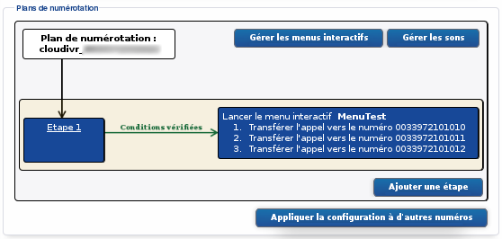{.thumbnail}

Pour remplir ce besoin, nous allons devoir configurer **l'étape 1**, pour qu'elle fasse appel à un **menu interactif** qui transfère les appels selon le choix de touche :

#### Créer le menu interactif {#creer-le-menu-interactif}

-   Cliquez sur **"Gérer les menus interactifs".**
-   **Action à effectuer :** "Ajouter un menu interactif".
-   **Nom :** vous choisissez le nom du menu. Pour notre exemple ce sera **MenuTest**.
-   **Fichier son d'accueil :** C'est le son qui sera joué dès le début d'appel.

    C'est ce son qui doit exposer à l'appelant les différents choix de touches possible.

-   **Fichier son en cas d'action invalide :**C'est le son que l'appelant entendra s'il se trompe de touche.
-   **Touche :** Choisissez "Touche" **1** et "Action" **Transférer l'appel** vers la ligne **0033972101010**, par exemple.
-   Répétez la dernière action pour les touches **2** et **3**.
-   Cliquez sur**"Ajouter"**.

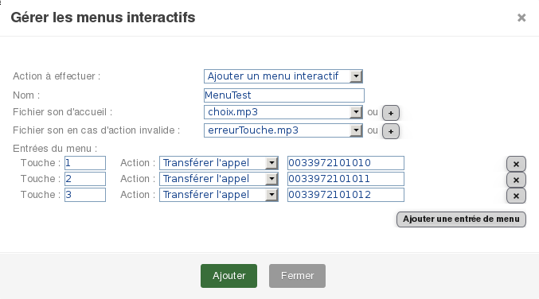{.thumbnail}

Si le numéro cible d'une touche est un numéro externe, les appels qui seront décrochés par ce numéro seront automatiquement facturés en hors-forfait. Les offres que vous pouvez avoir sur vos lignes ne rentrent pas en compte pour un alias.

Le menu interactif est maintenant créé, il ne reste plus qu'à l'inclure au plan de numérotation en créant la première étape de ce plan :

#### Configurer une étape du SVI {#configurer-une-étape-du-svi}

-   Cliquez sur **"Ajouter une étape"**.
-   Vérifiez que la case **"Étape activée"** est cochée.
-   Indiquez **"l'Action à exécuter"**:****
    -   Action : **"Lancer un menu interactif"**;****
    -   Menu interactif : **MenuTest**.****
-   Cliquez sur **"Créer"**.

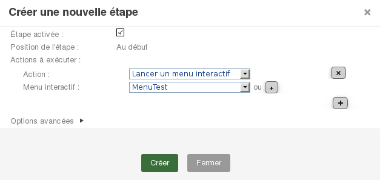{.thumbnail}

------------------------------------------------------------------------

### Divers actions possibles {#divers-actions-possibles}

Pour répondre à notre premier besoin, il ne fallait qu'une seule étape et qu'un seul menu interactif qui transfère les appels entrant vers les lignes.

Il est cependant possible d'effectuer d'autres stratégies.

#### Sur les menus interactifs {#sur-les-menus-interactifs}

Le menu interactif peut vous permettre de faire autre chose qu'un renvoi d'appel. Voici les différentes options et ce qu'elles représentent :

-   **Jouer un son :** si l'appelant appuie sur cette touche, il entendra un son de votre choix.

    Un fichier son est demandé : Taille max. : 10 Mo, formats principaux autorisés : wav, mp3, mp4, ogg et wma.

    Ce type de configuration peut être intéressante si vous souhaitez juste exposer vos offres commerciales par exemple.

<!-- -->

-   **Lancer un sous-menu :** Cette action vous permet de lancer un autre menu interactif lorsque la touche concernée est appuyée. Vous pouvez ainsi avoir plusieurs menus en cascade.

    Exemple de plan de numérotation:

    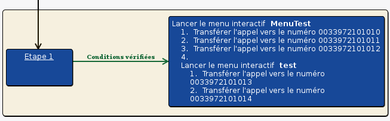{.thumbnail}

    En effet l'appelant est redirigé vers un menu **MenuTest** qui lui propose **quatre touches**. La quatrième le redirige vers un autre menu **test** qui lui-même propose les touches **1** et **2.**

-   **Mettre fin au menu interactif:** Si l'appelant appuie sur cette touche, l'appel sera coupé ou transféré à l'étape suivante si vous en avez configuré une.

    Exemple de plan de numérotation:

    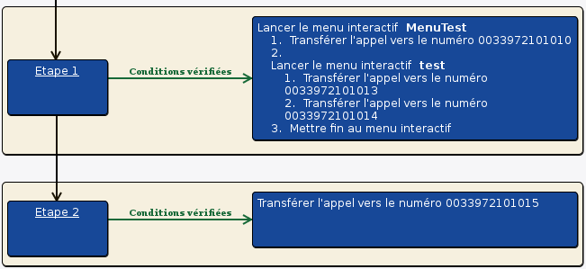{.thumbnail}

    Dans cet exemple, si l'appelant appuie sur la **touche 3**, l'appel passera à **l'étape 2** et sera transféré directement vers la ligne **0033972101015**.

    S'l n'y avait pas d'étape 2, l'appel serait coupé directement.

-   **Retour au menu principal/précédent :** Ces actions ne sont utiles que lorsque que vous avez plusieurs menus en cascade.

    Exemple de plan de numérotation :

    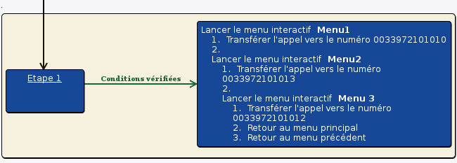{.thumbnail}

    Si l'appelant appuie sur la **touche 2**, il arrive dans le **Menu2**. S'l appuie de nouveau sur la **touche 2**, il arrive dans le **Menu3**. Or dans le menu 3, il y a :

    **Touche 2: Retour au menu principal**, cela le fera revenir à **l'accueil du Menu1** (premier menu).

    **Touche 3: Retour au menu précédent**, cela le fera revenir à**l'accueil du Menu2** (menu précédent).

-   **Transférer l'appel :** L'appel sera transféré vers la ligne cible si cette touche est appuyée. Nous avons déjà vu cette action lors de notre premier exemple.

Nous venons de voir que les menus interactifs peuvent être modulés afin d'appliquer une stratégie de votre choix.

#### **Sur les étapes** {#sur-les-étapes}

Notre premier exemple n'a nécessité qu'une seule étape qui renvoie vers un menu interactif, il existe cependant d'autres actions possibles pouvant être effectuées par les étapes. Vous pouvez aussi inclure plusieurs étapes dans votre plan de numérotation.

Pour ajouter une étape :

-   cliquez sur **"Ajouter une étape"** ;****
-   vérifiez que la case **"Étape activée"** est cochée ;
-   choisissez la **Position de l'étape** par rapport aux autres ;
-   indiquez **"l'Action à exécuter"** ;****
-   cliquez sur **"Créer**".

Nous voyons donc qu'il y a plusieurs actions possibles pouvant être exécutées lors d'une étape :

-   **Définir un nom d'appelant :** Cette action permet de changer, au cours du plan de numérotation, le nom de l'appelant qui sera présenté sur le téléphone de la ligne qui décroche l'appel.

    Exemple de plan de numérotation :

    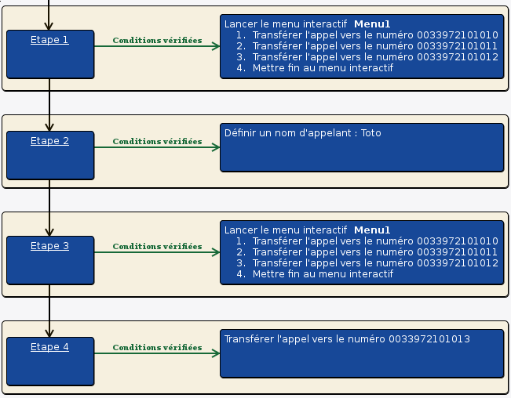{.thumbnail}

    L'action **définir un nom d'appelant** a été placée en **étape 2**.

    Si l'appelant appuie sur la **touche 1**, l'appel sera directement transféré vers la ligne 0033972101010 et celle-ci verra le nom d'origine de l'appelant sur son écran.Cependant, si l'appelant appuie sur la **touche 4** (passage à l'étape 2 pour le **changement du nom** puis l'étape 3) et qu'il appuie ensuite sur la **touche 1**, le nom présenté sur la ligne 0033972101010 sera **"Toto"**.

    Cette présentation sera identique pour la ligne 0033972101013 si l'appel va jusqu'à **l'étape 4**.

    Ce nom personnalisé ne s'affichera que si la ligne qui décroche est une ligne OVH. Dans le cas contraire, ce sera le numéro de l'appelant qui sera présenté.

    Cette fonctionnalité ne sera prise en compte que si le plan de numérotation est configuré pour présenter le numéro de l’appelant (voir le paragraphe [Plan de Numérotation](#SVI(ServeurVocalIntéractif)-PlanDeNumerotation)).

<!-- -->

-   **Jouer un son/Jouer un son en boucle:**

    Exemple :

    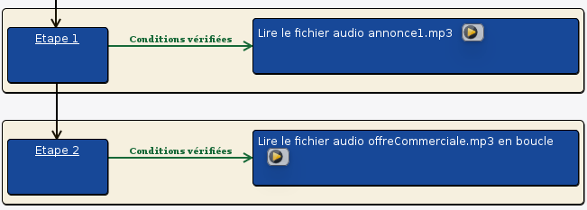{.thumbnail}

    Ce plan de numérotation va jouer **une fois** le son **annonce1.mp3** et ensuite jouer **en boucle** le son **offreCommerciale.mp3** jusqu'à ce que l'appelant raccroche.

-   **Lancer un menu interactif :** Permet de proposer à l'appelant un menu avec lequel il pourra interagir grâce aux touches de son téléphone. Nous avons déjà vu cette action lors de notre premier exemple.
-   **Raccrocher :** Cette étape permet de mettre fin à l'appel.
-   **Répondeur :** Cette action vous permet de renvoyer l'appel vers le répondeur de l'une de vos lignes OVH (sans la faire sonner).

    Exemple de plan de numérotation :

    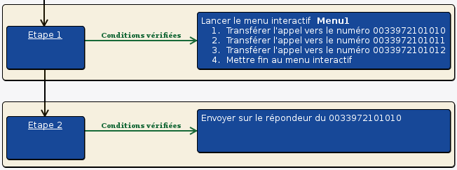{.thumbnail}

    Si l'appelant appuie sur la touche 4 lors de la première étape, l'appel passera à **l'étape 2** et sera redirigé directement vers **le répondeur de la ligne 0033972101010**.

-   **Temporiser :** Cette action permet simplement de choisir une durée (en ms) pendant laquelle il ne se passera rien.Au delà de cette durée, l'appel passera à l'étape suivante ou sera coupé si il n'y a pas d'autre étape.
-   **Transférer l'appel :**Cette action permet simplement de transférer l'appel vers une ligne (sans menu interactif donc sans laisser le choix pour l'appelant).

Il est également possible, selon vos besoins, d’exécuter **plusieurs actions dans une même étape** :

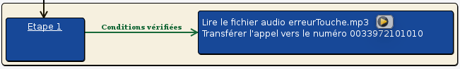{.thumbnail}

**L'étape 1** fera entendre le son **erreurTouche.mp3** à l'appelant puis fera sonner la ligne **0033972101010**.

Pour ce faire, lors de la configuration de l'étape :

-   Cliquez sur {.thumbnail} pour ajouter une **nouvelle action**.
-   Cliquez sur **"Créer"**.

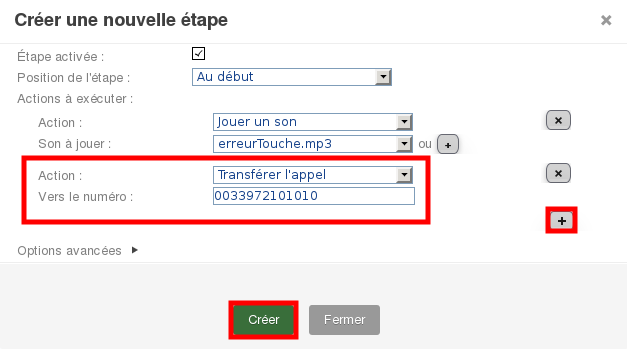{.thumbnail}

Nous avons vu qu'en combinant les différentes possibilités **des étapes** et **des menus interactifs**, nous pouvons obtenir un plan de numérotation complètement personnalisé et qui réponde à la majorité des besoins d'une société en matière de SVI.

------------------------------------------------------------------------

### Spécificités {#spécificités}

#### **"Gérer les sons"** et **"Appliquer la configuration à d'autres numéros"** {#gérer-les-sons-et-appliquer-la-configuration-à-dautres-numéros}

Lors des manipulations sur le plan de numérotation, vous avez pu remarquer qu'il y a deux boutons que nous n'avons pas encore évoqués : **"Gérer les sons"** et **"Appliquer la configuration à d'autres numéros"**.

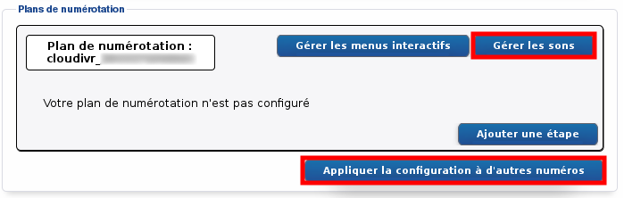{.thumbnail}

L'option **"Gérer les sons"** permet d'ajouter ou de supprimer un son dans la "base de donnée" de votre SVI. Ce son sera alors disponible directement (sans upload) lors de la configuration d'un menu interactif ou d'une étape.

Un fichier son est demandé : Taille max. : 10 Mo, formats principaux autorisés : wav, mp3, mp4, ogg et wma.

L'option **"Appliquer la configuration à d'autres numéros"** vous permet d'appliquer la configuration actuelle de votre SVI à un ou plusieurs autre(s) numéro(s). Cette configuration sera copiée dans sa totalité.

Pour ce faire :

-   Cliquez sur **"Appliquer la configuration à d'autres numéros"**.
-   Sélectionnez le**groupe**contenant le(s) numéro(s) à configurer.

    Cette action n'est pas obligatoire. Il n'est pas nécessaire de filtrer la recherche par groupes si vous n'avez pas beaucoup de numéros sur votre compte.

-   Sélectionnez**le(s) numéro(s)** à configurer.

    Les numéros cibles de ce menu doivent déjà être en mode SVI ([Voir le premier paragraphe](#SVI(ServeurVocalIntéractif)-aliasToSvi)).

-   Cliquez sur **"Valider".**

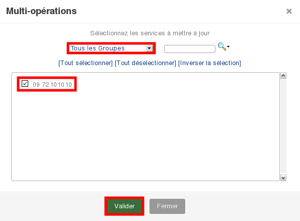{.thumbnail}

Dans cet exemple, l'alias **0972101010** prendra exactement la même configuration que notre SVI de base.

#### Plan de numérotation {#plan-de-numérotation}

Lorsque vous êtes dans le menu de configuration du SVI, vous pouvez cliquez sur le plan de numéro afin de personnaliser celui-ci :

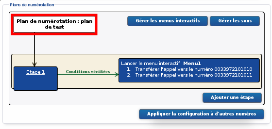{.thumbnail}

Vous pourrez ainsi modifier les choses suivantes :

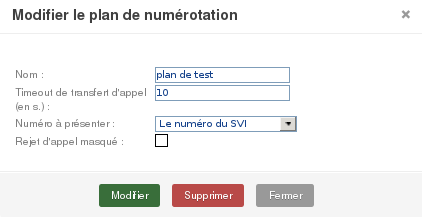{.thumbnail}

-   **Nom :**Ce nom sera présent sur le téléphone appelé (cible du SVI) lors d'un appel entrant si le **Numéro à présenter** est configuré sur **"SVI"** ou **"les 2 numéros"**.****
-   **Timeout de transfert d'appel :**Lorsque le plan de numérotation comporte un transfert vers une ligne externe, si cette ligne ne décroche pas avant la durée configurée, l'appel passera à l'étape suivante.

    Exemple {#exemple-1}
    -------

    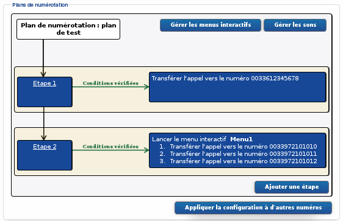{.thumbnail}

    Dans cette configuration, **un appel vers le SVI fera sonner la ligne 0033612345678 pendant la durée configurée** (valeur choisie : **10s**). Si le téléphone 0033612345678 ne décroche pas ou ne renvoie pas vers une messagerie sous 10 secondes, **l'appel passera au menu interactif Menu1**.

-   **Numéro à présenter :** Cela permet de définir la présentation lors d'un appel entrant sur le téléphone qui reçoit cet appel.

    -   **Le numéro de l'appelant :** le téléphone cible (qui reçoit l'appel) verra sur son écran le numéro de la ligne qui compose le numéro du SVI (ligne qui appelle).
    -   **Le numéro du SVI :** le téléphone cible (qui reçoit l'appel) verra sur son écran le numéro de l'alias (numéro qui est composé par l’appelant).
    -   **Les deux numéros :** le téléphone cible (qui reçoit l'appel) verra sur son écran la ligne qui compose l'appel ainsi que le numéro alias qui est composé.

        Parmi les téléphones fournis par OVH, seuls les téléphones Cisco SPA5XXG sont compatibles avec la présentation des deux numéros lors d'un appel entrant.

    Pour les configurations de type**"Le numéro du SVI**" et "**Les deux numéros"**, si le téléphone cible (qui reçoit l'appel) est un téléphone OVH, le numéro du SVI présenté sera remplacé par **le nom configuré dans ce même menu.**

    Pour notre exemple ce sera : "**plan de test"**.

-   **Rejet d'appel masqué :** Si cette case est cochée, tous les appelants anonymes seront rejetés.

------------------------------------------------------------------------

### Configuration avancée {#configuration-avancée}

Sur le type de configuration SVI, il est possible d'établir **des conditions** selon lesquels la stratégie jouée sera différentes.

Exemple {#exemple-2}
-------

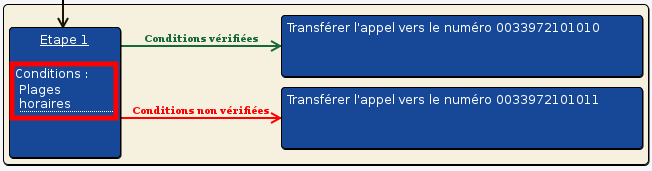{.thumbnail}

On voit sur ce plan de numérotation que l'étape peut proposer **deux stratégies possibles** selon une **condition horaire**.

En effet, des **plages horaires** sont configurées sur l'étape**(heures de disponibilité et heures d'indisponibilité)**.****Si l'appel entrant se présente dans les **heures de disponibilité**, l'étape jouera **l'action si condition vérifiée**, elle fera donc sonner la ligne 0033972101010.À l'inverse, si l'appel arrive **en dehors de ces heures de disponibilité**, l'étape fera sonner la ligne 0033972101011.

Pour configurer l'action si **"condition non vérifiée"** :

-   configurez votre **étape** sans cliquer sur "Créer" ;
-   cliquez {.thumbnail} à la ligne **"Action si conditions non vérifiées"**;****
-   choisissez votre Action ;

    Comme pour les **"conditions vérifiées"**, vous pouvez configurer plusieurs actions en cliquant sur {.thumbnail} autant de fois que nécessaire.

-   cliquez sur **"Créer"** pour finalisez la configuration de votre étape

Autre exemple {#autre-exemple}
-------------

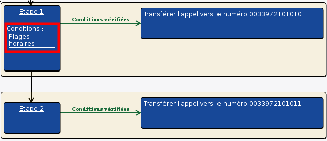{.thumbnail}

Il n'y a plus de **"conditions non vérifiées"** sur l'étape 1 mais il y a une **étape 2**.

Si l'appel entrant se présente **hors des horaires de disponibilité** de l'étape 1, l'appel passera directement à**l'étape 2** et fera sonner la ligne 033972101011.

Ces deux exemples montrent comment sont gérées les **"conditions"** dans les étapes.

Ces conditions peuvent prendre différentes formes : **les plages horaires**,**les créneaux exceptionnels**,**les filtrages d'appel** :

#### Plages Horaires {#plages-horaires}

Nous avons vu dans le dernier exemple qu'il est possible d'établir des stratégies différentes selon la condition **"plages horaires"**. Voyons comment le configurer dans le manager :

Lors de la configuration de votre étape :

-   Cliquez sur **"Options avancées"**.
-   Cliquez sur le**jour** où vous souhaitez appliquer vos disponibilités.
-   Choisissez la **plage horaire**.
-   Répétez l'action sur tous les jours de **disponibilité**.
-   Cliquez sur **"Créer"** pour finalisez la configuration de votre étape.

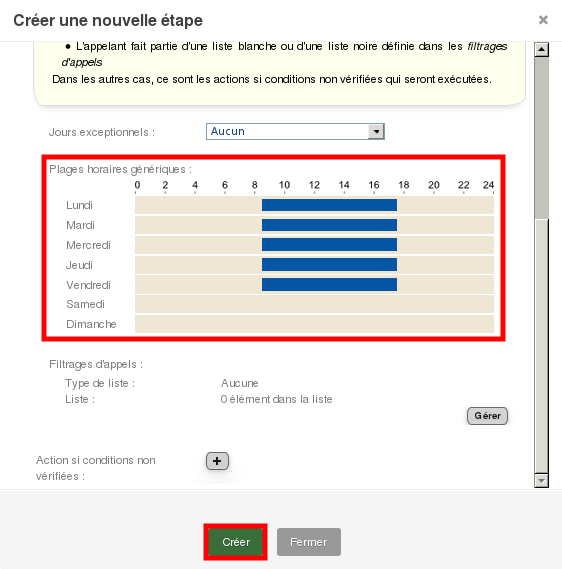{.thumbnail}

Dans ce cas, si l'appel arrive sur notre étape le lundi à 10h, l'action si **"condition vérifiée"** sera jouée.

Si maintenant l'appel arrive sur notre étape le lundi à 20h, ce sera l'action si **"condition non vérifiée"** qui sera jouée. À défaut d'action, l'appel passera à l'étape suivante ou sera coupée s'il n'y a pas d'autre étape.

#### Créneaux exceptionnels {#créneaux-exceptionnels}

Il est possible de gérer une **base de donnée** sur votre SVI contenant les **jours exceptionnels** (exemples : jours fériés, congés, ...).

Cette base de donnée pourra alors être consultée par votre **étape** pour devenir une **condition** à l’exécution d'une action.

Gestion de cette base de jours exceptionnels :

-   cliquez sur **"Gérer les créneaux exceptionnels"**;****
-   cliquez sur le **jour concerné**;****
-   choisissez le **type de créneau** (il aura une importance dans la configuration de l'étape) ;
-   cliquez sur **"Créer"**.

Utilisation de la condition **créneaux exceptionnels** lors de la création de votre étape :

-   cliquez sur **"Options avancées"**;****
-   choisissez le**Créneau**à la ligne**"Jours exceptionnels"**;****
-   cliquez sur**"Créer"**.

Exemple d'utilisation {#exemple-dutilisation}
---------------------

Configuration des jours exceptionnels pour le mois d'**avril 2015** :

**bleu = jours chômés**

**vert = créneau 1**

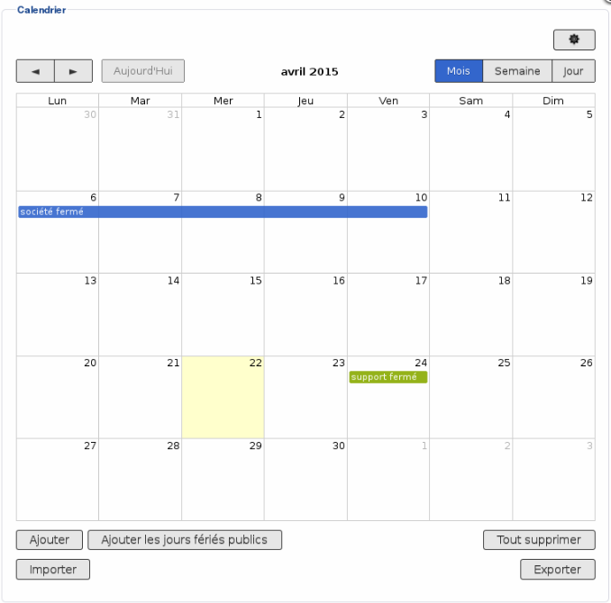{.thumbnail}

Notre plan de numérotation :

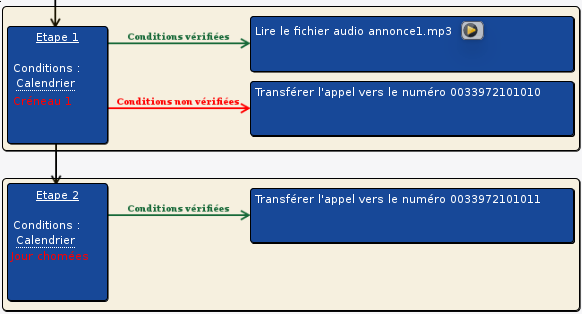{.thumbnail}

Dans cette situation :

Si un appel est reçu le **22 avril**, la condition de l'étape 1 est vérifiée. L**e son annonce1.mp3 est joué** puis l'appel passe à l'étape 2 et **la ligne 0033972101011 sonne**.

Si un appel est reçu le **7 avril**, la condition de l'étape 1 est vérifiée. **Le son annonce1.mp3 est joué** puis l'appel passe à l'étape 2. La condition de l'étape 2 n'est pas vérifiée, **l'appel prend fin sans faire sonner la ligne 0033972101011.**

Si un appel est reçu le **24 avril**, la condition de l'étape 1 n'est pas vérifiée. **L'appel reste à l'étape 1 et fait sonner la ligne 0033972101010.**

#### Filtrage d'appel {#filtrage-dappel}

La troisième forme de **condition** possible est le **filtrage d'appel** en fonction du numéro de l'appelant.

Lors de la configuration de votre étape :

-   Cliquez sur **"Options avancées"**.
-   Cliquez sur **"Gérer**" à la ligne**"Filtrages d'appels**".
-   Choisissez le **Type de liste**.

    **Liste blanche** = Autoriser uniquement les numéros de la liste à appeler.

    **Liste noire** = Interdire les numéros de la liste à appeler.

-   Choisissez **le numéro** ou **la plage de numéros** à ajouter dans cette liste.

    Vous pouvez configurer plusieurs numéros en cliquant sur {.thumbnail}.

-   Cliquez sur **"Modifier"**.
-   Cliquez sur **"Créer"**.

Exemple {#exemple-3}
-------

Voici la configuration de notre filtrage :

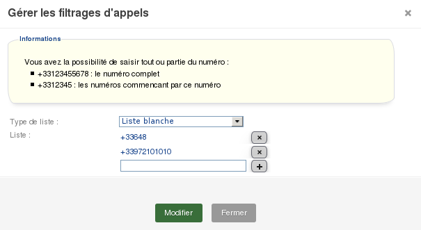{.thumbnail}

Uniquement les appels provenant de **0033972101010** et de la plage **0033648XXXXXX** passerons en **"conditions vérifiée"** sur cette étape.

Notre plan de numérotation :

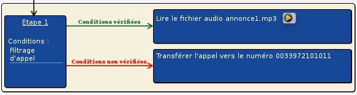{.thumbnail}

Dans cette situation :

Si le numéro **0033972101010** (ou un numéro de la plage **0033648XXXXXX**) appelle ce SVI, la condition de l'étape 1 est vérifiée. **L'annonce1.mp3 sera jouée**.

Si un autre numéro appelle ce SVI, la condition de l'étape 1 ne sera pas vérifiée.**La ligne 0033972101011 sonnera.**

Ces trois types de conditions **(plage horaire, créneaux exceptionnels, filtrage d'appel)** peuvent se cumuler sur une même étape.

Si seulement l'une des trois est **"non vérifiée"**, ce sera l'action si **"condition non vérifiée"** qui sera jouée. À défaut d'action, l'appel passera à l'étape suivante ou sera coupé s'il n'y a pas d'autre étape.

------------------------------------------------------------------------

### SVI mode Expert (programmation VXML)

Nous avons vu que le SVI permet de réceptionner les appels de façon intelligente et interactive.

Il existe un autre type de SVI qui permet, **via la programmation VXML**, de personnaliser d'avantage le comportement et de le scripter.

Voyez en détail ce type de configuration dans le guide suivant: Gérer et configurer mon numéro en SVI (VXML)].

------------------------------------------------------------------------

