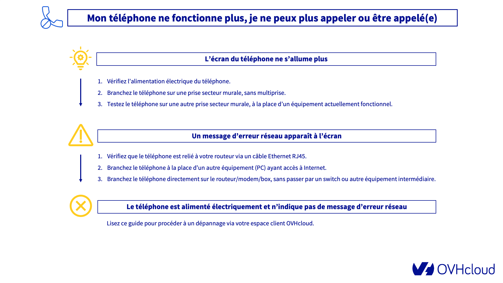

**Dernière mise à jour le 29/04/2022**
 
## Objectif

À la différence des modèles de téléphones historiques fonctionnant sur la technologie cuivre analogique, les téléphones VoIP fournis par OVHcloud utilisent le réseau Internet.
Pour fonctionner correctement, à l'instar de votre ordinateur, un téléphone OVHcloud a donc besoin :

- d'être alimenté électriquement;
- d'être raccordé à votre réseau local et de communiquer sur Internet.

Les causes d'un dysfonctionnement d'un téléphone VoIP sont donc variées :

- un défaut d'alimentation électrique;
- une problématique réseau telle que :
    - une connectivité limitée ou inexistante;
    - un défaut de distribution d'adresses IP (DHCP) sur votre réseau local;
- un défaut temporaire de configuration du téléphone.
 
**Découvrez comment diagnostiquer et dépanner votre téléphone OVHcloud.**

## Prérequis

- Être connecté à l'[espace client OVHcloud](https://www.ovh.com/auth/?action=gotomanager&from=https://www.ovh.com/fr/&ovhSubsidiary=fr){.external}, partie `Télécom`{.action}.
- Disposer d'une [ligne téléphonique OVHcloud](https://www.ovhtelecom.fr/telephonie/voip/){.external}.
- Disposer d'un [téléphone fourni par OVHcloud](https://www.ovhtelecom.fr/telephonie/comparatif-des-telephones.xml){.external} et l'avoir installé.

## En pratique

> [!warning]
> Les équipes de support OVHcloud ne pourront pas vous fournir d'assistance quant à la configuration matérielle et logicielle de votre réseau local, celui-ci étant de votre responsabilité.
>
> En cas de difficultés, nous vous recommandons de faire appel à l'un de [nos partenaires](https://partner.ovhcloud.com/fr/directory/) ou à vous faire aider par la communauté des utilisateurs OVHcloud. Pour plus d'informations, reportez-vous à la section « [Aller plus loin](#gofurther) » de ce guide
>

Ce guide vous détaille les causes principales d'un défaut d'enregistrement de la ligne SIP associée à votre téléphone, suivant un ordre logique. 
Nous vous conseillons donc de **suivre l'ordre des étapes de vérification** ci-dessous afin de dépanner votre téléphone. 
Si votre téléphone retrouve son fonctionnement normal après avoir suivi l'une des premières étapes de ce guide, il n'est pas indispensable de suivre les étapes ultérieures.

Cliquez sur l'image ci-dessous pour afficher un résumé des actions à entreprendre.

{.thumbnail}

### Étape 1 - Vérifier votre réseau local

Dans un premier temps, consultez notre [tutoriel dédié au diagnostic du réseau local](https://docs.ovh.com/fr/voip/depannage-telephone-plug-and-phone/) pour vérifier que votre installation électrique est conforme et que votre réseau local est optimisé pour l'utilisation de la téléphonie VoIP OVHcloud.

## Étape 2 - Procéder à un dépannage du téléphone depuis l'espace client OVHcloud

Si votre téléphone reste inopérant malgré le diagnostic de votre réseau local, vous devez alors effectuer un dépannage par le biais de votre espace client OVHcloud.

> **Prérequis nécessaire: connaître l'adresse IP publique de votre réseau**
>
> Pour procéder au dépannage, il est indispensable de connaître l'adresse IP publique du réseau sur lequel est raccordé votre téléphone.
>
> Rendez-vous sur <http://monip.ovh> et prenez note de l'adresse IP publique qui vous est indiquée.
>

Pour démarrer la manipulation, connectez-vous à votre [espace client OVHcloud](https://www.ovh.com/auth/?action=gotomanager&from=https://www.ovh.com/fr/&ovhSubsidiary=fr){.external}, puis cliquez sur l'onglet `Telecom`{.action}.

Cliquez sur `Téléphonie`{.action} puis choisissez la ligne concernée. 

Rendez-vous dans l'onglet `Assistance`{.action} et cliquez sur le bouton `Dépannage Plug & Phone`{.action}.

{.thumbnail}

Une fois dans l'assistant, celui-ci va vous guider en vous posant plusieurs questions et en vous proposant des manipulations. 
Suivez avec précision les informations qui s'affichent à chaque étape de l'assistant. Ces informations peuvent vous permettre de résoudre la panne que vous rencontrez.

> [!primary]
> Le nombre de questions peut varier selon le modèle de téléphone.

Assurez-vous également que votre téléphone est correctement branché électriquement et bien connecté à votre réseau local.

{.thumbnail}

En fonction des informations sélectionnées, vous pourriez être amené à reconfigurer automatiquement votre téléphone. Si tel est le cas, veillez à bien suivre les trois manipulations qui s'affichent :

|Manipulations|Description|
|---|---|  
|Vérifier l'adresse MAC du téléphone|L'adresse affichée dans votre espace client OVHcloud doit être la même que l'adresse MAC, unique, sur votre téléphone. Vous pouvez la retrouver sur l'étiquette du constructeur.|  
|Entrer l'adresse IP du téléphone|Il s'agit de la dernière adresse IP publique connue de votre téléphone. Assurez-vous de renseigner la bonne adresse afin que la reconfiguration puisse arriver à son terme.|
|Redémarrer électriquement le téléphone|Après avoir redémarré, le téléphone récupérera un nouveau fichier de configuration, permettant ainsi de le reconfigurer.|

> [!warning]
>
> Si la reconfiguration de votre téléphone n'arrive pas à son terme, assurez-vous d'avoir bien respecté les manipulations précédentes.
>

### Étape 3 - Réinitialiser le téléphone (facultatif)

La réinitialisation d'un téléphone s'effectuer généralement via son menu lorsqu'il en dispose d'un. A défaut, certains modèles de téléphones nécessitent d'effectuer une combinaison de touches ou d'appuyer sur un bouton dédié.

Le tableau ci-dessous récapitule les manipulations à effectuer pour réinitialiser un téléphone, en fonction de la marque de celui-ci.

|Marque/Gamme|Procédure de réinitialisation|
|---|---|
|**Cisco** disposant d'un écran| Appuyez sur le bouton `Engrenage` pour accéder au menu principal. Allez dans le sous-menu `Admn. Appareil`. Sélectionnez l'option `Réinit. Usine`. Validez la réinitialisation.|
|**Cisco** sans écran (modèle ATA191)|Appuyez pendant 10 secondes, avec un objet pointu, dans le trou `Reset` situé à l'arrière du boîtier Cisco. Le voyant *Power* va clignoter durant la procédure de réinitialisation. Les voyants *Power* puis *Internet* vont ensuite rester allumés, puis le voyant *Line 1* (ou *Line 2*) s'allumera.|
|**Gigaset** DECT (sans-fil)|Débranchez l'alimentation électrique de la base émettrice/réceptrice. Rebranchez l'alimentation électrique en maintenant enfoncé le bouton unique de la base (en façade de celle-ci). Relâchez le bouton au bout de 30 secondes après avoir rebranché l'alimentation.|
|**Gigaset** standard|Dans le menu principal, sélectionnez le sous-menu `Réglages`. Sélectionnez `Réinitialisation`. Appuyez sur `OK` et confirmez la réinitialisation.|
|**Yealink** DECT (sans-fil)|Appuyez sur le bouton `OK` du combiné pour accéder au menu principal. Sélectionnez les sous-menus `Réglages`puis `Réglages système`. Sélectionnez `Reset Base`  Si un code PIN vous est demandé, entrez `0000` et validez. Sélectionnez `Réinit d'usine` et validez.|
|**Yealink** standard|Appuyez pendant 10 secondes sur le bouton `OK` du téléphone. Confirmez la réinitialisation.|
 
### Étape 4 - Effectuer des tests complémentaires (facultatif)

Si la reconfiguration de votre téléphone n'a pas permis de résoudre votre problématique, poursuivez en réalisant deux tests complémentaires. 

#### 4.1 Réinitialiser votre modem

> [!alert]
>
> La réinitialisation de votre modem peut entraîner la perte de potentielles configurations personnalisées sur celui-ci.
> **Ne réalisez cette étape que si vous êtes sûr de vous.**

Il se peut que votre modem ne permette plus à votre téléphone de fonctionner correctement. Afin d'écarter cette éventualité, vous pouvez effectuer une réinitialisation de celui-ci. Pour cela, deux possibilités :

- **vous disposez d'un modem OVHcloud** : reportez-vous aux instructions décrites dans notre documentation « [Réinitialiser votre box OVHcloud](https://docs.ovh.com/fr/xdsl/redemarrer-reinitialiser-modem-adsl-ovh/#reinitialiser-votre-box-ovhcloud_1){.external} » ;

- **vous disposez d'un modem d'un autre opérateur** : reportez-vous à la documentation fournie par votre opérateur. 

#### 4.2 Effectuer un test croisé

Réaliser un test croisé permet de vérifier si l'incident provient par exemple d'un défaut de votre téléphone ou de votre routeur / modem / Box Internet. Pour cela, branchez votre téléphone sur un autre accès à Internet fonctionnel. 

Dès lors, deux possibilités :

- **votre téléphone fonctionne sur cet autre accès** : cela signifie que la problématique que vous rencontrez actuellement provient de votre routeur / modem / Box Internet (que ce soit sa configuration ou une panne matérielle) ;

- **votre téléphone ne fonctionne pas sur cet autre accès** : cela indique que la problématique que vous rencontrez actuellement provient de votre téléphone (que ce soit sa configuration ou une panne matérielle). Dans ce cas de figure, nous vous invitons à contacter notre service support via la création d'un ticket d'assistance depuis votre espace client OVHcloud. Afin de faciliter le diagnostic du téléphone par nos équipes, veillez à bien détailler dans ce ticket les tests que vous avez déjà effectués.

### Étape 5 - Contacter l'assistance OVHcloud

Si votre téléphone OVHcloud reste inopérant une fois les manipulations décrites ci-dessuus effectuées, nous vous invitons à contacter notre service support via la création d'un ticket d'assistance depuis votre espace client OVHcloud. 
Afin de faciliter le diagnostic du téléphone par nos équipes, veillez à bien détailler dans ce ticket l'ensemble des tests que vous avez déjà effectués.
 
## Aller plus loin
 
Échangez avec notre communauté d'utilisateurs sur <https://community.ovh.com/>.