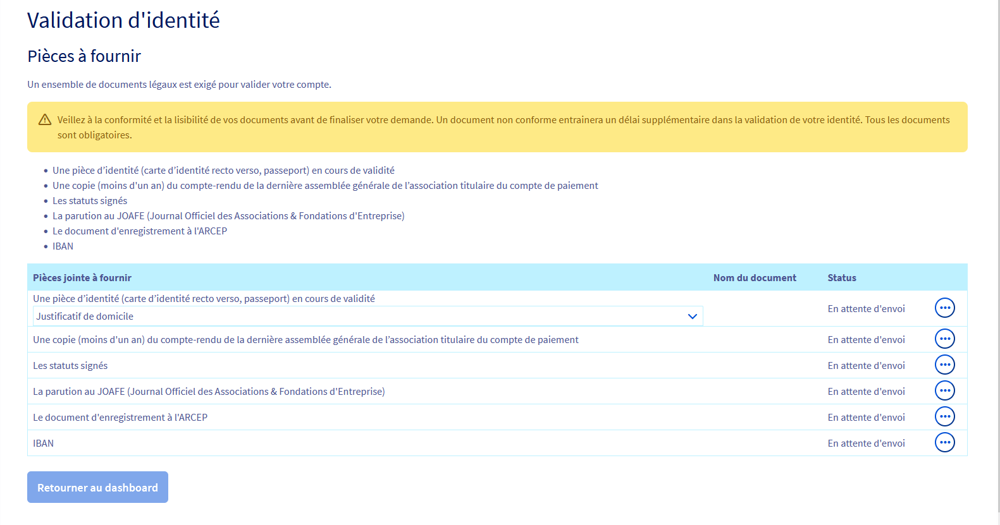

**Dernière mise à jour le 10/12/2021**

## Objectif

L'exploitation de numéros de Services à Valeur Ajoutée (SVA) OVHcloud nécessite d'être en conformité avec le cadre réglementaire défini par l'ARCEP.
Lors de la commande ou de la portabilité d'un numéro SVA, vous devez renseigner des informations précises sur l'identité de votre entreprise et fournir des documents justificatifs à OVHcloud.

Vos justificatifs d'identité pouvant expirer dans le temps, vous pourrez également les mettre à jour depuis votre espace client OVHcloud.

**Découvrez comment valider votre identité afin d'exploiter un numéro spécial SVA.**

## Prérequis

- Être connecté à l'[espace client OVHcloud](https://www.ovh.com/auth/?action=gotomanager&from=https://www.ovh.com/fr/&ovhSubsidiary=fr){.external}, partie `Télécom`{.action}.

## En pratique

> [!warning]
> Afin d'exploiter un numéro spécial SVA, il est obligatoire de fournir l'ensemble des justificatifs requis. Faute de validation de ces documents, vous ne pourrez pas exploiter votre numéro.
>

Connectez-vous à votre [espace client OVHcloud](https://www.ovh.com/auth/?action=gotomanager&from=https://www.ovh.com/fr/&ovhSubsidiary=fr){.external}, partie `Télécom`. Cliquez sur `Téléphonie`{.action} dans la barre de services à gauche, puis sélectionnez votre groupe de téléphonie.

Cliquez soit sur l'onglet `Commande de numéros`{.action} soit sur `Commander un numéro`{.action} dans le menu « Je veux... ».

{.thumbnail}

Vous accédez alors aux différents types de numéros. Cliquez sur `Vérifier l'identité` en face de « Numéros à valeur ajoutée ».

{.thumbnail}

### Renseigner les coordonnées

Choisissez si vous êtes un « Professionnel » ou un « Professionnel revendeur » puis renseignez précisément les coordonnées demandées.

{.thumbnail}

### Ajouter des bénéficiaires

Si vous êtes le seul bénéficiaire, cochez la case « Mon représentant est bénéficiaire ». Dans le cas contraire, cliquez sur `+ Ajouter un bénéficiaire`{.action} et renseignez les coordonnées du bénéficiaire.

> [!primary]
> Vous pouvez ajouter jusqu'à 4 bénéficiaires.

{.thumbnail}

Cochez la case :

- « Je certifie être l'éditeur des contenus des numéros SVA » (si vous avez choisi le type de compte « Professionnel »);
- « Je certifie être revendeur de numéro SVA et certifie connaître et appliquer les obligations à mes propres clients »  (si vous avez choisi le type de compte « Professionnel revendeur »).

{.thumbnail}

Cliquez sur `Etape suivante`{.action}.

Dans la fenêtre qui s'affiche alors, prenez connaissance des informations puis saisissez `CONFIRMER` dans le champ prévu à cet effet et cliquez sur `Valider mes informations`{.action}.

{.thumbnail}

### Téléverser les documents justificatifs

Une fois vos informations saisies, la liste des documents justificatifs à fournir apparaît. Cliquez sur le bouton `...`{.action} puis sur `Télécharger`{.action} à droite de chaque document à fournir. 

Cliquez sur `Sélectionner un fichier`{.action}, sélectionnez le document correspondant sur votre poste de travail puis cliquez sur `Valider le document`{.action}.

> [!warning]
> **Choix de la pièce d'identité :**
>
> Veillez à bien sélectionner, via le menu déroulant prévu à cet effet, le type de pièce d'identité que vous souhaitez ajouter **avant** de la téléverser.
>

{.thumbnail}

Une fois tous vos documents ajoutés, cliquez sur `Retourner au tableau de bord`{.action}.

### Vérifier le statut de mes documents

Dans votre `Tableau de bord`{.action}, cliquez sur `Voir mon profil SVA`{.action} dans la partie `Profil SVA`.

Vous aurez alors accès aux coordonnées précédemment renseignées ainsi qu'au tableau récapitulatif de vos documents.

La colonne `Statut` du tableau vous indique le statut de validation du document. Le bouton `...`{.action} à droite de chaque document vous permet d'interagir en conséquence.

|Statut|Description|Action possible|
|---|---|---|
|Valide|Votre document a été validé par nos équipes|Pas d'action possible|
|Attente de validation|Votre document a bien été réceptionne et va être vérifié par nos équipes|Pas d'action possible avant la vérification du document|
|Non valide|Votre document a été vérifié mais n'est pas conforme|Cliquez sur `...`{.action} à droite de ce document pour téléverser un nouveau justificatif|
|Arrivé à expiration le XX/XX/XXXX|La date de fin de validité sera bientôt atteinte|Cliquez sur `...`{.action} à droite de ce document pour téléverser un nouveau justificatif à jour|
|Expiré|La date de fin de validité du document est atteinte|Cliquez sur `...`{.action} à droite de ce document pour téléverser un nouveau justificatif à jour|

## Aller plus loin

[Les recommandations déontologiques applicables aux services à valeur ajoutée téléphoniques](https://www.ovh.com/fr/support/documents_legaux/conditions%20particulieres%20deontologie%20numeros%20SVA%20Fr.pdf).

Échangez avec notre communauté d'utilisateurs sur <https://community.ovh.com>.
