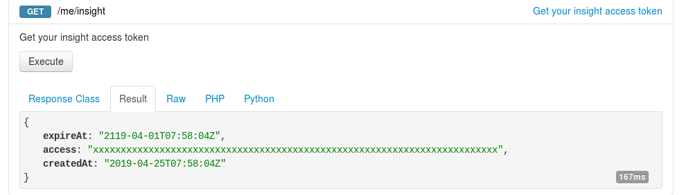
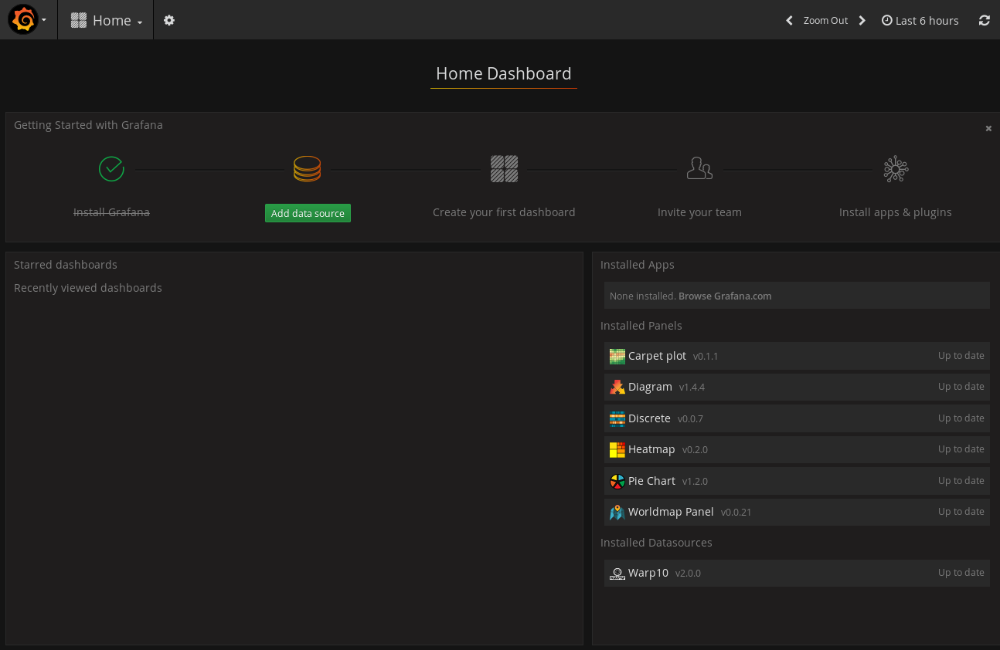
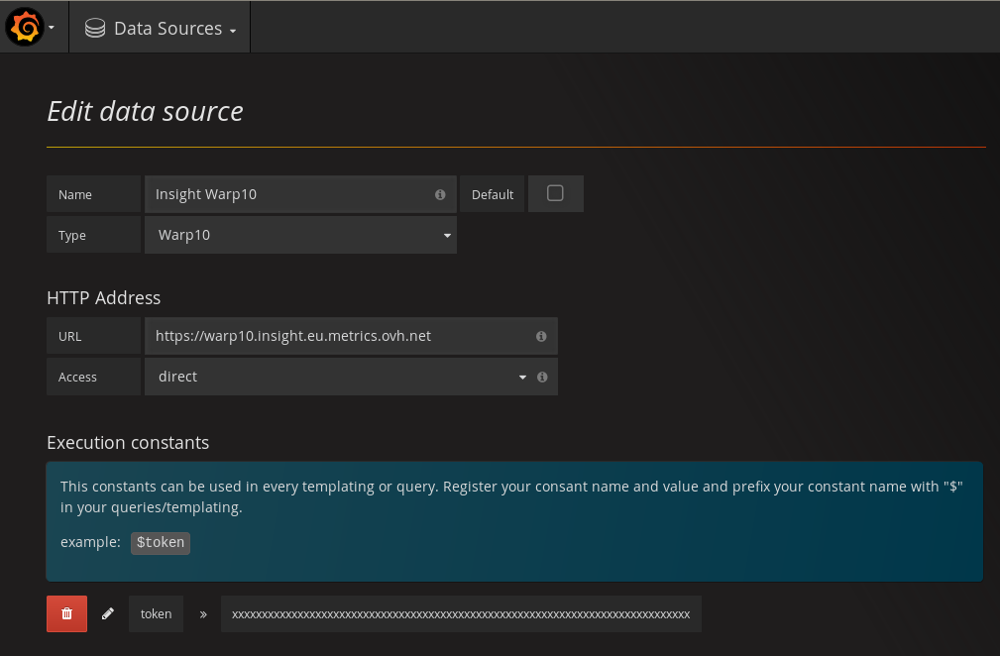
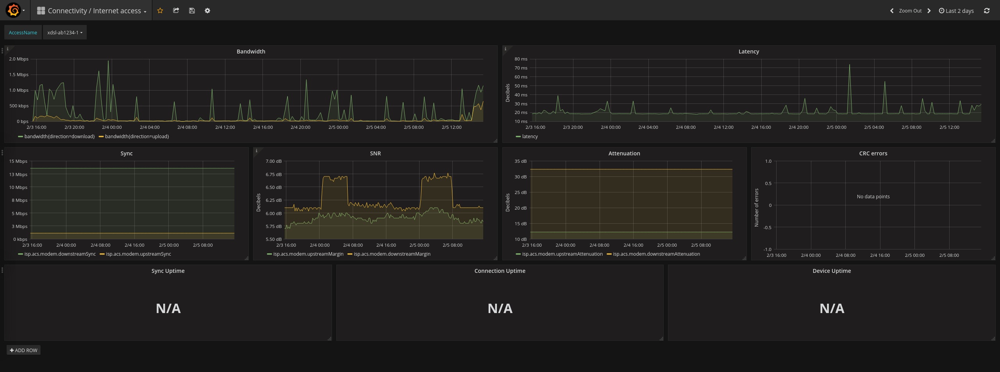

> [!warning]
>
> Ce guide est déprécié et concerne l'utilisation de l'offre OVHcloud Insight dont la fermeture est prévue pour le 26/10/2021.
> Plus d'informations sur <http://travaux.ovh.net/?do=details&id=51756&>.
>

> [!primary]
> Une version en langue anglaise de ce guide est disponible [ici](https://docs.ovh.com/gb/en/xdsl/build-your-own-monitoring-solution/)
>

**Dernière mise à jour le 27/07/2021**

## Objectif

OVHcloud propose avec sa solution [Insight](https://docs.ovh.com/fr/metrics/metrics-insight/) de partager les métriques de vos services pour les intégrer à vos propres solutions.

**Découvrez comment activer Insight et mettre en place votre premier tableau de bord Grafana pour monitorer vos accès Internet.**

## Prérequis

- Disposer d’un [accès internet xDSL ou fibre OVHcloud](https://www.ovhtelecom.fr/offre-internet/){.external}.
- La [configuration à distance](https://docs.ovh.com/fr/xdsl/configuration_du_modem_a_partir_de_votre_espace_client/#etape-1-acceder-a-la-gestion-de-votre-box) de votre modem doit être activée.

## En pratique

### Etape 1 : récupérer votre jeton de lecture de métrique OVHcloud Insight

1\. Rendez-vous sur la console APIv6 à cette adresse : [https://api.ovh.com/console/](https://api.ovh.com/console/){.external}

2\. Authentifiez-vous avec vos identifiants OVHcloud. Retrouvez plus d'informations sur l'utilisation des API sur le guide [Premiers pas avec les API OVHcloud](https://docs.ovh.com/fr/api/first-steps-with-ovh-api/).

3\. Executez la méthode suivante pour récupérer votre jeton de lecture :

> [!api]
>
> @api {GET} /me/insight
>

{.thumbnail}

4\. Enregistrez de manière sécurisée votre jeton de lecture retourné sous la clé `access`.

### Etape 2 : mettre en place votre premier tableau de bord Grafana

1\. Rendez-vous sur l'interface Grafana fournie par OVHcloud à l'adresse : [https://grafana.metrics.ovh.net](https://grafana.metrics.ovh.net){.external}

2\. Authentifiez-vous avec vos identifiants OVHcloud.

3\. Choisissez `Add data source`{.action}.

{.thumbnail}

4\. Configurez la source de donnée telle que :

```
Name : Insight Warp10

Type : Warp10

Url  : https://warp10.insight.eu.metrics.ovh.net
```

5\. Ajoutez une constante nommée `token` en utilisant votre jeton de lecture OVHcloud Insight.

{.thumbnail}

6\. Cliquez sur `Add`{.action} pour finaliser cette configuration.

7\. Cliquez sur l'icône Grafana en haut à gauche et choisissez dans le menu : `Dashboard`{.action}, puis `Import`{.action}

8\. Uploadez le template suivant : [internet-access-grafana-dashboard-v3.json](http://files.isp.ovh.net/grafana/internet-access-grafana-dashboard-v3.json)

9\. Cliquez sur `Import`{.action} pour finaliser l'ajout du template.

{.thumbnail}

> [!primary]
>
> Félicitations !
>
> Vous avez maintenant votre premier tableau de bord Grafana de surveillance de vos accès Internet OVHcloud.
>


Les informations suivantes sont actuellement disponibles pour vos accès Internet :

- traffic entrant et sortant
- latence

Et si votre modem est compatible :

- synchronisation
- SNR *(Signal to Noise Ratio)*
- atténuation
- erreurs CRC *(Contrôle de Redondance Cyclique)*
- erreurs FEC *(Correction d'erreurs directe)*
- erreurs HEC *(Correction d'erreurs header)*
- uptime de la synchronisation, de la connection et du modem

## Aller plus loin

Échangez avec notre communauté d'utilisateurs sur [https://community.ovh.com](https://community.ovh.com){.external}.
