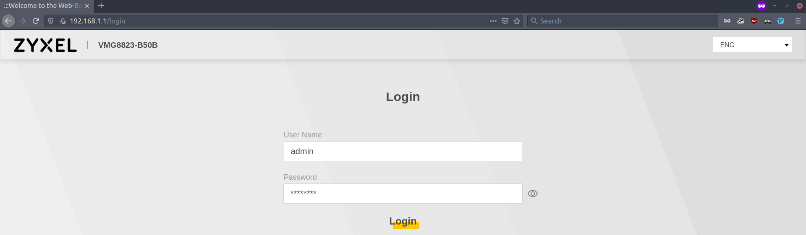
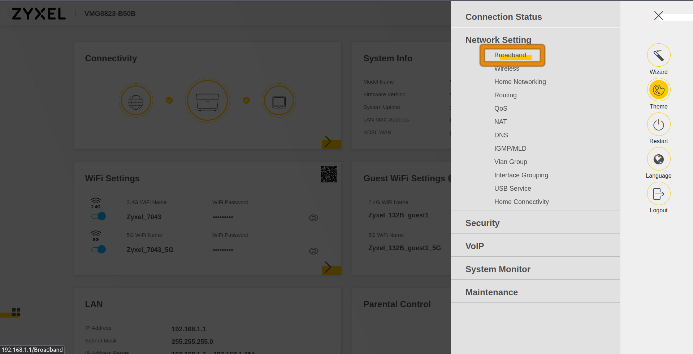

**Dernière mise à jour le 08/12/2022**

## Objectif

Le mode bridge est utile si vous souhaitez que votre modem ne se comporte plus comme un routeur. Ce mode n'est utile que dans le cas où vous possédez un équipement agissant en tant que routeur sur votre réseau local. Cet équipement gérera alors entièrement votre connexion, OVHcloud ne pouvant intervenir sur celui-ci.

**Apprenez à activer le bridge sur votre modem Zyxel**

## Prérequis

- Disposer d’un [accès internet xDSL ou fibre OVHcloud](https://www.ovhtelecom.fr/offre-internet/){.external} et d'un modem Zyxel fourni par OVHcloud.
- Être connecté à l'[espace client OVHcloud](https://www.ovhtelecom.fr/manager/#/){.external} dans la partie `Accès Internet`{.action}.
- Cette fonctionnalité est disponible uniquement si la configuration à distance est désactivée.

## En pratique

> [!primary]
>
> Ce guide ne concerne que les modems de marque Zyxel. Pour activer le mode bridge sur un modem Thomson ou Technicolor, l'activation se fait depuis l'espace client OVHcloud. Pour cela, vous pouvez consulter le guide [Configurer sa box à partir de l’espace client OVHcloud](../configuration_du_modem_a_partir_de_votre_espace_client/)
>

### Étape 1 : Accéder à l'outil de configuration à distance

Connectez-vous à votre [espace client OVHcloud](https://www.ovhtelecom.fr/manager/#/){.external}, partie « Télécom ». Cliquez sur `Accès Internet`{.action}, puis sélectionnez le pack et l’accès à Internet concerné. Assurez-vous d'être positionné sur l'onglet `Mon modem`{.action}.

Dans le cadre « Configuration à distance », vérifiez que la case à côté de `Configuration à distance activée` est bien décochée. Dès lors, deux possibilités :

- **La configuration à distance est désactivée**: Poursuivez la lecture de cette documentation à l'étape 2 « [Connectez-vous à l'interface locale du modem](./#etape-2-connectez-vous-a-linterface-locale-du-modem) » ;

- **la configuration à distance est activée**: Vous devez désactiver la configuration à distance si vous souhaitez paramétrer votre modem Zyxel en mode bridge. Pour ce faire, décochez la case à côté de `Configuration à distance activée`, confirmez la manipulation, puis patientez quelques minutes le temps de la désactivation.

{.thumbnail}

### Étape 2 : Connectez-vous à l'interface locale du modem

Connectez-vous à l'interface locale du modem, celle-ci est disponible à l'adresse IP locale de votre modem, 192.168.1.1 par défaut. Si vous avez modifié l'adresse IP locale de votre modem via la configuration du LAN, utilisez l'adresse IP que vous aviez définie.

Un couple user/password vous est alors demandé :

- Si la configuration à distance de votre modem était déjà désactivée à l'étape 1, utilisez l'utilisateur **admin** ainsi que le mot de passe que vous avez personnalisé.
- Si la configuration à distance de votre modem était déjà désactivée et que vous avez effectué un reset, utilisez l'utilisateur **admin** ainsi que le mot de passe sur l'étiquette au dos du modem.
- Si la configuration à distance de votre modem n'était pas désactivée, utilisez l'utilisateur **admin** ainsi que le mot de passe qui vous a été transmis par e-mail. L'objet de cet e-mail contient la mention « Réinitialisation du mot de passe du modem de votre accès ».

{.thumbnail}

> [!primary]
> L'ensemble des e-mails envoyés par OVHcloud sont accessibles depuis votre espace client. Pour retrouver vos derniers identifiants de connexion reçus par e-mail, connectez-vous à votre [espace client OVHcloud](https://www.ovh.com/auth/?action=gotomanager&from=https://www.ovh.com/fr/&ovhSubsidiary=fr) depuis un autre accès à Internet ou un smartphone. Une fois connecté, cliquez puis sur `E-mails de service`{.action} à droite de l'écran.
>

### Étape 3 : Accéder aux options de connexion broadbrand

Une fois connecté à l'interface locale du modem, accédez à la page de configuration `Broadband`. Cliquez sur l'icône menu en haut à droite, la page `Broadband` se trouve dans le menu `Network Setting`.

{.thumbnail}

Sur cette page, éditez l'interface correspondant à votre type de connexion :

- **ADSL**: Pour une connexion de type ADSL
- **VDSL**: Pour une connexion de type VDSL
- **ETHWAN**: Pour une connexion de type FTTH

{.thumbnail}

En cas de doute, le type de votre connexion est disponible sur l'espace client OVHcloud.

{.thumbnail}

### Étape 4 : Modifier le mode de votre connexion

Une fois sur la page d'édition de votre connexion, sélectionnez le mode souhaité dans la liste déroulante.

{.thumbnail}

Validez le changement, le bridge est désormais activé sur les ports LAN 1, 2 et 3. Le port 4 vous permet d'accéder à l'interface du modem.

{.thumbnail}

### Étape 5 : Revenir en mode routeur

Pour revenir en mode routeur suivez le guide [Redémarrer ou réinitialiser une box OVHcloud](../redemarrer-reinitialiser-modem-adsl-ovh/#reinitialiser-votre-box-ovh_1) pour réinitialiser votre modem Zyxel et rétablir sa configuration par défaut.

## Aller plus loin

Vous pouvez retrouver plus d'information sur la configuration du modem sur le [guide utilisateur du modem Zyxel](http://files.isp.ovh.net/zyxel/VMG8825-T50K_V5.13_5.50-1.pdf){.external}

Échangez avec notre communauté d'utilisateurs sur <https://community.ovh.com>.
