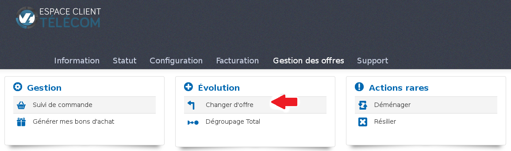
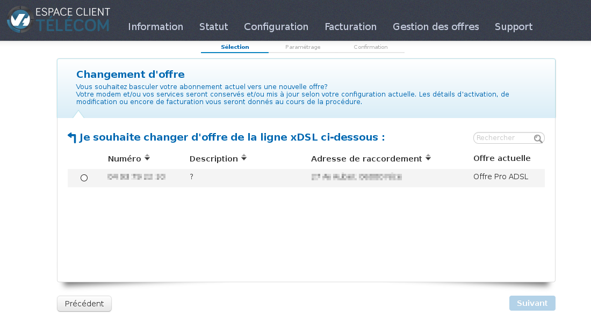
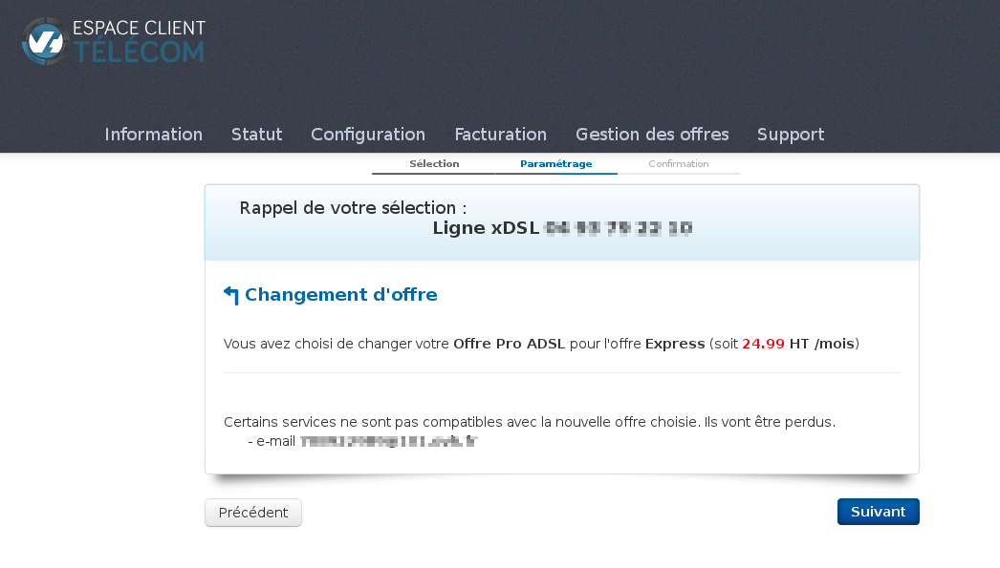
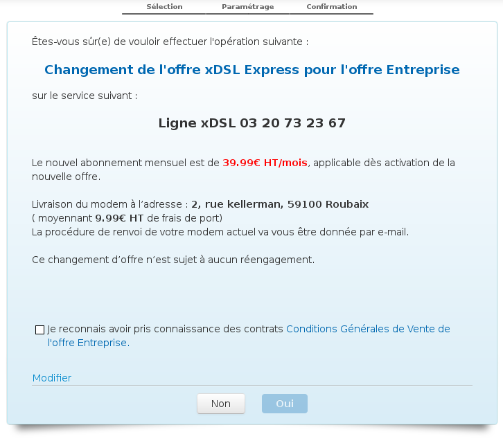

### Préambule {#préambule}

Le changement d'offre est une option vous permettant de faire évoluer une offre afin de pouvoir accéder à de nouvelles fonctionnalités / services.

Niveau : Débutant

------------------------------------------------------------------------

### Prérequis {#prérequis}

-   Disposer d'un accès xDSL
-   Avoir une offre éligible

------------------------------------------------------------------------

### Comment procéder {#comment-procéder}

La demande de changement d'offre s'effectue via votre espace client sur :

<https://www.ovhtelecom.fr/espaceclient/login/>

Cliquez sur "**Gestion des offres**" puis "**Changer d'offre**" :

{.thumbnail}

Sélectionnez la ligne sur laquelle vous souhaitez effectuer le changement d'offre et cliquez sur "**suivant**" :

{.thumbnail}

Sur l'étape suivante, vous allez retrouver deux choses.

La première concerne votre offre actuelle (son intitulé, son prix et les services actifs) et la deuxième concerne les offres que l'on peut vous proposer.

{.thumbnail}

Si des services ne sont pas compatibles avec la nouvelle offre, vous en serez averti :

{.thumbnail}

Lors de la dernière étape, une demande de confirmation apparaîtra afin de valider le changement d'offre.

{.thumbnail}

Il faut compter un délai **d'une heure** pour que le changement soit effectif, sauf en cas de changement de modem (délai d'expédition) ou changement de collecte (changement physique au niveau de la ligne qui implique une demande auprès d'Orange, 7 à 10 jours en moyenne avec une coupure probable du service).

------------------------------------------------------------------------

### Les particularités {#les-particularités}

Suivant l'offre que vous possédez, vous pouvez être amené à effectuer un changement de modem (offre no!Tv, nobox, double ADSL, Pro et bêta). Le changement de modem vous sera alors indiqué lors du changement d'offre.

Les services des packs Express ou Entreprise seront accessibles une fois le changement effectif. Cependant, aucun bon d'achat n'est mis à votre disposition lors du changement. Toutefois, l'option pour générer un bon d'achat sera disponible sur votre espace client (cf. : [Comment gérer mon bon d'achat]({legacy}7962632)).

Si vous possédez une offre Express, vous avez la possibilité de la faire évoluer en Entreprise. Par contre, l'inverse n'est pas possible.

Le changement d'offre n'est pas disponible sur les offres SDSL.

------------------------------------------------------------------------

