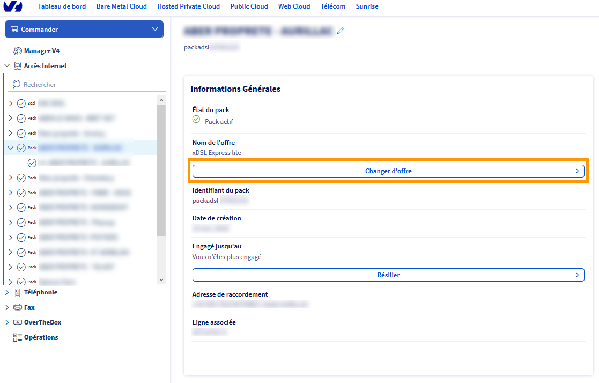
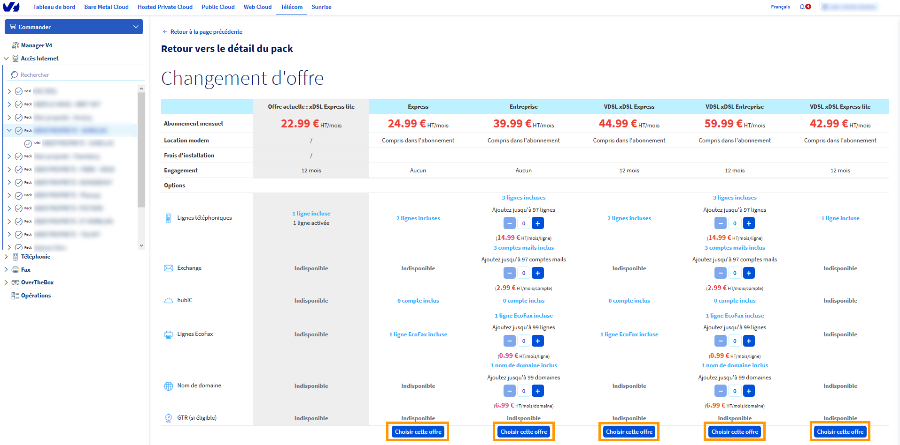
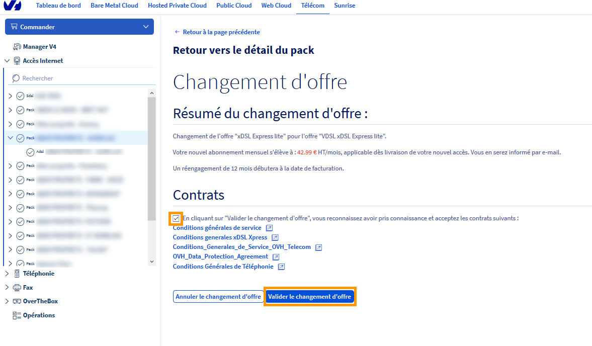

**Dernière mise à jour le 05/11/2020**

## Objectif

Vous pouvez faire évoluer votre offre xDSL/FTTH afin de pouvoir accéder à de nouvelles fonctionnalités et services.

## Prérequis

- Disposer d'un accès xDSL/FTTH actif.
- Disposer d'une offre éligible.

> [!primary]
> Le changement d'offre n'est pas disponible sur les offres SDSL.
>

## En pratique

### Changer d’offre

La demande de changement d'offre s'effectue via votre [espace client OVHcloud](https://www.ovh.com/auth/?action=gotomanager&from=https://www.ovh.com/fr/&ovhSubsidiary=fr).
 Dans l'onglet `Télécom`{.action}, sélectionnez la rubrique `Accès Internet`{.action} puis choisissez le pack que vous souhaitez faire évoluer.
 Cliquez ensuite sur `Changer d'offre`{.action} dans le cadre « Informations Générales ».

{.thumbnail}

La page suivante vous permettra de retrouver les informations nécessaires pour effectuer votre choix d'offre.

La première colonne du tableau récapitule votre offre actuelle (son nom, son prix et les services actifs. Les autres colonnes concernent les offres auxquelles vous pouvez souscrire, compte tenu de votre adresse actuelle.
 Cliquez sur le bouton `Choisir cette offre`{.action} sous la colonne correspondant à l'offre que vous souhaitez souscrire.

{.thumbnail}

Lors de la dernière étape, une demande de confirmation apparaîtra afin de valider le changement d'offre.
 Lisez les contrats, cochez la case afin de les accepter puis cliquez sur le bouton `Valider le changement d'offre`{.action}.

{.thumbnail}

Il faut compter un délai d'une heure pour que le changement soit effectif, sauf pour les cas particuliers suivants :

- en cas de remplacement du modem. Un délai de livraison de 24 à 48 heures est alors à prendre en compte suite à l'expédition du modem.
- en cas de changement de collecte (Un changement physique au niveau de la ligne qui implique une demande auprès de l'opérateur de collecte). Un délai moyen de 7 à 10 jours peut alors être constaté ainsi qu'une coupure probable du service.

Suivant votre offre actuelle, un remplacement du modem peut s'avérer nécessaire. Cela vous sera indiqué lors du choix de votre nouvelle offre.

Les nouveaux services liés à votre nouvelle offre (Express ou Entreprise) seront accessibles une fois le changement effectif. 

> [!primary]
> Si vous possédez une offre Express, vous avez la possibilité de la faire évoluer en Entreprise. Il est par contre impossible de faire évoluer une offre Entrepise vers une offre Express.
>

## Aller plus loin

Échangez avec notre communauté d'utilisateurs sur <https://community.ovh.com>
