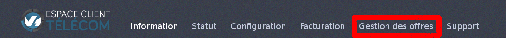
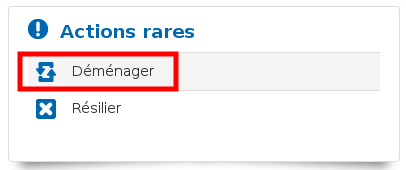
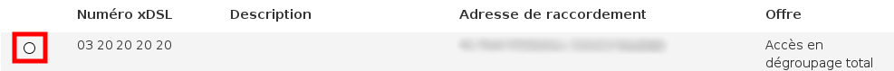
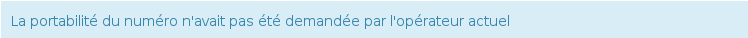
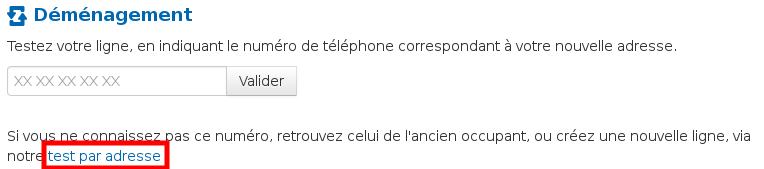
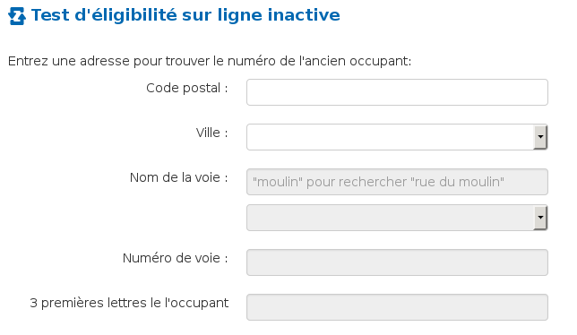
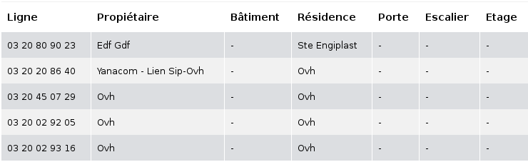
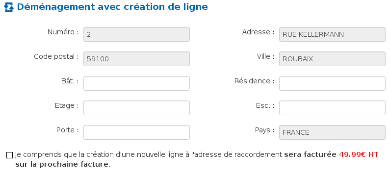

### Préambule {#préambule}

Le déménagement d'un accès xDSL est un service permettant de recréer votre accès internet à une adresse différente lors d'un changement de lieu de vie ou de lieu de travail tout en conservant les services liés à votre offre.C'est un service gratuit accessible dans le Manager.

**Sommaire :**

****

Niveau : Débutant

------------------------------------------------------------------------

### Prérequis {#prérequis}

-   Disposer d'un abonnement xDSL actif.

-   Disposer d'une offre xDSL récente. En effet, seules les offres Express et Entreprise sont éligibles au déménagement.

-   Disposer d'un compte OVH créditeur ou neutre.

-   Disposer d'un accès ADSL ou VDSL. En effet, le déménagement d'un accès SDSL n'est pas possible.
-   La nouvelle adresse doit-être différente de l'ancienne.

------------------------------------------------------------------------

### Réaliser une demande de déménagement**** {#réaliser-une-demande-de-déménagement}

Pour demander le déménagement d'un accès xDSL :

-   Rendez-vous dans le Manager.
-   Cliquez sur "Gestion des offres".

{.thumbnail}

-   Cliquez sur "Déménager".

{.thumbnail}

-   Sélectionnez le numéro de la ligne que vous souhaitez déménager

{.thumbnail}

-   Cliquez sur "Suivant".

#### Vous disposez déjà du numéro de ligne à la nouvelle adresse {#vous-disposez-déjà-du-numéro-de-ligne-à-la-nouvelle-adresse}

-   Renseignez ce numéro dans l'unique champ de la fenêtre puis cliquez sur "Valider".

Le Manager va alors lister les lignes éligibles. Il vous faudra choisir la ligne associée à votre nouvelle adresse.

Si la ligne est **active**, il vous sera demandé de choisir entre le dégroupage total ou le dégroupage partiel.

**Le dégroupage partiel** : vous conservez votre abonnement France Telecom ainsi que l'utilisation de votre ligne analogique.

**Le dégroupage total** : l'abonnement France Telecom est résilié. L'utilisation de la ligne analogique n'est plus possible. OVH gère l'intégralité de la ligne.

Enfin, le Manager vous propose de conserver le numéro de la nouvelle ligne.

Cochez la case "**Oui**" si vous souhaitez profiter de la portabilité de votre numéro. Attention, ne porter ce numéro que s'il vous appartient.

Dans certains cas, la portabilité n'est pas possible malgré le fait que votre ligne soit active. Dans ce cas, le message suivant apparaît :

{.thumbnail}

Si la ligne est **inactive**, seul le dégroupage total est possible. La portabilité du numéro, elle, est impossible dans ce cas.

-   Cliquez sur "**Suivant**".

Une nouvelle fenêtre s'affiche, vous invitant à valider le réengagement de 12 mois, la clôture de votre accès actuel ainsi que les conditions générales de vente de l'offre. Cochez alors les cases correspondantes puis cliquez sur "**Oui**". Cette action valide la demande de déménagement.

#### Vous ne disposez d'aucun numéro à la nouvelle adresse {#vous-ne-disposez-daucun-numéro-à-la-nouvelle-adresse}

-   Cliquez sur "**test par adresse**". Ce clic vous amène sur la page de recherche de ligne inactive

{.thumbnail}

-   Renseignez les champs demandés.

{.thumbnail}

Dans le cas où une ligne inactive existe à votre adresse, un tableau s'affichera, vous permettant de sélectionner la ligne correspondante à votre adresse.

{.thumbnail}

-   Sélectionnez alors la ligne correspondante.

Une nouvelle fenêtre s'affiche, vous invitant à valider le réengagement de 12 mois, la résiliation de votre accès actuel ainsi que les conditions générales de vente de l'offre. Cochez alors les cases correspondantes et cliquez sur "**Oui**". Cette action valide la demande de déménagement.

Si aucune ligne ne correspond à votre adresse où si la recherche ne donne aucun résultat, cliquez sur "**Créer une nouvelle ligne**".

-   Renseignez très précisément les champs demandés.

En effet, dans ce processus de déménagement, OVH réalisera la création de la ligne ainsi que son dégroupage. Il vous faut alors nous indiquer votre adresse complète afin de construire la ligne à l'adresse exacte. Cette opération est facturée 49.99 € HT**.**

**{.thumbnail}**

-   Cliquez sur "**Suivant**".

Dans ce cas, la création de la ligne implique le déplacement d'un technicien mandaté par France Telecom, ceci afin de réaliser le raccordement de votre logement au réseau cuivre France Telecom.

-   Sélectionnez une date ainsi qu'un créneau d'intervention.
-   Cliquez sur "**Suivant**".

Une nouvelle fenêtre s'affiche, vous invitant à valider le réengagement de 12 mois, la résiliation de votre accès actuel ainsi que les conditions générales de vente de l'offre. Cochez alors les cases correspondantes et cliquez sur "**Oui**". Cette action valide la demande de déménagement.

------------------------------------------------------------------------

### Que se passe t-il après la demande de déménagement ? {#que-se-passe-t-il-après-la-demande-de-déménagement}

Après avoir validé votre demande de déménagement dans le Manager, un ordre de dégroupage est envoyé à France Telecom.

La création de la ligne à la nouvelle adresse se réalise en 7 à 10 jours en moyenne.

L'accès xDSL de l'ancienne adresse est maintenu jusqu'à la livraison de l'accès à la nouvelle adresse. Nous coupons l'accès à la fin du mois en cours si et uniquement si l'accès à la nouvelle adresse a été livré.

C'est pourquoi pendant une période, vous disposerez d'un accès fonctionnel aux deux adresses, ceci afin de vous assurer une continuité de service pendant la transition.

------------------------------------------------------------------------

