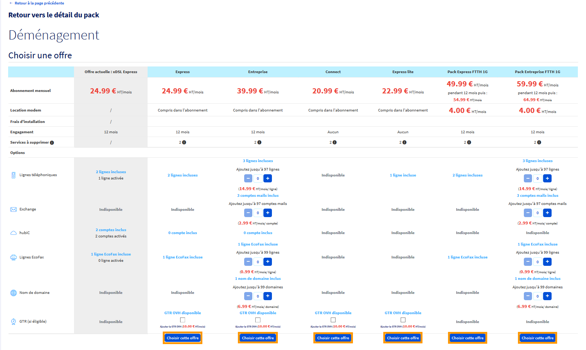
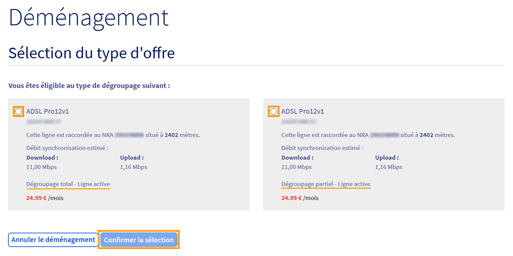

**Dernière mise à jour le 11/12/2020**

## Préambule

Le déménagement d'un accès xDSL est un service permettant de recréer votre accès internet à une adresse différente lors d'un changement de lieu de vie ou de lieu de travail tout en conservant les services liés à votre offre.
 C'est un service gratuit accessible depuis votre espace client.

**Sommaire :**

Niveau : Débutant

## Prérequis

-   Disposer d'un abonnement xDSL(ADSL/VDSL)ou Ftth actif. Les accès SDSL ne peuvent être déménagé.
-   Disposer d'une offre xDSL récente. (cela inclus les offres Connect, Express, Entreprise et Serenity)
-   La nouvelle adresse doit-être différente de l'ancienne.

## Réaliser une demande de déménagement 

La demande de déménagement s'effectue via votre [espace client OVHcloud](https://www.ovh.com/auth/?action=gotomanager)
 Dans l'onglet `Télécom`{.action}, sélectionnez la rubrique `Accès Internet`{.action}, choisissez le pack voulu puis sélectionnez l'accès xDSL.
 Cliquez ensuite sur `Déménager`{.action} dans le cadre « Informations Générales ».
{.thumbnail}

Vous pourrez ensuite définir la date à laquelle votre accès (à votre adresse actuelle) sera fermé.
 Un créneau de 30jours vous est proposé pour cela.

### Choix de la nouvelle adresse

#### Cas n°1 : Vous disposez déjà du numéro de ligne à la nouvelle adresse

Cochez la case "Testez avec le numéro de téléphone correspondant à votre nouvelle adresse." puis renseignez ce numéro dans le champ situé en dessous.
 Cliquez ensuite sur le bouton `Valider`{.action}
{.thumbnail}

Suite à cette validation, un cadre apparaitra vous indiquant l'adresse associée à ce numéro.
 Cliquez sur le bouton `Choisir cette ligne`{.action}
> [!primary]
> Dans de rare cas, une ligne peut apparaître active et inactive en même temps. Veillez à sélectionner la ligne correspondant à votre future adresse.
>
{.thumbnail}

#### Cas n°2 : Vous ne disposez d'aucun numéro à la nouvelle adresse

Cochez la case "Testez avec le nouvelle adresse" puis renseignez les champs requis (code postal, ville, numéro et rue)
Cliquez ensuite sur le bouton `Valider`{.action}

{.thumbnail}

Dans le cas où une ou plusieurs lignes inactives existent à votre future adresse, un tableau s'affichera avec les numéros de lignes disponible à cette adresse.
 Â l'aide des initiales des personnes rattachées à ces lignes, sélectionnez celui qui correspond à votre futur logement en cliquant sur le bouton `C'est ma ligne`{.action}.
 Si aucunes des lignes proposées ne correspond, cliquez sur le bouton `Je n'ai pas trouvé ma ligne`{.action}

{.thumbnail}

En cliquant sur le bouton `Je n'ai pas trouvé ma ligne`{.action}, une création de ligne sera alors demandé à cette adresse.

{.thumbnail}

### Choix de l'offre

Lors de votre demande de déménagement, vous avez la possibilité de conserver ou de changer d'offre.
Pour cela, il vous suffit de cliquer sur le bouton `Choisir cette offre`{.action} correspondant à l'offre voulue en bas du tableau

{.thumbnail}

### Choix du type de dégroupage

Si vous avez renseigné un numéro de ligne actif au début de votre demande, il vous sera demande de choisir entre 2 type de dégroupage à votre nouvelle adresse.
Vous devrez choisir entre "Dégroupage total" et "Dégroupage partiel".

Le dégroupage partiel signifie que vous souhaitez conserver la ligne analogique à cette adresse. 
Vous aurez donc un abonnement OVH pour l'accès internet ainsi qu'un abonnement chez Orange pour cette ligne analogique. 
 Le dégroupage total signifie que vous n'aurez que l'accès internet à votre nouvelle adresse (soit uniquement l'abonnement OVH).

Cochez la case correspondant à votre choix puis cliquez sur le bouton `Confirmer la sélection`{.action}

{.thumbnail}

### Conservation des numéros

Dans certains cas, vous pourrez demander à conserver le numéros présent à votre adresse actuelle ainsi que celui de votre futur logement.
Pour cela, il vous suffit de cocher la case "Je souhaite conserver le numéro : 0XXXXXXXXX".
 Si la conservation n'est pas possible, vous aurez le message "Vous ne pouvez pas porter ce numéro" en dessous de cette case.

Cliquez ensuite sur le bouton `Confirmer la sélection`{.action} pour passer à l'étape suivante.

{.thumbnail}

### Prise de rendez-vous pour le création de l'accès à la nouvelle adresse

Cette étape n'apparait que si une création de ligne est demandée à la nouvelle adresse.
Choisissez sur la planning la date et l'heure du rendez-vous avec un technicien Orange en cochant la case correspondante.

Cliquez ensuite sur le bouton `Confirmer la sélection`{.action} pour valider cette étape.

{.thumbnail}

### Validation du déménagement

Une nouvelle fenêtre s'affiche, vous invitant à valider le réengagement de 12 mois, la résiliation de votre accès actuel ainsi que les conditions générales de vente de l'offre. Cochez alors les cases correspondantes et cliquez sur `Valider le déménagement`{.action}. Cette action valide la demande de déménagement.

{.thumbnail}

## Que se passe-t-il après la demande de déménagement ?

Le déménagement de la ligne à la nouvelle adresse se réalise en 7 à 10 jours en moyenne, sauf en cas de création de ligne ou cela dépend de la date de rendez-vous choisie.

L'accès xDSL de l'ancienne adresse est maintenu jusqu'à la livraison de l'accès à la nouvelle adresse. Nous coupons l'accès à la fin du mois en cours si et uniquement si l'accès à la nouvelle adresse a été livré.

C'est pourquoi pendant une période, vous disposerez d'un accès fonctionnel aux deux adresses, ceci afin de vous assurer une continuité de service pendant la transition.

------------------------------------------------------------------------

