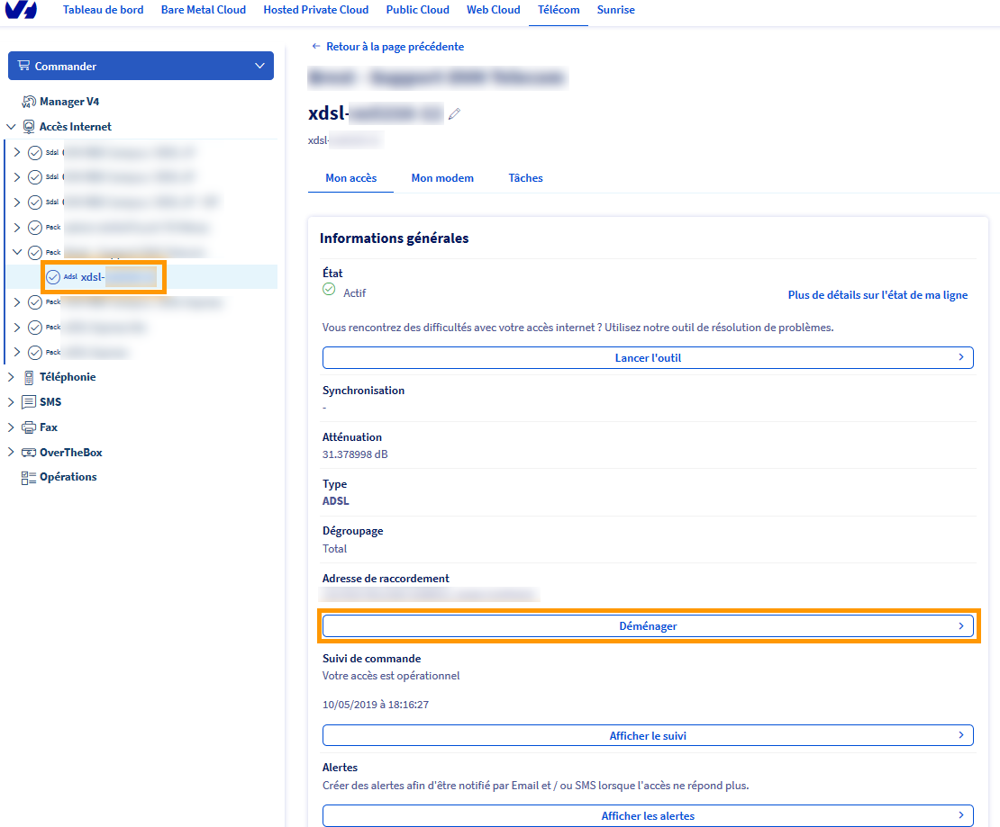
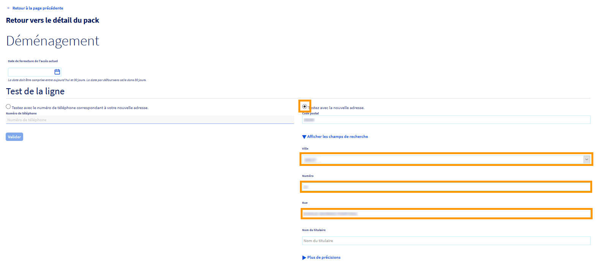
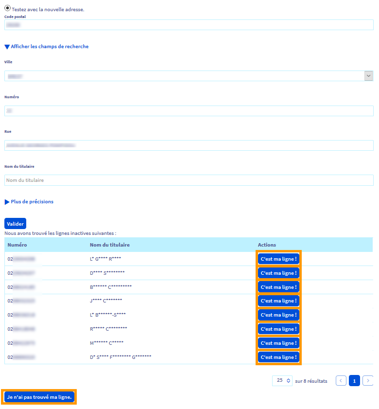

**Dernière mise à jour le 19/11/2020**

## Préambule

Le déménagement d'un accès xDSL est un service permettant de recréer votre accès internet à une adresse différente lors d'un changement de lieu de vie ou de lieu de travail tout en conservant les services liés à votre offre.
 C'est un service gratuit accessible depuis votre espace client.

**Sommaire :**

Niveau : Débutant

## Prérequis

-   Disposer d'un abonnement xDSL(ADSL/VDSL)ou Ftth actif. Les accès SDSL ne peuvent être déménagé.
-   Disposer d'une offre xDSL récente. (cela inclus les offres Connect, Express, Entreprise et Serenity)
-   Disposer d'un compte OVH créditeur ou neutre.
-   La nouvelle adresse doit-être différente de l'ancienne.

## Réaliser une demande de déménagement 

La demande de déménagement s'effectue via votre [espace client OVHcloud](https://www.ovh.com/auth/?action=gotomanager)
 Dans l'onglet `Télécom`{.action}, sélectionnez la rubrique `Accès Internet`{.action}, choisissez le pack voulu puis sélectionnez l'accès xDSL.
 Cliquez ensuite sur `Déménager`{.action} dans le cadre « Informations Générales ».
{.thumbnail}

Vous pourrez ensuite définir la date à laquelle votre accès (à votre adresse actuelle) sera fermé.
 Un créneau de 30jours vous est proposé pour cela.

### Vous disposez déjà du numéro de ligne à la nouvelle adresse

Cochez la case "Testez avec le numéro de téléphone correspondant à votre nouvelle adresse." puis renseignez ce numéro dans le champ situé en dessous.
 Cliquez ensuite sur le bouton `Valider`{.action}
{.thumbnail}

Suite à cette validation, un cadre apparaitra vous indiquant l'adresse associée à ce numéro.
> [!primary]
> Dans de rare cas, une ligne peut apparaître active et inactive en même temps. Veillez à sélectionner la ligne correspondant à votre future adresse.
>
{.thumbnail}

### Vous ne disposez d'aucun numéro à la nouvelle adresse

Cochez la case "Testez avec le nouvelle adresse" puis renseignez les champs requis (code postal, ville, numéro et rue)
Cliquez ensuite sur le bouton `Valider`{.action}

{.thumbnail}

Dans le cas où une ou plusieurs lignes inactives existent à votre future adresse, un tableau s'affichera avec les numéros de lignes disponible à cette adresse.
 Â l'aide des initiales des personnes rattachées à ces lignes, sélectionnez celui qui correspond à votre futur logement en cliquant sur le bouton `C'est ma ligne`{.action}.
 Si aucunes des lignes proposées ne correspond, cliquez sur le bouton `Je n'ai pas trouvé ma ligne`{.action}

{.thumbnail}

Une nouvelle fenêtre s'affiche, vous invitant à valider le réengagement de 12 mois, la résiliation de votre accès actuel ainsi que les conditions générales de vente de l'offre. Cochez alors les cases correspondantes et cliquez sur "**Oui**". Cette action valide la demande de déménagement.

------------------------------------------------------------------------

## Que se passe t-il après la demande de déménagement ?

Après avoir validé votre demande de déménagement dans le Manager, un ordre de dégroupage est envoyé à France Telecom.

La création de la ligne à la nouvelle adresse se réalise en 7 à 10 jours en moyenne.

L'accès xDSL de l'ancienne adresse est maintenu jusqu'à la livraison de l'accès à la nouvelle adresse. Nous coupons l'accès à la fin du mois en cours si et uniquement si l'accès à la nouvelle adresse a été livré.

C'est pourquoi pendant une période, vous disposerez d'un accès fonctionnel aux deux adresses, ceci afin de vous assurer une continuité de service pendant la transition.

------------------------------------------------------------------------

