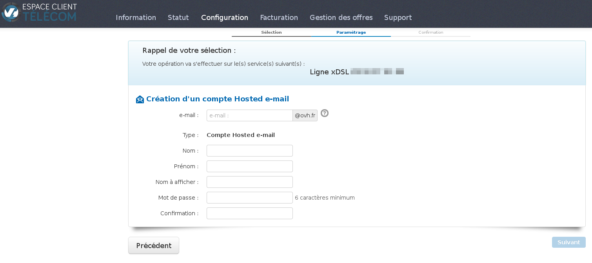
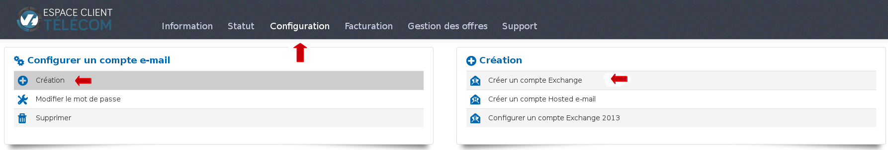
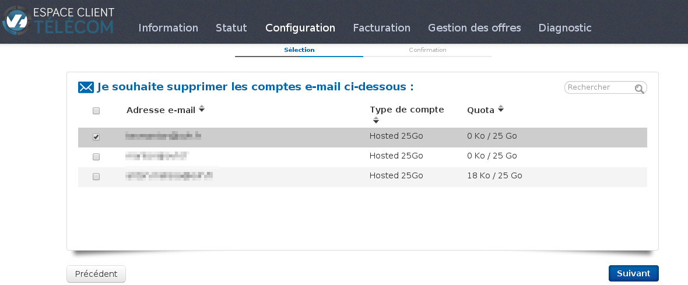

### Préambule {#préambule}

Le service mail est un service proposé en option sur votre pack ADSL/VDSL. Une fois l'accès actif, vous avez la possibilité de créer/gérer ce service via votre espace client.

Niveau : Débutant

------------------------------------------------------------------------

### Prérequis {#prérequis}

-   Disposer d'un accès ADSL/VDSL actif.

### Création d'un compte mail {#création-dun-compte-mail}

La création d'un compte mail est disponible depuis votre espace client Telecom en cliquant sur "**configuration**", "**e-mail**" et **"créer"**.

{.thumbnail}

-   **Hosted e-mail**

Les comptes hosted e-mail sont disponibles sur **les offres Express**. Les nouvelles offres comportent 2 comptes et les anciennes 10.

Pour pouvoir accéder au formulaire de création, vous devez cliquer sur le champ "**Créer un compte hosted e-mail**". Vous accéderez ensuite à ce formulaire :

{.thumbnail}

Une fois le champ e-mail rempli, une vérification de disponibilité est enclenchée. Afin de pouvoir accéder au formulaire suivant, veuillez remplir tous les champs :

{.thumbnail}

Vérifier le **récapitulatif** et cliquer sur "**oui**" pour valider la création.

Il faut compter une **dizaine de minutes** pour la création de votre compte Hosted e-mail.

Une fois le compte e-mail créé, vous allez recevoir sur votre adresse de contact un e-mail regroupant toutes les informations de votre compte : e-mail, mot de passe et les serveurs pour le paramétrage sur un client mail (Outlook, Thunderbird, ...).

Le message s'intitule : "votre compte Hosted E-mail <xxxxxx@ovh.fr> est prêt !".

-   **Compte Exchange 25Go**

Afin de pouvoir créer vos comptes Exchange, vous devez au préalable activer un nom de domaine. 

Pour pouvoir accéder au formulaire de création, même procédé que les comptes Hosted e-mail sauf qu'il faut sélectionner "**Créer un compte Exchange**" :

{.thumbnail}

{.thumbnail}

Dans le formulaire de création, vous retrouvez les mêmes champs que pour l'hosted e-mail. Vous avez deux options supplémentaires : **antivirus, antispam.** Sur le formulaire suivant, il vous est demandé une validation pour la création de votre compte Exchange.

-   **Compte Exchange 50Go**

La création d'un compte exchange 50Go (2013) sera disponible via votre espace client WEB. Du coup, vous serez redirigé automatiquement sur l'espace client afin de pouvoir le(s) configurer. Sélectionnez le compte de votre pack xDSL.

{.thumbnail}

------------------------------------------------------------------------

### Modifier un compte mail {#modifier-un-compte-mail}

-   **Hosted e-mail et exchange 2010** :

Lors de la modification d'un compte e-mail, vous pourrez uniquement modifier le mot de passe de votre compte e-mail. La modification s'effectue dans "**Configuration**", "**E-mail**" puis "**Modifier le mot de passe**".

{.thumbnail}{.thumbnail}

Sélectionnez le pack xDSL pour lequel vous souhaitez modifier le compte mail puis le mail en question

{.thumbnail}{.thumbnail}

Indiquez le nouveau **mot de passe** que vous souhaitez en respectant un**minimum de 8 caractères**. Un formulaire de demande validation apparaîtra**.**

{.thumbnail}{.thumbnail}

Si vous souhaitez effectuer des modifications sur certains paramètres de votre compte, sachez que le compte reste administrable via le **Webmail** dans la partie "**Paramètres**".

-   **Exchange 2013**

Pour les compte **Exchange 2013**, ce sera la même chose que lors de la création. Vous serez redirigé sur l**'espace client WEB**.

------------------------------------------------------------------------

### Supprimer un compte mail {#supprimer-un-compte-mail}

-   **Hosted e-mail et exchange 2010**

Pour pouvoir procéder à la suppression de votre compte, rendez-vous sur "**Configuration**", "**Supprimer**" puis "**Comptes Hosted et Exchange 2010**".

{.thumbnail}{.thumbnail}

Sélectionnez le pack xDSL pour lequel vous souhaitez supprimer le compte mail puis le mail en question.

{.thumbnail}{.thumbnail}

Pour finir, une demande de confirmation pour la suppression apparaître. Suite à cela, un e-mail **vous sera envoyé sur l'adresse de contact de votre pack xDSL** afin de confirmer la suppression du compte en question.

Le mail s'intitule : "**Suppression de votre Hosted Email !**".

Si vous venez à **supprimer votre pack xDSL** mais que vous souhaitez **conserver vos comptes hosted**, sachez que cela est possible pour une durée de **6 mois**. Rapprochez-vous du support telecom au 1007 (ouvert du lundi au vendredi de 8h à 20h et le samedi de 9h à 17h) afin d'en effectuer la demande.

-   **Exchange 2013** :

La suppression des comptes **Exchange 2013** s'effectue depuis l**'espace client WEB**.

------------------------------------------------------------------------

