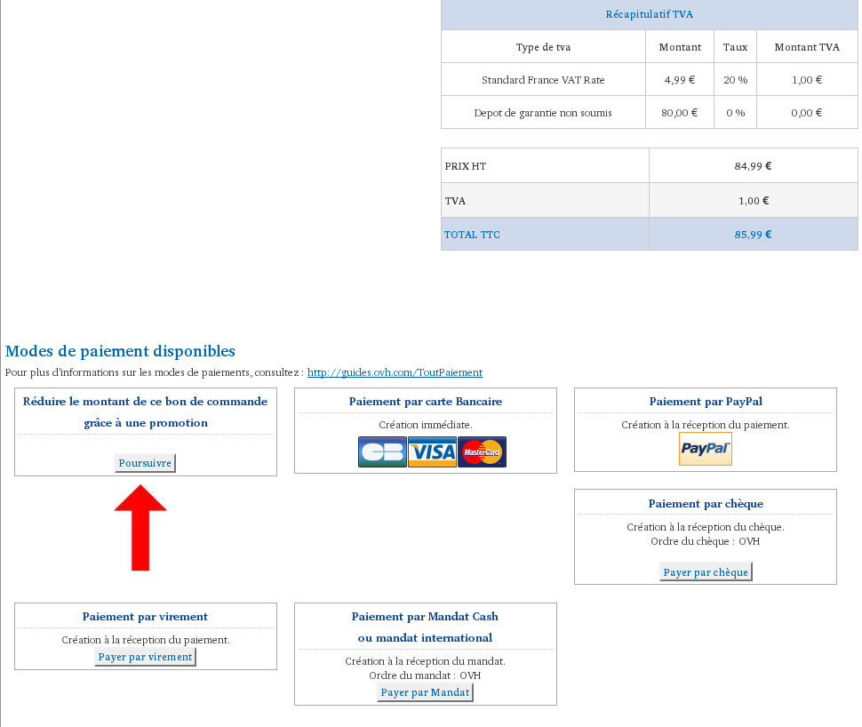
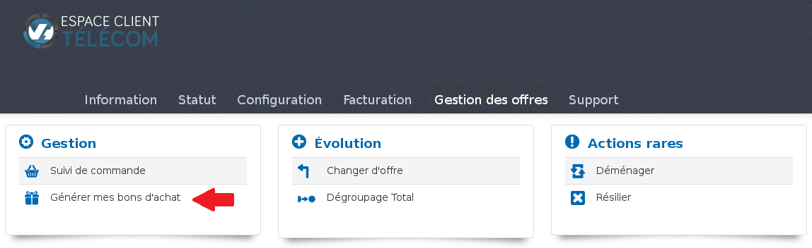
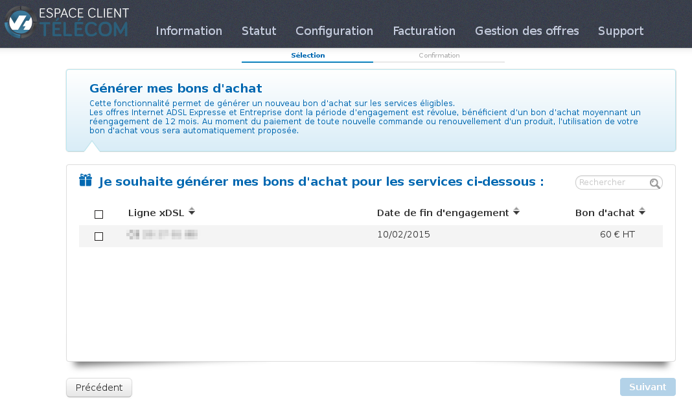
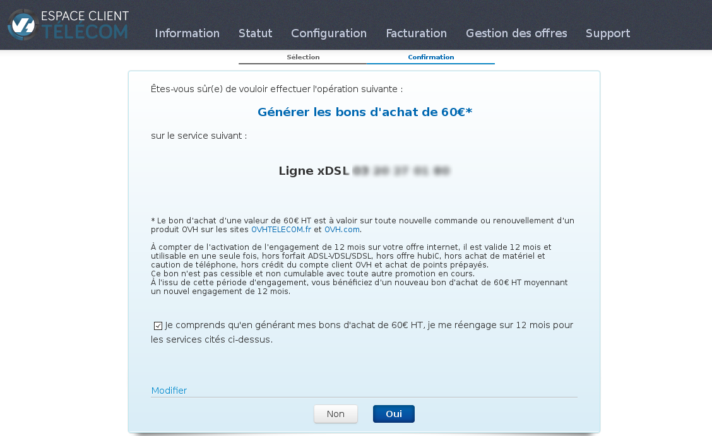

### Préambule {#préambule}

Suite à la souscription et à l'activation d'un pack ADSL/VDSL, un bon d'achat est mis à votre disposition pour l'achat ou le renouvellement d'un produit chez OVH.

**Sommaire :**

Niveau : Débutant

------------------------------------------------------------------------

### Prérequis {#prérequis}

-   Disposer d'un accès xDSL (Express ou Entreprise).

------------------------------------------------------------------------

### Utiliser un bon d'achat {#utiliser-un-bon-dachat}

Le bon d'achat est utilisable pour toute nouvelle commande ou tout renouvellement de produit OVH sur les sites **[ovhtelecom.fr](http://ovhtelecom.fr){.external-link}** et **[ovh.com](http://ovh.com){.external-link}**[.](http://ovh.com){.external-link}

Le bon d'achat est valable pendant **une durée de 12 mois** (à compter de l'**activation de votre ligne ADSL/VDSL**) et est utilisable en **une seule fois**.

La commande doit être passée sur le **même identifiant** que celui correspondant au pack ADSL/VDSL.

Comment utiliser le bon achat sur un bon de commande :

Lors du paiement de votre commande, dans les "**Modes de paiement disponibles**", vous aurez la possibilité de pouvoir déduire votre bon en sélectionnant "**Réduire le montant de ce bon de commande grâce à une promotion**".

{.thumbnail}

------------------------------------------------------------------------

### Dans quel(s) cas, vous ne pouvez pas utiliser le bon d'achat {#dans-quels-cas-vous-ne-pouvez-pas-utiliser-le-bon-dachat}

-   Paiement des factures Xdsl/Voip

-   Offre hubic

-   Achat de matériel et caution de téléphone
-   Créditer le compte OVH
-   Achat de points prépayés.

------------------------------------------------------------------------

### Générer mes bons d'achat {#générer-mes-bons-dachat}

{.thumbnail}

Vous pouvez générer un nouveau bon d'achat sous condition d'un réengagement d'un an et sous réserve que votre pack ADSL/VDSL ne soit plus soumis à un engagement. Pour le demander, authentifiez-vous sur votre espace client :

<https://www.ovhtelecom.fr/espaceclient/login/>

Cliquez sur "**Gestion des offres**" puis "**Générer mes bons d'achat**".

{.thumbnail}

Sélectionnez la ligne xDSL afin de générer votre bon d'achat et cliquez sur "**suivant**".

{.thumbnail}

Une demande de confirmation sera affichée lors de la validation de votre bon afin de valider le réengagement.

------------------------------------------------------------------------