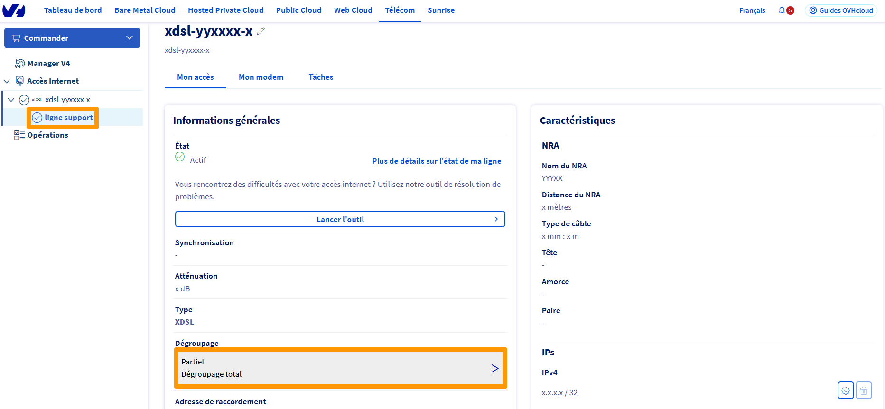
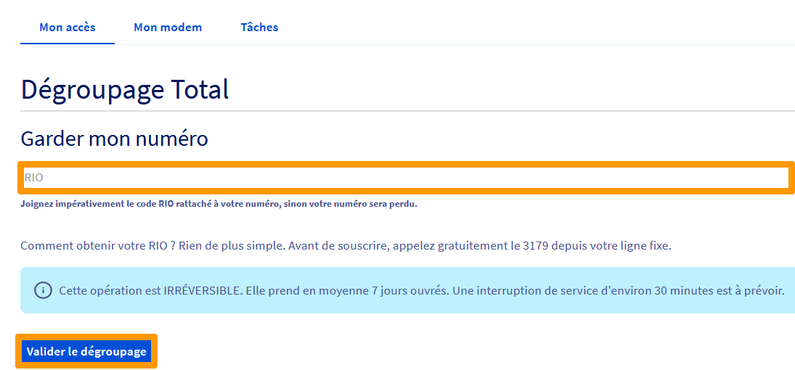

**Dernière mise à jour le 22/04/2021**

## Objectif

Le passage d'un dégroupage partiel à total permet de confier à OVHcloud la gestion complète de votre ligne, de faire porter votre numéro et de pouvoir l'utiliser avec votre téléphonie OVHcloud.
 Il vous permet aussi de simplifier et de réduire votre facture en vous affranchissant de l'abonnement Orange/France Telecom présent dessus.

**Découvez comment demander le dégroupage total de votre ligne depuis votre espace client OVHcloud**

## Prérequis

-   Disposer d'un accès OVHcloud en dégroupage partiel.
-   Disposer d'une offre éligible.

> [!primary]
> A savoir :
>
> Le passage d'un dégroupage partiel à total est irréversible.
>  Si vous bénéficiez d'une ancienne offre, il est nécessaire de passer à l'une de nos offres Express ou Entreprise. Consultez notre guide « [Changer l'offre d'un accès xDSL](https://docs.ovh.com/fr/xdsl/comment-changer-mon-offre-xdsl/) ».
>  Une interruption de service est probable.
>

## En pratique

### Demander le dégroupage total sur votre accès

Connectez-vous à la rubrique `Telecom` de votre [espace client OVHcloud](https://www.ovh.com/auth?onsuccess=https%3A%2F%2Fwww.ovhtelecom.fr%2Fmanager&ovhSubsidiary=fr). Cliquez ensuite sur `Accès Internet`{.action} dans le menu de gauche, sélectionnez votre offre puis cliquez sur la référence de ligne support de connexion. 

Dans l'onglet `Mon accès`{.action}, vous retrouverez, dans les `Informations générales`, la possibilité de migrer votre accès en dégroupage total.

{.thumbnail}

Pour effectuer la portabilité du numéro support de connexion, vous devrez renseigner son RIO avant de valider l'opération. Contactez les services de Orange/France Télécom pour obtenir le RIO.

{.thumbnail}

Cette demande prend en moyenne 7 jours ouvrés et ne peut pas être anticipée. L'interruption de service est en théorie de 30 minutes.

Votre ligne fixe sera alors résiliée techniquement auprès de votre précédent opérateur. En fonction de votre offre chez votre opérateur, nous vous invitons à vérifier que l'offre commerciale est également résiliée.

## Aller plus loin

Échangez avec notre communauté d'utilisateurs sur <https://community.ovh.com>
